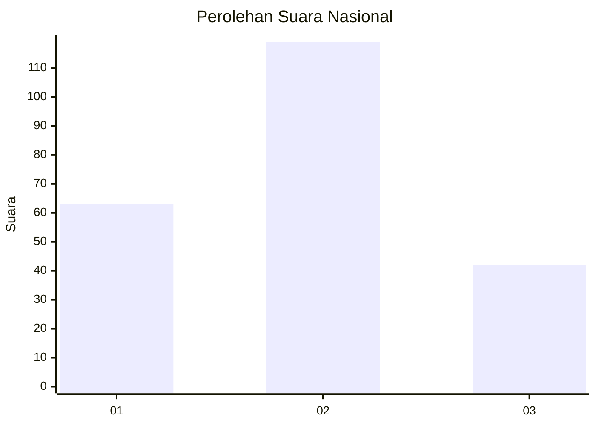
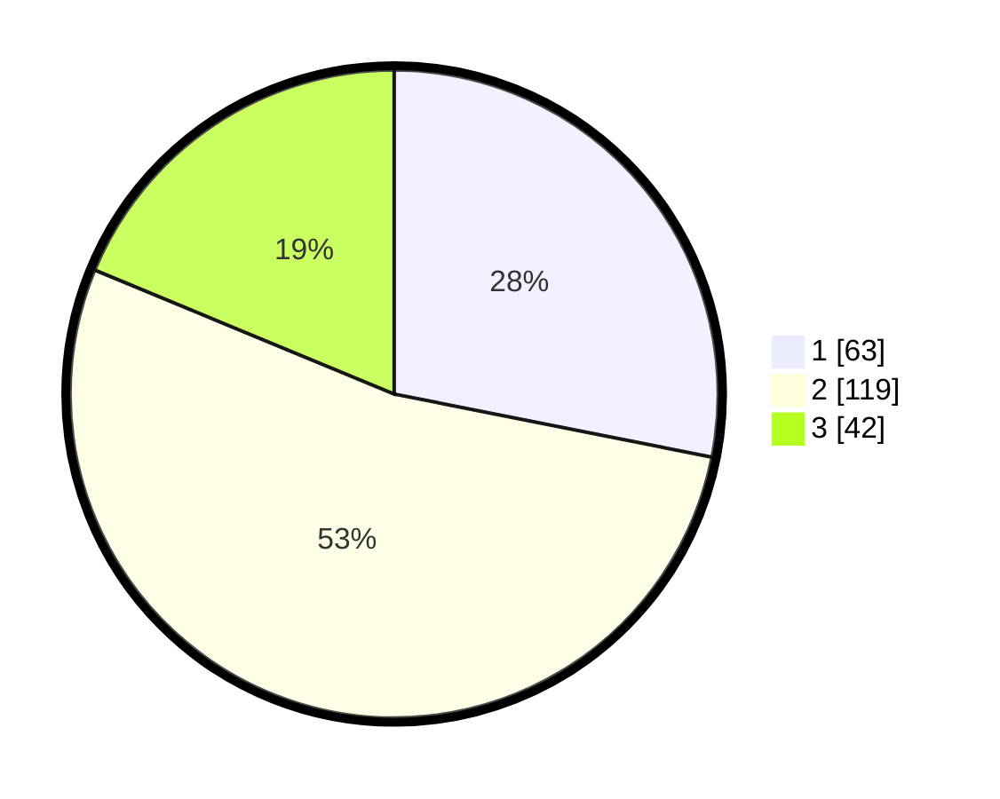

# Hasil

## Grafik

## Tabel

| No. | Nama Paslon    | Suara | Suara (raw) | Persentase |
|:--- |:-------------- | -----:| -----------:| ----------:|
| 1   | ANIES MUHAIMIN | 63    | [63][p-1]   | 28,13      |
| 2   | PRABOWO GIBRAN | 119   | [119][p-2]  | 53,13      |
| 3   | GANJAR MAHFUD  | 42    | [42][p-3]   | 18,75      |

[p-1]: https://github.com/gigit-pemilu/pemilu-2024/blob/main/pilpres/hitung-suara/sub/34-di-yogyakarta/sub/04-sleman/sub/07-depok/sub/2002-maguwoharjo/sub/031-tps/sub/paslon-1.txt
[p-2]: https://github.com/gigit-pemilu/pemilu-2024/blob/main/pilpres/hitung-suara/sub/34-di-yogyakarta/sub/04-sleman/sub/07-depok/sub/2002-maguwoharjo/sub/031-tps/sub/paslon-2.txt
[p-3]: https://github.com/gigit-pemilu/pemilu-2024/blob/main/pilpres/hitung-suara/sub/34-di-yogyakarta/sub/04-sleman/sub/07-depok/sub/2002-maguwoharjo/sub/031-tps/sub/paslon-3.txt

## Foto C Plano

https://sirekap-obj-formc.kpu.go.id/e679/pemilu/ppwp/34/04/07/20/02/3404072002031-20240215-004608--2cf6a612-0596-4a80-a840-5010afa20bd7.jpg

https://sirekap-obj-formc.kpu.go.id/e679/pemilu/ppwp/34/04/07/20/02/3404072002031-20240215-004638--5e09cc9e-4884-423d-97c1-da70f7ad389d.jpg

https://sirekap-obj-formc.kpu.go.id/e679/pemilu/ppwp/34/04/07/20/02/3404072002031-20240215-004726--0afa5199-d2c5-4a98-b7f0-df71ba753712.jpg

## Metadata

| Key        | Value               |
| ---------- | ------------------- |
| Time Stamp | 2024-02-15 15:00:29 |

