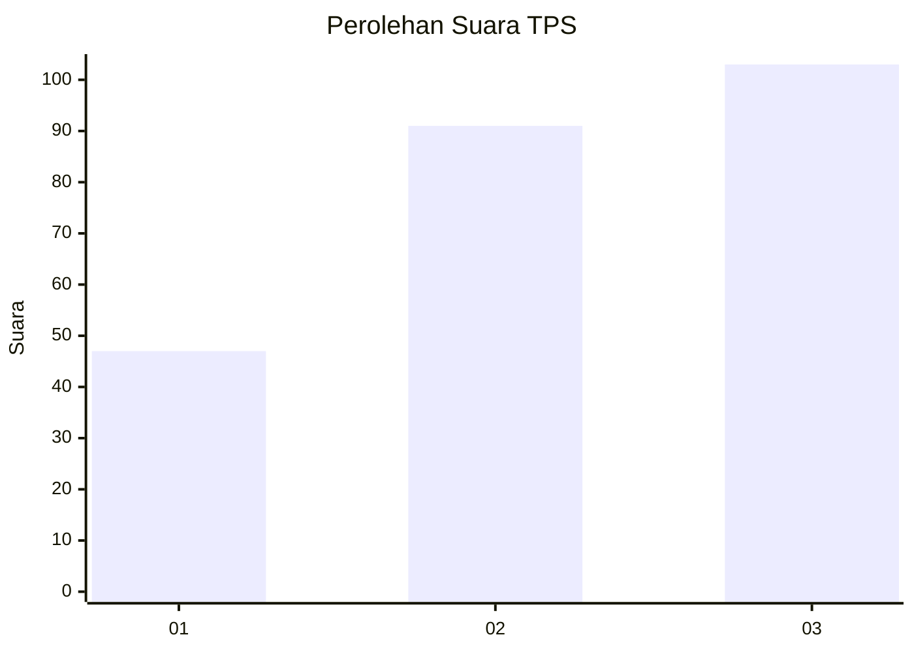
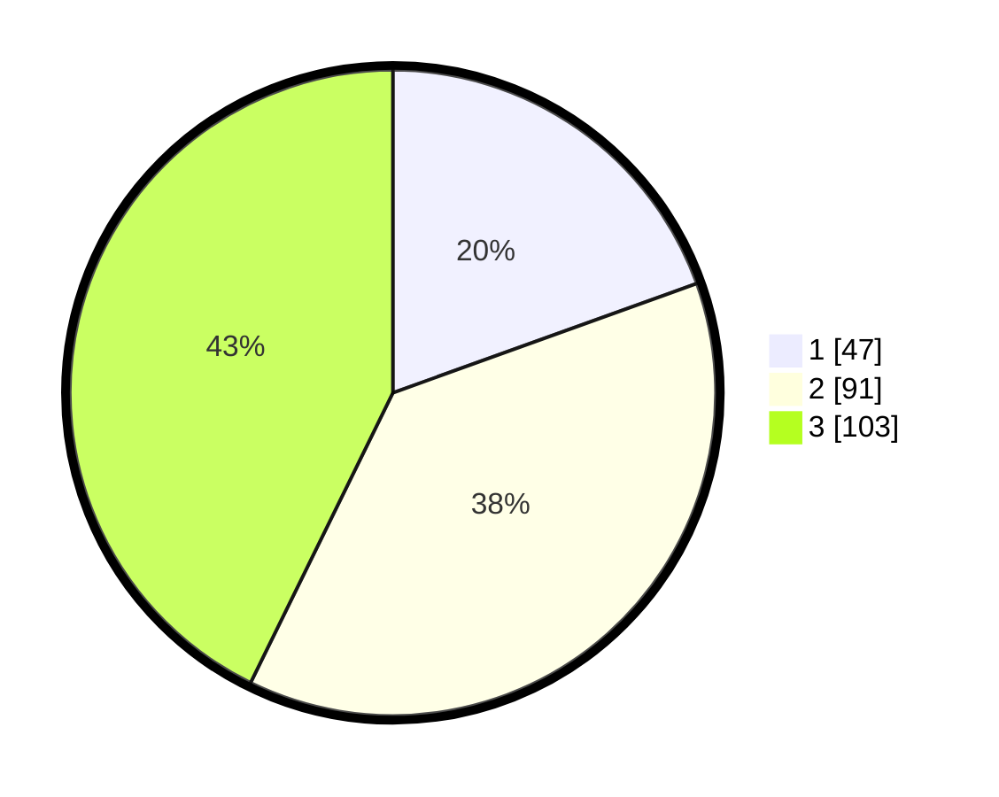

# Hasil

## Grafik

## Tabel

| No. | Nama Paslon    | Suara | Suara (raw) | Persentase |
|:--- |:-------------- | -----:| -----------:| ----------:|
| 1   | ANIES MUHAIMIN | 47    | [47][p-1]   | 19,50      |
| 2   | PRABOWO GIBRAN | 91    | [91][p-2]   | 37,76      |
| 3   | GANJAR MAHFUD  | 103   | [103][p-3]  | 42,74      |

[p-1]: https://github.com/gigit-pemilu/pemilu-2024-34-di-yogyakarta/blob/main/pilpres/hitung-suara/sub/34-di-yogyakarta/sub/04-sleman/sub/07-depok/sub/2002-maguwoharjo/sub/037-tps/sub/paslon-1.txt
[p-2]: https://github.com/gigit-pemilu/pemilu-2024-34-di-yogyakarta/blob/main/pilpres/hitung-suara/sub/34-di-yogyakarta/sub/04-sleman/sub/07-depok/sub/2002-maguwoharjo/sub/037-tps/sub/paslon-2.txt
[p-3]: https://github.com/gigit-pemilu/pemilu-2024-34-di-yogyakarta/blob/main/pilpres/hitung-suara/sub/34-di-yogyakarta/sub/04-sleman/sub/07-depok/sub/2002-maguwoharjo/sub/037-tps/sub/paslon-3.txt

## Foto C Plano

https://sirekap-obj-formc.kpu.go.id/2078/pemilu/ppwp/34/04/07/20/02/3404072002037-20240215-003948--321526b2-a972-4cab-a1f9-b246fc32fdcf.jpg

https://sirekap-obj-formc.kpu.go.id/2078/pemilu/ppwp/34/04/07/20/02/3404072002037-20240215-004105--de6bd7aa-91d8-4cfa-875b-361b0ca8e5e8.jpg

https://sirekap-obj-formc.kpu.go.id/2078/pemilu/ppwp/34/04/07/20/02/3404072002037-20240215-004128--22e3ba0c-15e7-49a8-af7a-3d55c700b7c1.jpg

## Metadata

| Key        | Value               |
| ---------- | ------------------- |
| Time Stamp | 2024-02-15 15:00:29 |

