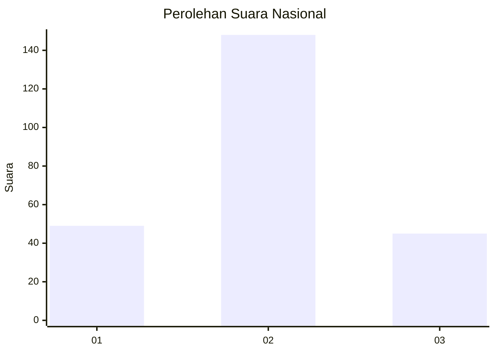
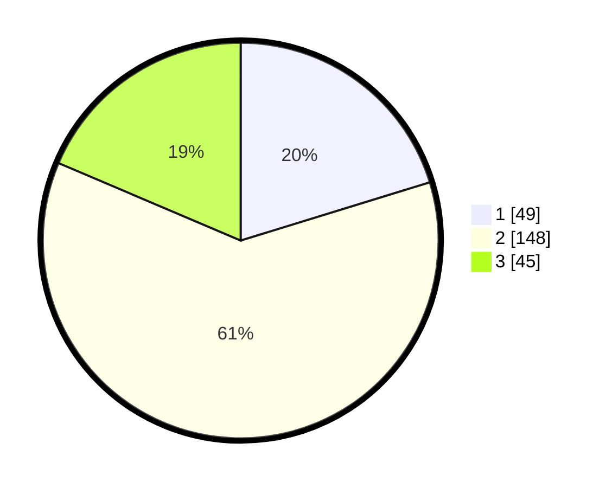

# Hasil

## Grafik

## Tabel

| No. | Nama Paslon    | Suara | Suara (raw) | Persentase |
|:--- |:-------------- | -----:| -----------:| ----------:|
| 1   | ANIES MUHAIMIN | 49    | [49][p-1]   | 20,25      |
| 2   | PRABOWO GIBRAN | 148   | [148][p-2]  | 61,16      |
| 3   | GANJAR MAHFUD  | 45    | [45][p-3]   | 18,60      |

[p-1]: https://github.com/gigit-pemilu/pemilu-2024/blob/main/pilpres/hitung-suara/sub/34-di-yogyakarta/sub/04-sleman/sub/07-depok/sub/2002-maguwoharjo/sub/042-tps/sub/paslon-1.txt
[p-2]: https://github.com/gigit-pemilu/pemilu-2024/blob/main/pilpres/hitung-suara/sub/34-di-yogyakarta/sub/04-sleman/sub/07-depok/sub/2002-maguwoharjo/sub/042-tps/sub/paslon-2.txt
[p-3]: https://github.com/gigit-pemilu/pemilu-2024/blob/main/pilpres/hitung-suara/sub/34-di-yogyakarta/sub/04-sleman/sub/07-depok/sub/2002-maguwoharjo/sub/042-tps/sub/paslon-3.txt

## Foto C Plano

https://sirekap-obj-formc.kpu.go.id/558e/pemilu/ppwp/34/04/07/20/02/3404072002042-20240214-224500--f4519082-ebaf-4946-943b-9cdaadcd6b21.jpg

https://sirekap-obj-formc.kpu.go.id/558e/pemilu/ppwp/34/04/07/20/02/3404072002042-20240214-224508--3935f945-9703-4285-8a63-bb573e2384c6.jpg

https://sirekap-obj-formc.kpu.go.id/558e/pemilu/ppwp/34/04/07/20/02/3404072002042-20240214-224513--3c4e08cd-6278-4cfd-94f7-a8b8b105f1f1.jpg

## Metadata

| Key        | Value               |
| ---------- | ------------------- |
| Time Stamp | 2024-02-16 22:01:00 |

