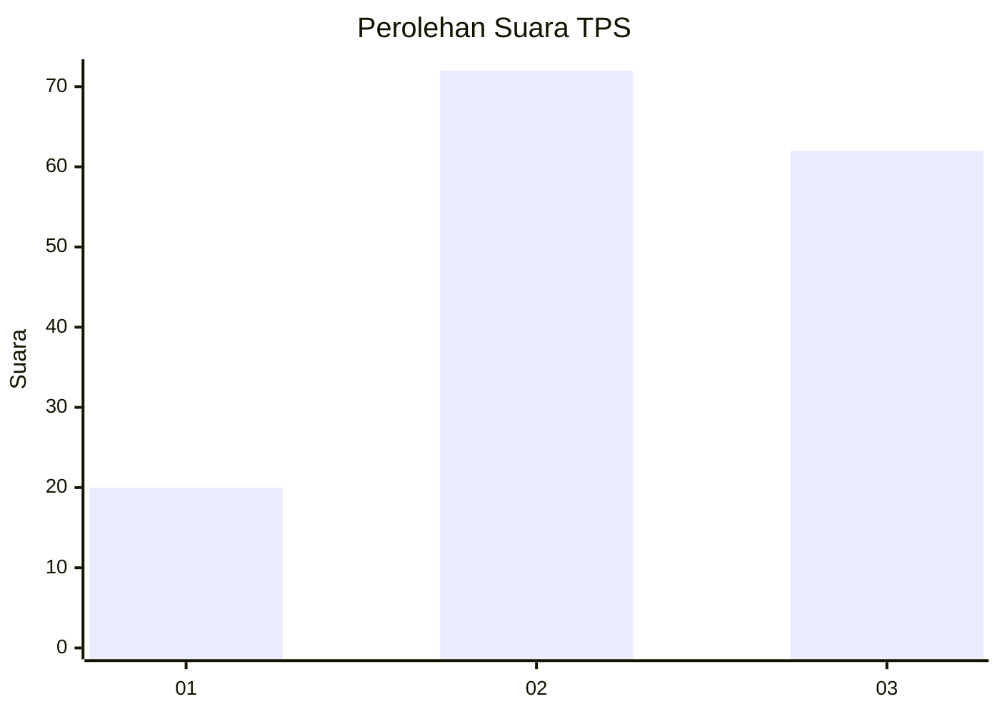
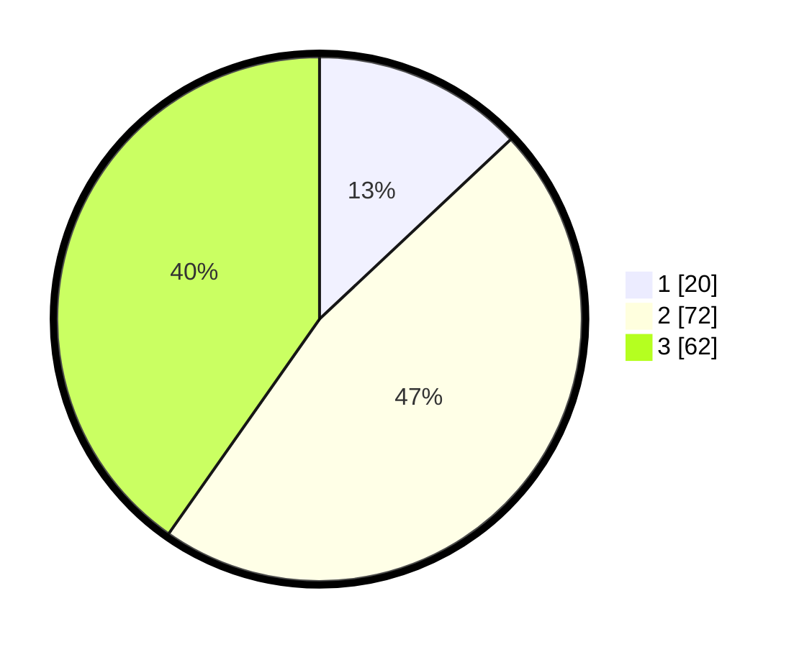

# Hasil

## Grafik

## Tabel

| No. | Nama Paslon    | Suara | Suara (raw) | Persentase |
|:--- |:-------------- | -----:| -----------:| ----------:|
| 1   | ANIES MUHAIMIN | 20    | [20][p-1]   | 12,99      |
| 2   | PRABOWO GIBRAN | 72    | [72][p-2]   | 46,75      |
| 3   | GANJAR MAHFUD  | 62    | [62][p-3]   | 40,26      |

[p-1]: https://github.com/gigit-pemilu/pemilu-2024-34-di-yogyakarta/blob/main/pilpres/hitung-suara/sub/34-di-yogyakarta/sub/04-sleman/sub/07-depok/sub/2002-maguwoharjo/sub/045-tps/sub/paslon-1.txt
[p-2]: https://github.com/gigit-pemilu/pemilu-2024-34-di-yogyakarta/blob/main/pilpres/hitung-suara/sub/34-di-yogyakarta/sub/04-sleman/sub/07-depok/sub/2002-maguwoharjo/sub/045-tps/sub/paslon-2.txt
[p-3]: https://github.com/gigit-pemilu/pemilu-2024-34-di-yogyakarta/blob/main/pilpres/hitung-suara/sub/34-di-yogyakarta/sub/04-sleman/sub/07-depok/sub/2002-maguwoharjo/sub/045-tps/sub/paslon-3.txt

## Foto C Plano

https://sirekap-obj-formc.kpu.go.id/a35d/pemilu/ppwp/34/04/07/20/02/3404072002045-20240214-224803--a310a70a-ddea-4433-bd94-d291a32d9f37.jpg

https://sirekap-obj-formc.kpu.go.id/a35d/pemilu/ppwp/34/04/07/20/02/3404072002045-20240214-230906--52e46213-585d-4383-95e5-f579077ce4ed.jpg

https://sirekap-obj-formc.kpu.go.id/a35d/pemilu/ppwp/34/04/07/20/02/3404072002045-20240214-224940--342e5cd5-d74b-4859-9f64-1be9aaf48f4d.jpg

## Metadata

| Key        | Value               |
| ---------- | ------------------- |
| Time Stamp | 2024-02-15 15:00:29 |

