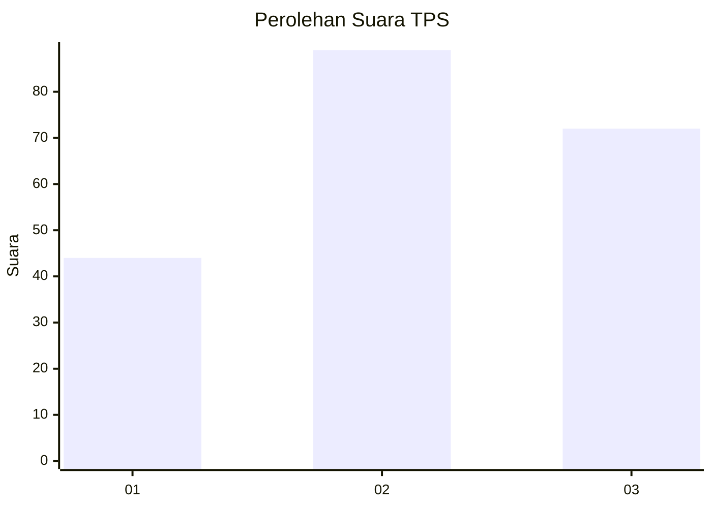
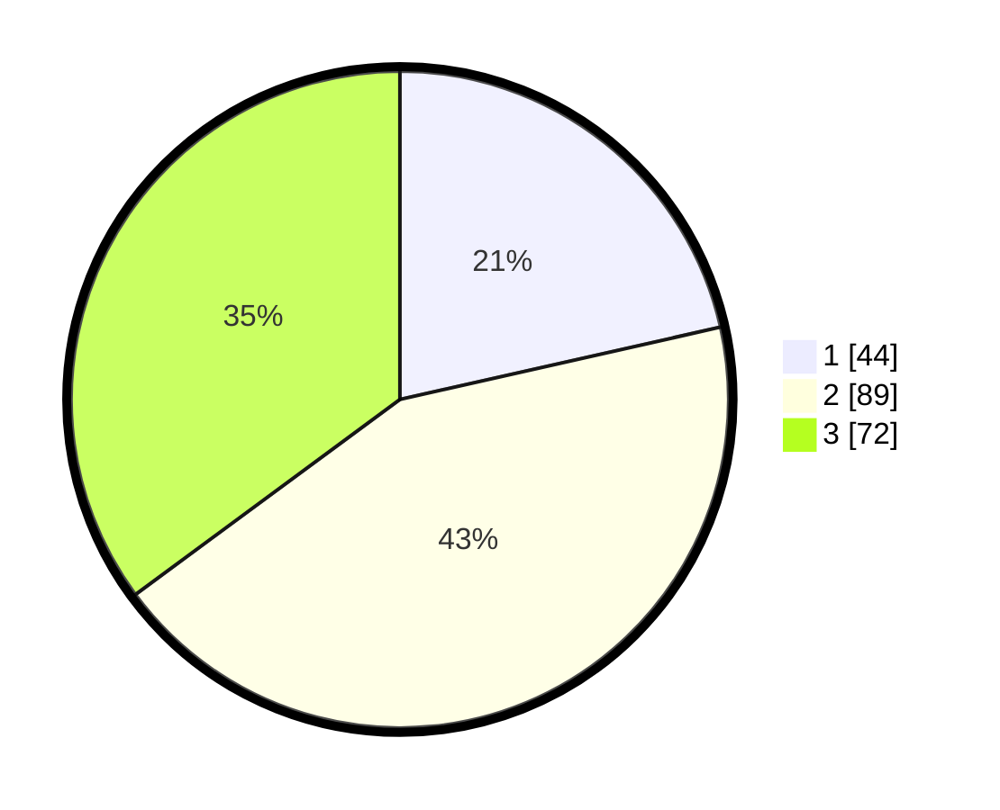

# Hasil

## Grafik

## Tabel

| No. | Nama Paslon    | Suara | Suara (raw) | Persentase |
|:--- |:-------------- | -----:| -----------:| ----------:|
| 1   | ANIES MUHAIMIN | 44    | [44][p-1]   | 21,46      |
| 2   | PRABOWO GIBRAN | 89    | [89][p-2]   | 43,41      |
| 3   | GANJAR MAHFUD  | 72    | [72][p-3]   | 35,12      |

[p-1]: https://github.com/gigit-pemilu/pemilu-2024-34-di-yogyakarta/blob/main/pilpres/hitung-suara/sub/34-di-yogyakarta/sub/04-sleman/sub/07-depok/sub/2002-maguwoharjo/sub/047-tps/sub/paslon-1.txt
[p-2]: https://github.com/gigit-pemilu/pemilu-2024-34-di-yogyakarta/blob/main/pilpres/hitung-suara/sub/34-di-yogyakarta/sub/04-sleman/sub/07-depok/sub/2002-maguwoharjo/sub/047-tps/sub/paslon-2.txt
[p-3]: https://github.com/gigit-pemilu/pemilu-2024-34-di-yogyakarta/blob/main/pilpres/hitung-suara/sub/34-di-yogyakarta/sub/04-sleman/sub/07-depok/sub/2002-maguwoharjo/sub/047-tps/sub/paslon-3.txt

## Foto C Plano

https://sirekap-obj-formc.kpu.go.id/f135/pemilu/ppwp/34/04/07/20/02/3404072002047-20240214-155903--ca5dbb23-4f57-4c16-ab20-fc43356aeeff.jpg

https://sirekap-obj-formc.kpu.go.id/f135/pemilu/ppwp/34/04/07/20/02/3404072002047-20240214-204048--82c61996-856c-4a75-9b46-22c805fb3412.jpg

https://sirekap-obj-formc.kpu.go.id/f135/pemilu/ppwp/34/04/07/20/02/3404072002047-20240214-224954--f0b6925c-1edb-48d7-9470-36266a77d959.jpg

## Metadata

| Key        | Value               |
| ---------- | ------------------- |
| Time Stamp | 2024-02-25 11:00:00 |

