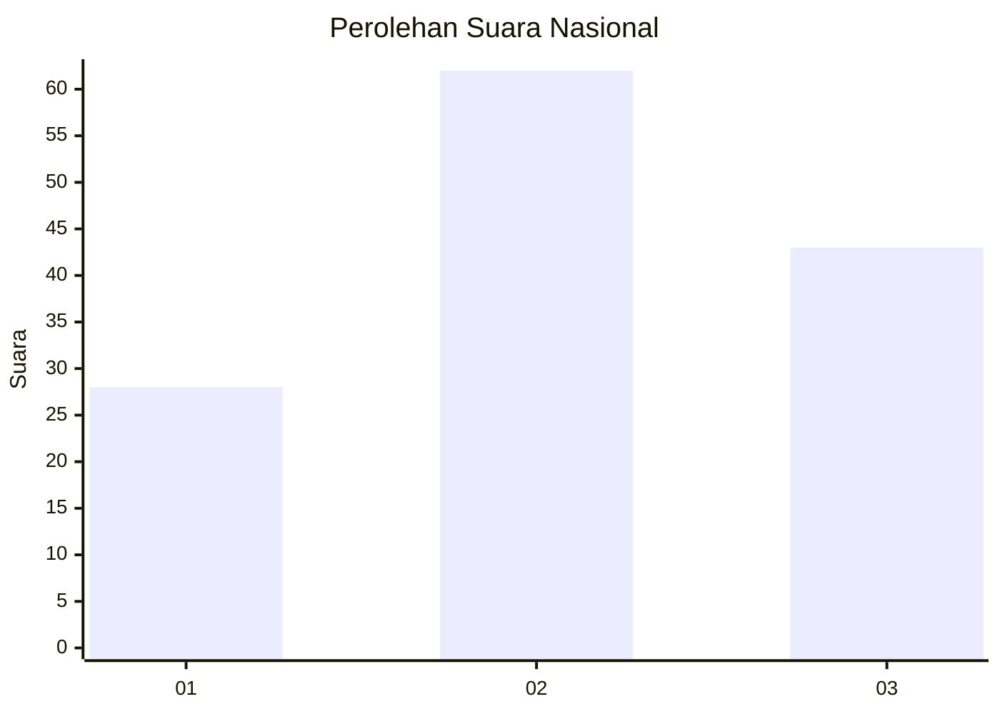
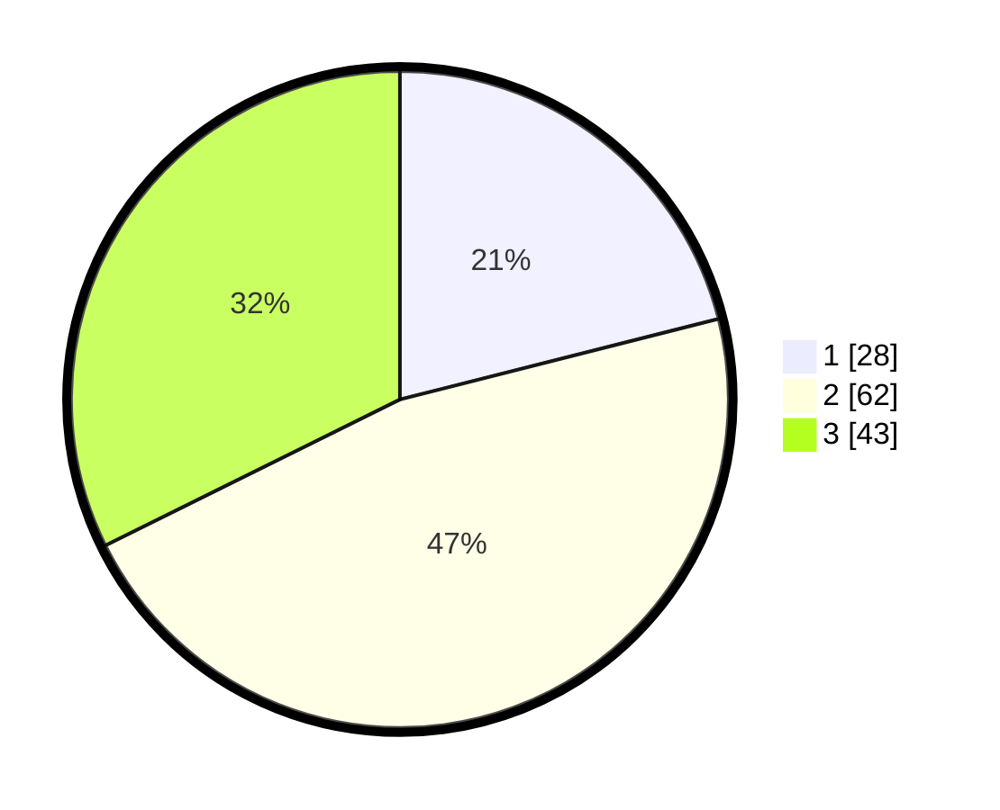

# Hasil

## Grafik

## Tabel

| No. | Nama Paslon    | Suara | Suara (raw) | Persentase |
|:--- |:-------------- | -----:| -----------:| ----------:|
| 1   | ANIES MUHAIMIN | 28    | [28][p-1]   | 21,05      |
| 2   | PRABOWO GIBRAN | 62    | [62][p-2]   | 46,62      |
| 3   | GANJAR MAHFUD  | 43    | [43][p-3]   | 32,33      |

[p-1]: https://github.com/gigit-pemilu/pemilu-2024/blob/main/pilpres/hitung-suara/sub/34-di-yogyakarta/sub/04-sleman/sub/07-depok/sub/2002-maguwoharjo/sub/049-tps/sub/paslon-1.txt
[p-2]: https://github.com/gigit-pemilu/pemilu-2024/blob/main/pilpres/hitung-suara/sub/34-di-yogyakarta/sub/04-sleman/sub/07-depok/sub/2002-maguwoharjo/sub/049-tps/sub/paslon-2.txt
[p-3]: https://github.com/gigit-pemilu/pemilu-2024/blob/main/pilpres/hitung-suara/sub/34-di-yogyakarta/sub/04-sleman/sub/07-depok/sub/2002-maguwoharjo/sub/049-tps/sub/paslon-3.txt

## Foto C Plano

https://sirekap-obj-formc.kpu.go.id/85c6/pemilu/ppwp/34/04/07/20/02/3404072002049-20240214-213910--f9ca7dbb-dcd6-45e4-9898-ecbf11bf0e55.jpg

https://sirekap-obj-formc.kpu.go.id/85c6/pemilu/ppwp/34/04/07/20/02/3404072002049-20240214-213915--dc4209e6-1b8d-4e45-9067-36082d8a57b9.jpg

## Metadata

| Key        | Value               |
| ---------- | ------------------- |
| Time Stamp | 2024-02-15 15:00:29 |

