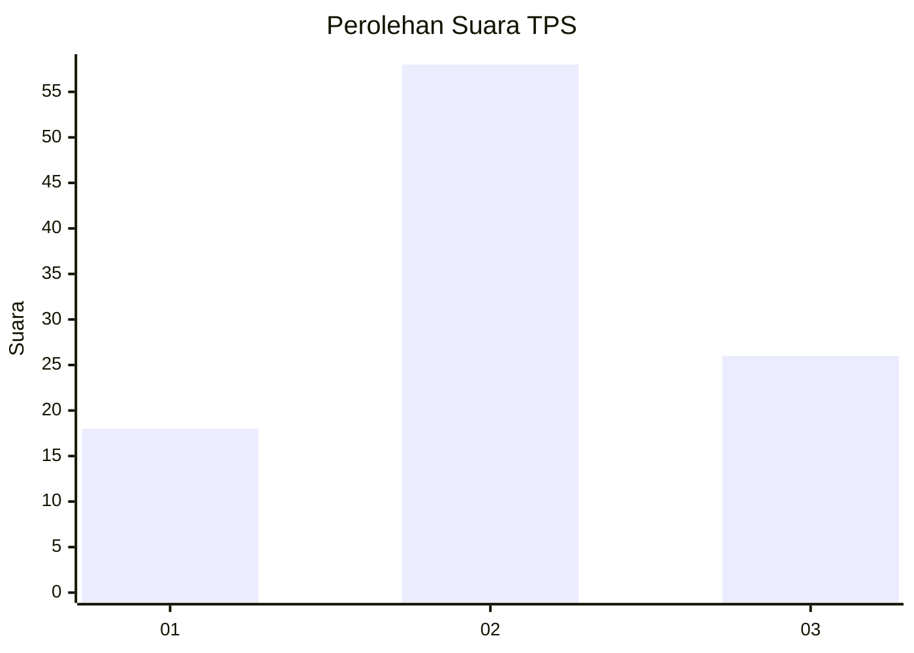
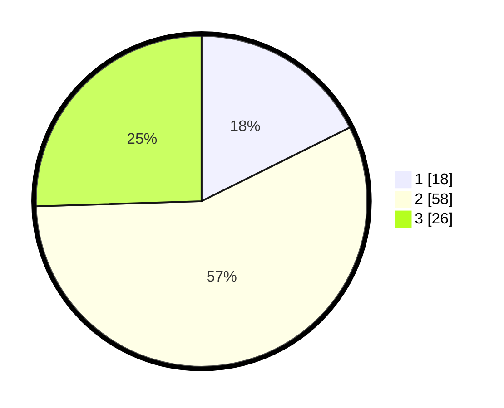

# Hasil

## Grafik

## Tabel

| No. | Nama Paslon    | Suara | Suara (raw) | Persentase |
|:--- |:-------------- | -----:| -----------:| ----------:|
| 1   | ANIES MUHAIMIN | 18    | [18][p-1]   | 17,65      |
| 2   | PRABOWO GIBRAN | 58    | [58][p-2]   | 56,86      |
| 3   | GANJAR MAHFUD  | 26    | [26][p-3]   | 25,49      |

[p-1]: https://github.com/gigit-pemilu/pemilu-2024-34-di-yogyakarta/blob/main/pilpres/hitung-suara/sub/34-di-yogyakarta/sub/04-sleman/sub/07-depok/sub/2002-maguwoharjo/sub/052-tps/sub/paslon-1.txt
[p-2]: https://github.com/gigit-pemilu/pemilu-2024-34-di-yogyakarta/blob/main/pilpres/hitung-suara/sub/34-di-yogyakarta/sub/04-sleman/sub/07-depok/sub/2002-maguwoharjo/sub/052-tps/sub/paslon-2.txt
[p-3]: https://github.com/gigit-pemilu/pemilu-2024-34-di-yogyakarta/blob/main/pilpres/hitung-suara/sub/34-di-yogyakarta/sub/04-sleman/sub/07-depok/sub/2002-maguwoharjo/sub/052-tps/sub/paslon-3.txt

## Foto C Plano

https://sirekap-obj-formc.kpu.go.id/c917/pemilu/ppwp/34/04/07/20/02/3404072002052-20240216-053947--30dd539b-7cb3-4b48-a511-add632c540ef.jpg

https://sirekap-obj-formc.kpu.go.id/c917/pemilu/ppwp/34/04/07/20/02/3404072002052-20240216-053949--97b8d412-f842-409f-8d25-80dbb31e2995.jpg

https://sirekap-obj-formc.kpu.go.id/c917/pemilu/ppwp/34/04/07/20/02/3404072002052-20240216-053948--afecf5c3-7bb4-4b53-bc2d-605269f9b7aa.jpg

## Metadata

| Key        | Value               |
| ---------- | ------------------- |
| Time Stamp | 2024-02-16 21:01:00 |

## DATA PEMILIH TETAP

Jumlah pemilih dalam DPT: **117**.
 * L: **60**.
 * P: **57**.

## DATA PENGGUNA HAK PILIH

Jumlah pengguna hak pilih dalam DPT: **99**.
 * L: **48**.
 * P: **51**.

Jumlah pengguna hak pilih dalam DPTb: **3**.
 * L: **1**.
 * P: **2**.

Jumlah pengguna hak pilih dalam DPK: **2**.
 * L: **1**.
 * P: **1**.

Jumlah pengguna hak pilih: **104**.
 * L: **50**.
 * P: **54**.

## JUMLAH SUARA SAH DAN TIDAK SAH

JUMLAH SELURUH SUARA SAH: **102**.

JUMLAH SUARA TIDAK SAH: **2**.

JUMLAH SELURUH SUARA SAH DAN SUARA TIDAK SAH: **104**.

