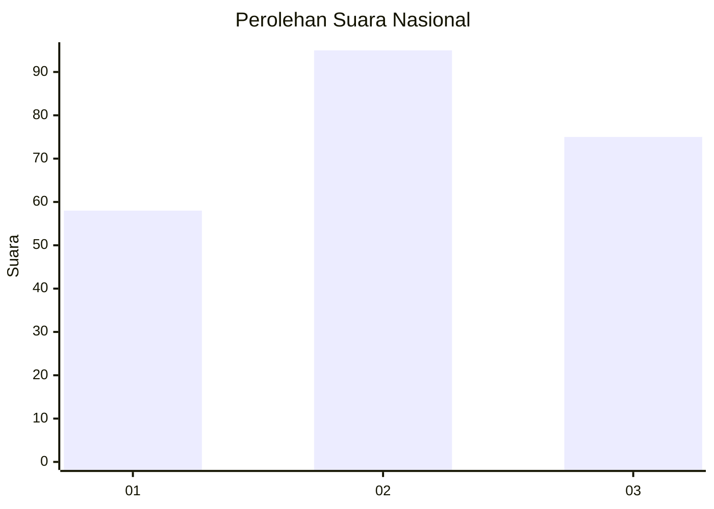
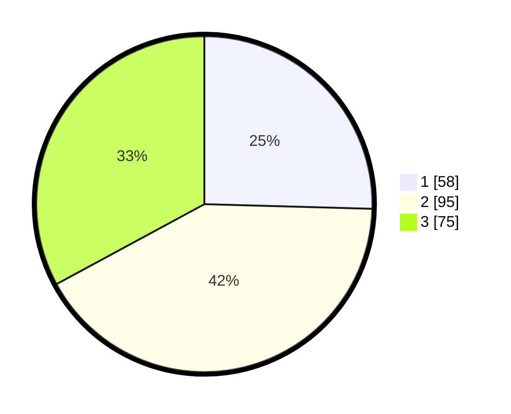

# Hasil

## Grafik

## Tabel

| No. | Nama Paslon    | Suara | Suara (raw) | Persentase |
|:--- |:-------------- | -----:| -----------:| ----------:|
| 1   | ANIES MUHAIMIN | 58    | [58][p-1]   | 25,44      |
| 2   | PRABOWO GIBRAN | 95    | [95][p-2]   | 41,67      |
| 3   | GANJAR MAHFUD  | 75    | [75][p-3]   | 32,89      |

[p-1]: https://github.com/gigit-pemilu/pemilu-2024/blob/main/pilpres/hitung-suara/sub/34-di-yogyakarta/sub/04-sleman/sub/07-depok/sub/2002-maguwoharjo/sub/058-tps/sub/paslon-1.txt
[p-2]: https://github.com/gigit-pemilu/pemilu-2024/blob/main/pilpres/hitung-suara/sub/34-di-yogyakarta/sub/04-sleman/sub/07-depok/sub/2002-maguwoharjo/sub/058-tps/sub/paslon-2.txt
[p-3]: https://github.com/gigit-pemilu/pemilu-2024/blob/main/pilpres/hitung-suara/sub/34-di-yogyakarta/sub/04-sleman/sub/07-depok/sub/2002-maguwoharjo/sub/058-tps/sub/paslon-3.txt

## Foto C Plano

https://sirekap-obj-formc.kpu.go.id/54c5/pemilu/ppwp/34/04/07/20/02/3404072002058-20240214-200648--c4a9e0be-d757-40a0-aaf8-6f9ae0443787.jpg

https://sirekap-obj-formc.kpu.go.id/54c5/pemilu/ppwp/34/04/07/20/02/3404072002058-20240214-200820--eca12d8b-7ed1-4565-8375-dd53a739674a.jpg

https://sirekap-obj-formc.kpu.go.id/54c5/pemilu/ppwp/34/04/07/20/02/3404072002058-20240214-192447--602e8161-2938-4212-90a0-ada98dc966bf.jpg

## Metadata

| Key        | Value               |
| ---------- | ------------------- |
| Time Stamp | 2024-02-24 22:31:28 |

