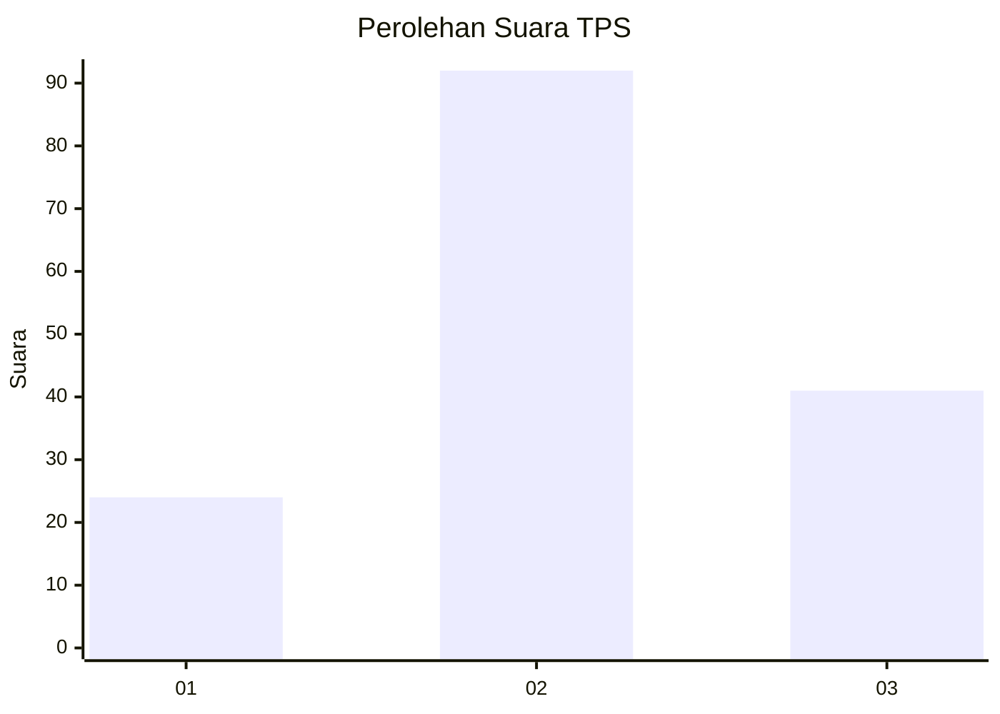
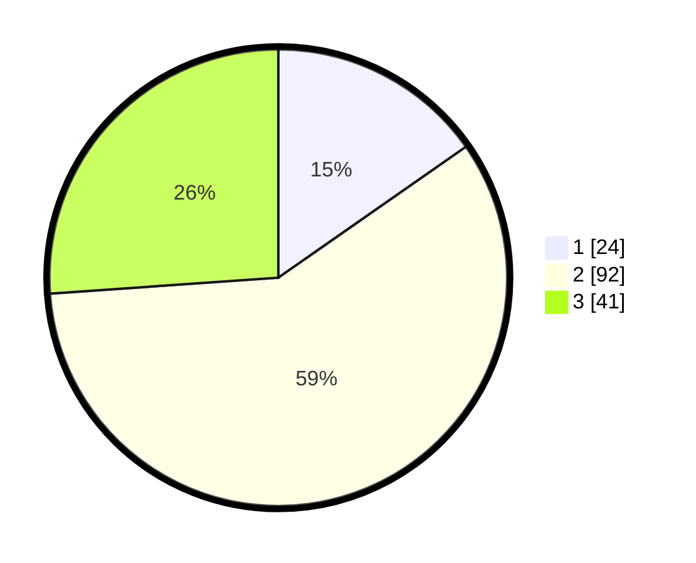

# Hasil

## Grafik

## Tabel

| No. | Nama Paslon    | Suara | Suara (raw) | Persentase |
|:--- |:-------------- | -----:| -----------:| ----------:|
| 1   | ANIES MUHAIMIN | 24    | [24][p-1]   | 15,29      |
| 2   | PRABOWO GIBRAN | 92    | [92][p-2]   | 58,60      |
| 3   | GANJAR MAHFUD  | 41    | [41][p-3]   | 26,11      |

[p-1]: https://github.com/gigit-pemilu/pemilu-2024-34-di-yogyakarta/blob/main/pilpres/hitung-suara/sub/34-di-yogyakarta/sub/04-sleman/sub/07-depok/sub/2002-maguwoharjo/sub/060-tps/sub/paslon-1.txt
[p-2]: https://github.com/gigit-pemilu/pemilu-2024-34-di-yogyakarta/blob/main/pilpres/hitung-suara/sub/34-di-yogyakarta/sub/04-sleman/sub/07-depok/sub/2002-maguwoharjo/sub/060-tps/sub/paslon-2.txt
[p-3]: https://github.com/gigit-pemilu/pemilu-2024-34-di-yogyakarta/blob/main/pilpres/hitung-suara/sub/34-di-yogyakarta/sub/04-sleman/sub/07-depok/sub/2002-maguwoharjo/sub/060-tps/sub/paslon-3.txt

## Foto C Plano

https://sirekap-obj-formc.kpu.go.id/9639/pemilu/ppwp/34/04/07/20/02/3404072002060-20240214-233204--bcb697b9-ea61-406b-93b2-b7000f70d48d.jpg

https://sirekap-obj-formc.kpu.go.id/9639/pemilu/ppwp/34/04/07/20/02/3404072002060-20240214-233237--5c087609-9c0b-4f79-96bd-8b0fa0151141.jpg

https://sirekap-obj-formc.kpu.go.id/9639/pemilu/ppwp/34/04/07/20/02/3404072002060-20240214-234401--44a8af60-a2c6-42bf-8a64-08084919641a.jpg

## Metadata

| Key        | Value               |
| ---------- | ------------------- |
| Time Stamp | 2024-02-16 22:01:00 |

