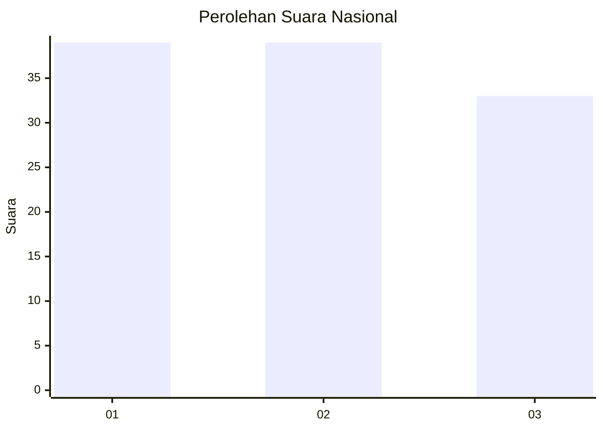
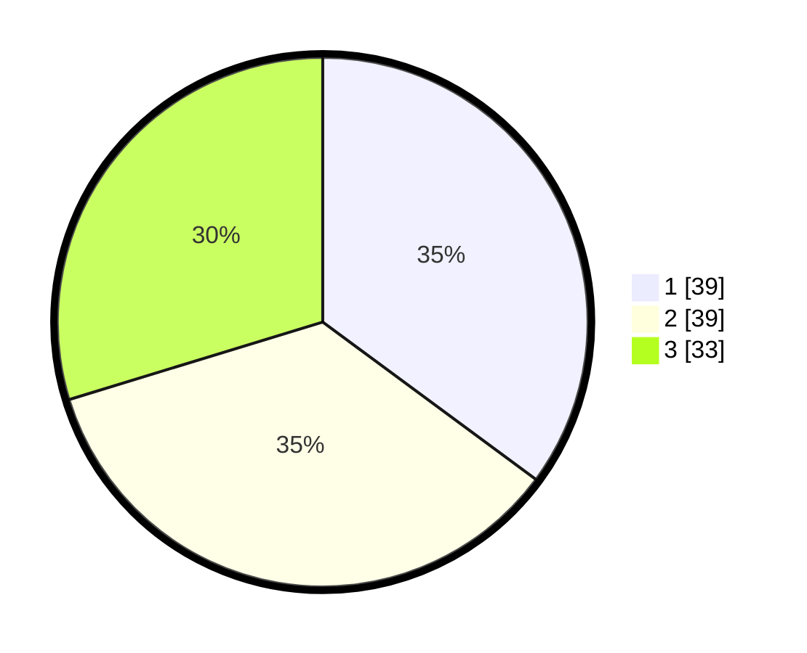

# Hasil

## Grafik

## Tabel

| No. | Nama Paslon    | Suara | Suara (raw) | Persentase |
|:--- |:-------------- | -----:| -----------:| ----------:|
| 1   | ANIES MUHAIMIN | 39    | [39][p-1]   | 35,14      |
| 2   | PRABOWO GIBRAN | 39    | [39][p-2]   | 35,14      |
| 3   | GANJAR MAHFUD  | 33    | [33][p-3]   | 29,73      |

[p-1]: https://github.com/gigit-pemilu/pemilu-2024/blob/main/pilpres/hitung-suara/sub/34-di-yogyakarta/sub/04-sleman/sub/07-depok/sub/2002-maguwoharjo/sub/066-tps/sub/paslon-1.txt
[p-2]: https://github.com/gigit-pemilu/pemilu-2024/blob/main/pilpres/hitung-suara/sub/34-di-yogyakarta/sub/04-sleman/sub/07-depok/sub/2002-maguwoharjo/sub/066-tps/sub/paslon-2.txt
[p-3]: https://github.com/gigit-pemilu/pemilu-2024/blob/main/pilpres/hitung-suara/sub/34-di-yogyakarta/sub/04-sleman/sub/07-depok/sub/2002-maguwoharjo/sub/066-tps/sub/paslon-3.txt

## Foto C Plano

https://sirekap-obj-formc.kpu.go.id/206c/pemilu/ppwp/34/04/07/20/02/3404072002066-20240214-203005--6aa9a46f-3978-4da9-a1c2-aa74899aa481.jpg

https://sirekap-obj-formc.kpu.go.id/206c/pemilu/ppwp/34/04/07/20/02/3404072002066-20240214-203409--e4e156ce-9915-4013-848b-abdb54f44171.jpg

https://sirekap-obj-formc.kpu.go.id/206c/pemilu/ppwp/34/04/07/20/02/3404072002066-20240214-203525--11aa645a-4e6f-4cf5-ba69-4d4844d2b7c3.jpg

## Metadata

| Key        | Value               |
| ---------- | ------------------- |
| Time Stamp | 2024-02-17 13:37:34 |

