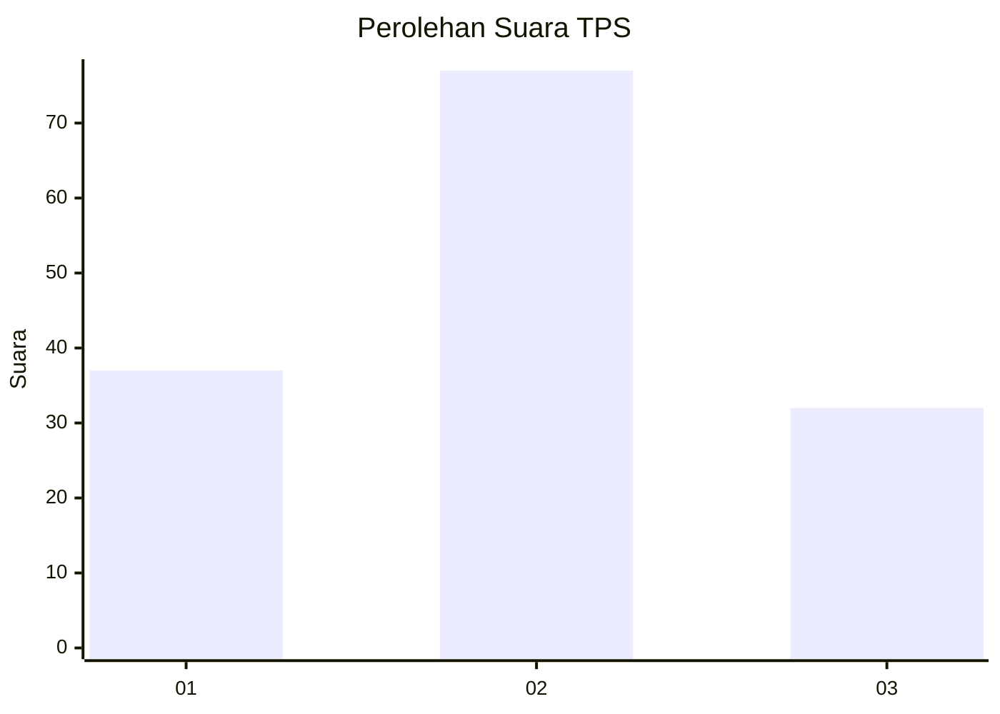
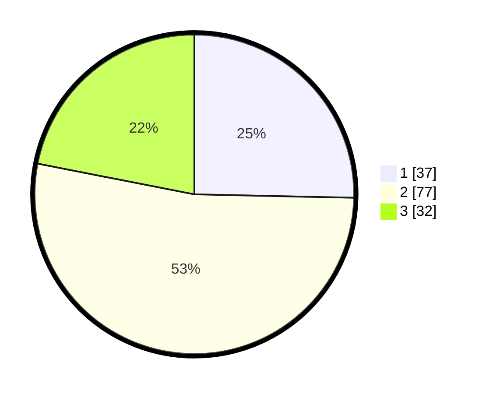

# Hasil

## Grafik

## Tabel

| No. | Nama Paslon    | Suara | Suara (raw) | Persentase |
|:--- |:-------------- | -----:| -----------:| ----------:|
| 1   | ANIES MUHAIMIN | 37    | [37][p-1]   | 25,34      |
| 2   | PRABOWO GIBRAN | 77    | [77][p-2]   | 52,74      |
| 3   | GANJAR MAHFUD  | 32    | [32][p-3]   | 21,92      |

[p-1]: https://github.com/gigit-pemilu/pemilu-2024-34-di-yogyakarta/blob/main/pilpres/hitung-suara/sub/34-di-yogyakarta/sub/04-sleman/sub/07-depok/sub/2002-maguwoharjo/sub/070-tps/sub/paslon-1.txt
[p-2]: https://github.com/gigit-pemilu/pemilu-2024-34-di-yogyakarta/blob/main/pilpres/hitung-suara/sub/34-di-yogyakarta/sub/04-sleman/sub/07-depok/sub/2002-maguwoharjo/sub/070-tps/sub/paslon-2.txt
[p-3]: https://github.com/gigit-pemilu/pemilu-2024-34-di-yogyakarta/blob/main/pilpres/hitung-suara/sub/34-di-yogyakarta/sub/04-sleman/sub/07-depok/sub/2002-maguwoharjo/sub/070-tps/sub/paslon-3.txt

## Foto C Plano

https://sirekap-obj-formc.kpu.go.id/91dd/pemilu/ppwp/34/04/07/20/02/3404072002070-20240214-215111--0407ee21-b760-472c-82a6-52ae7fd3a413.jpg

https://sirekap-obj-formc.kpu.go.id/91dd/pemilu/ppwp/34/04/07/20/02/3404072002070-20240214-215324--8ff1f2af-acee-4ece-838a-fea6fe44bcfc.jpg

https://sirekap-obj-formc.kpu.go.id/91dd/pemilu/ppwp/34/04/07/20/02/3404072002070-20240214-215436--38f478e0-a5cd-41f0-a5a7-138bccbc64ed.jpg

## Metadata

| Key        | Value               |
| ---------- | ------------------- |
| Time Stamp | 2024-02-15 15:00:29 |

