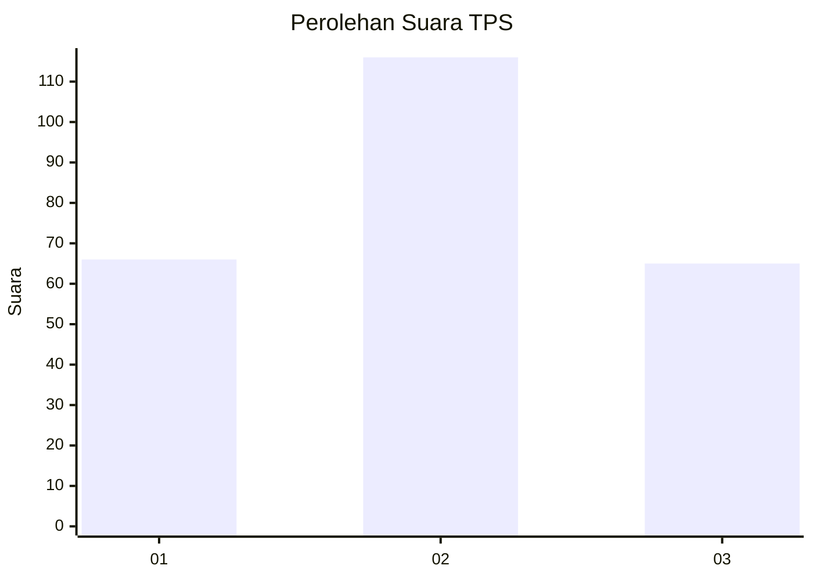
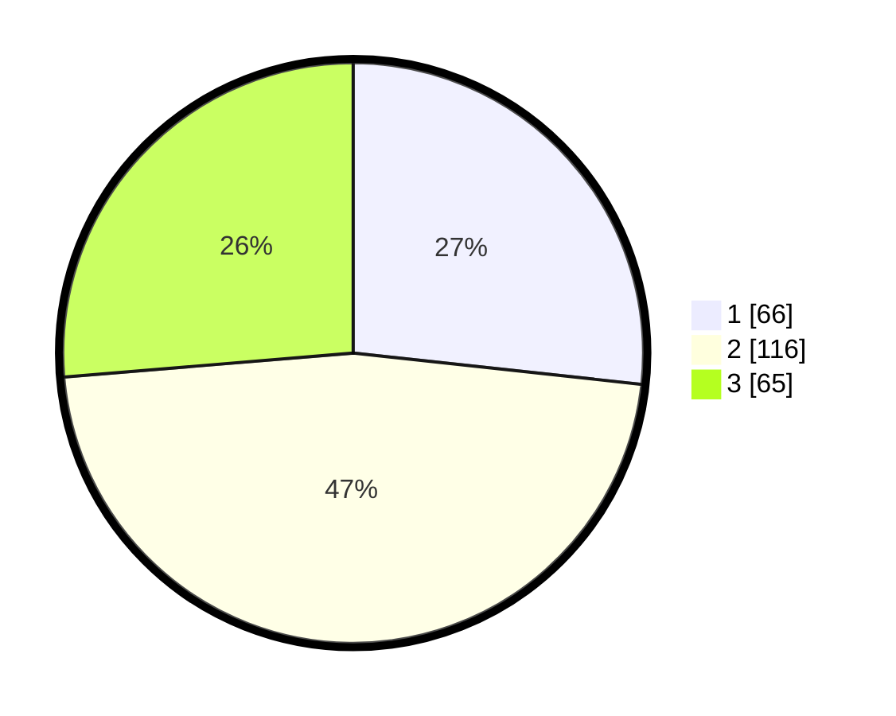

# Hasil

## Grafik

## Tabel

| No. | Nama Paslon    | Suara | Suara (raw) | Persentase |
|:--- |:-------------- | -----:| -----------:| ----------:|
| 1   | ANIES MUHAIMIN | 66    | [66][p-1]   | 26,72      |
| 2   | PRABOWO GIBRAN | 116   | [116][p-2]  | 46,96      |
| 3   | GANJAR MAHFUD  | 65    | [65][p-3]   | 26,32      |

[p-1]: https://github.com/gigit-pemilu/pemilu-2024-34-di-yogyakarta/blob/main/pilpres/hitung-suara/sub/34-di-yogyakarta/sub/04-sleman/sub/07-depok/sub/2002-maguwoharjo/sub/073-tps/sub/paslon-1.txt
[p-2]: https://github.com/gigit-pemilu/pemilu-2024-34-di-yogyakarta/blob/main/pilpres/hitung-suara/sub/34-di-yogyakarta/sub/04-sleman/sub/07-depok/sub/2002-maguwoharjo/sub/073-tps/sub/paslon-2.txt
[p-3]: https://github.com/gigit-pemilu/pemilu-2024-34-di-yogyakarta/blob/main/pilpres/hitung-suara/sub/34-di-yogyakarta/sub/04-sleman/sub/07-depok/sub/2002-maguwoharjo/sub/073-tps/sub/paslon-3.txt

## Foto C Plano

https://sirekap-obj-formc.kpu.go.id/b38f/pemilu/ppwp/34/04/07/20/02/3404072002073-20240214-220608--dada4eb8-fa8b-4090-8e19-1dc08a2ff1ca.jpg

https://sirekap-obj-formc.kpu.go.id/b38f/pemilu/ppwp/34/04/07/20/02/3404072002073-20240214-220714--49244f7b-90ff-4dc7-981b-e7b4b83fc29e.jpg

https://sirekap-obj-formc.kpu.go.id/b38f/pemilu/ppwp/34/04/07/20/02/3404072002073-20240214-220739--3af54dbf-0d83-4b20-a39d-53096bb50d20.jpg

## Metadata

| Key        | Value               |
| ---------- | ------------------- |
| Time Stamp | 2024-02-15 15:00:29 |

