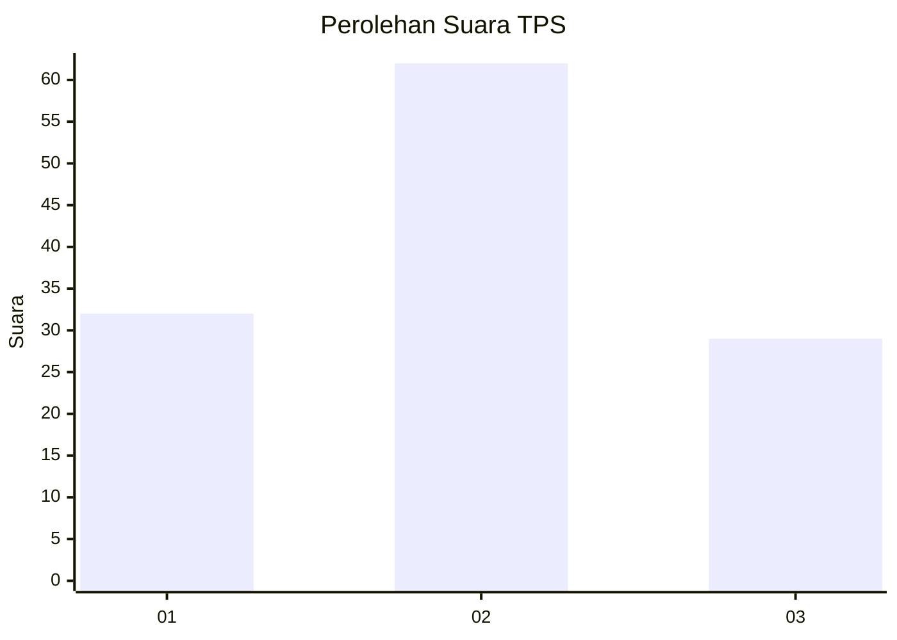
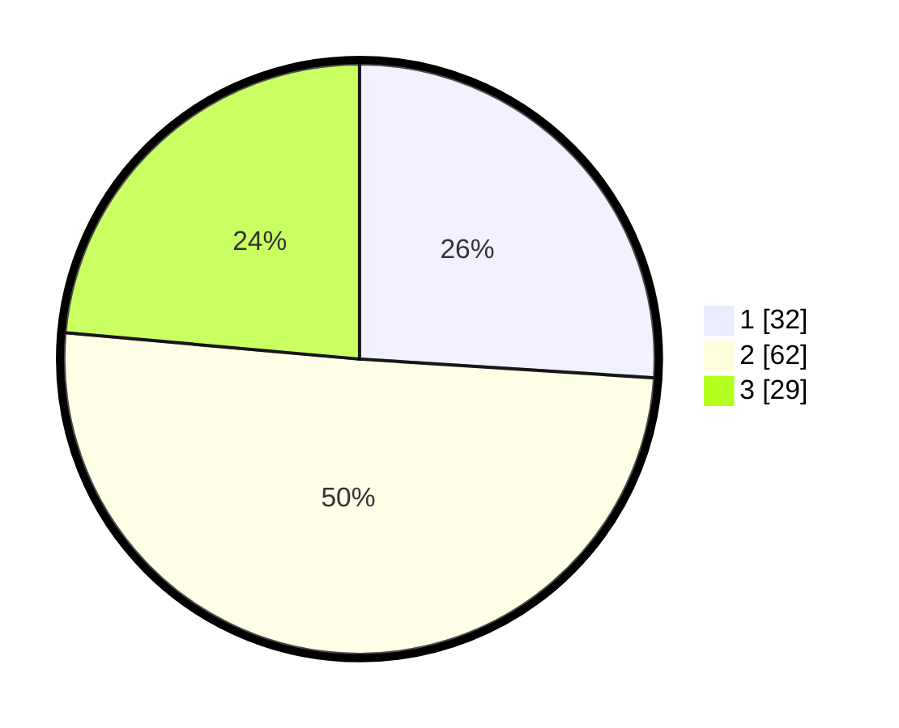

# Hasil

## Grafik

## Tabel

| No. | Nama Paslon    | Suara | Suara (raw) | Persentase |
|:--- |:-------------- | -----:| -----------:| ----------:|
| 1   | ANIES MUHAIMIN | 32    | [32][p-1]   | 26,02      |
| 2   | PRABOWO GIBRAN | 62    | [62][p-2]   | 50,41      |
| 3   | GANJAR MAHFUD  | 29    | [29][p-3]   | 23,58      |

[p-1]: https://github.com/gigit-pemilu/pemilu-2024-34-di-yogyakarta/blob/main/pilpres/hitung-suara/sub/34-di-yogyakarta/sub/04-sleman/sub/07-depok/sub/2002-maguwoharjo/sub/098-tps/sub/paslon-1.txt
[p-2]: https://github.com/gigit-pemilu/pemilu-2024-34-di-yogyakarta/blob/main/pilpres/hitung-suara/sub/34-di-yogyakarta/sub/04-sleman/sub/07-depok/sub/2002-maguwoharjo/sub/098-tps/sub/paslon-2.txt
[p-3]: https://github.com/gigit-pemilu/pemilu-2024-34-di-yogyakarta/blob/main/pilpres/hitung-suara/sub/34-di-yogyakarta/sub/04-sleman/sub/07-depok/sub/2002-maguwoharjo/sub/098-tps/sub/paslon-3.txt

## Foto C Plano

https://sirekap-obj-formc.kpu.go.id/7cac/pemilu/ppwp/34/04/07/20/02/3404072002098-20240214-231227--48b9c4d2-e812-446c-b642-f7928f818a4b.jpg

https://sirekap-obj-formc.kpu.go.id/7cac/pemilu/ppwp/34/04/07/20/02/3404072002098-20240214-231407--b0ee9335-5adf-44cb-b536-220db8112b4d.jpg

https://sirekap-obj-formc.kpu.go.id/7cac/pemilu/ppwp/34/04/07/20/02/3404072002098-20240214-231554--81030ef8-1181-4596-99e3-71f3baa244ff.jpg

## Metadata

| Key        | Value               |
| ---------- | ------------------- |
| Time Stamp | 2024-02-15 15:30:25 |

