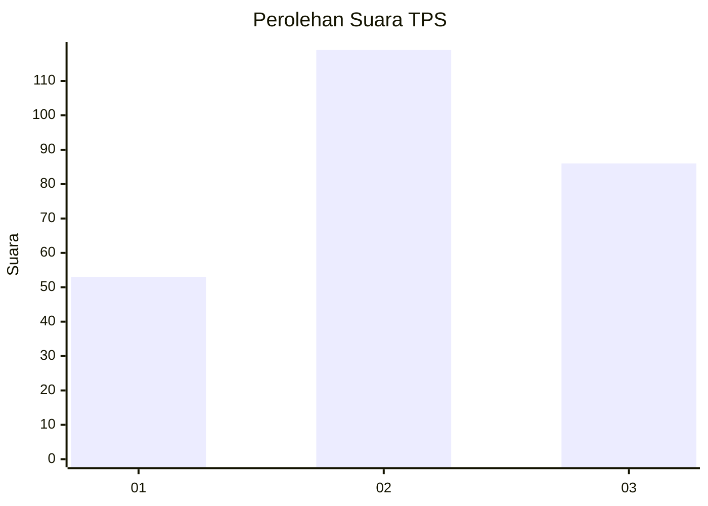
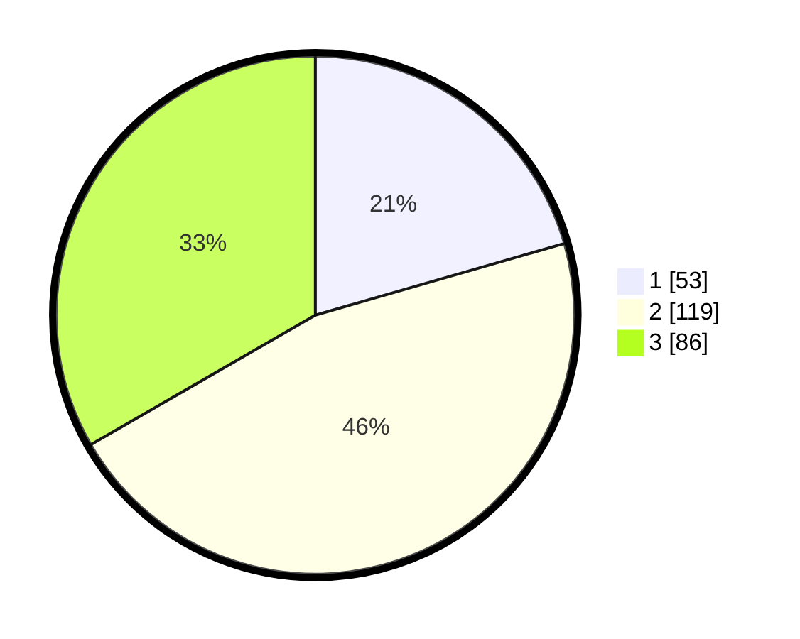

# Hasil

## Grafik

## Tabel

| No. | Nama Paslon    | Suara | Suara (raw) | Persentase |
|:--- |:-------------- | -----:| -----------:| ----------:|
| 1   | ANIES MUHAIMIN | 53    | [53][p-1]   | 20,54      |
| 2   | PRABOWO GIBRAN | 119   | [119][p-2]  | 46,12      |
| 3   | GANJAR MAHFUD  | 86    | [86][p-3]   | 33,33      |

[p-1]: https://github.com/gigit-pemilu/pemilu-2024-34-di-yogyakarta/blob/main/pilpres/hitung-suara/sub/34-di-yogyakarta/sub/04-sleman/sub/07-depok/sub/2002-maguwoharjo/sub/105-tps/sub/paslon-1.txt
[p-2]: https://github.com/gigit-pemilu/pemilu-2024-34-di-yogyakarta/blob/main/pilpres/hitung-suara/sub/34-di-yogyakarta/sub/04-sleman/sub/07-depok/sub/2002-maguwoharjo/sub/105-tps/sub/paslon-2.txt
[p-3]: https://github.com/gigit-pemilu/pemilu-2024-34-di-yogyakarta/blob/main/pilpres/hitung-suara/sub/34-di-yogyakarta/sub/04-sleman/sub/07-depok/sub/2002-maguwoharjo/sub/105-tps/sub/paslon-3.txt

## Foto C Plano

https://sirekap-obj-formc.kpu.go.id/6b36/pemilu/ppwp/34/04/07/20/02/3404072002105-20240214-224945--46aa0176-5abe-4fc6-ba0c-50e87b941239.jpg

https://sirekap-obj-formc.kpu.go.id/6b36/pemilu/ppwp/34/04/07/20/02/3404072002105-20240214-230458--97c72a21-b36d-4175-b39c-d78116fe39d3.jpg

https://sirekap-obj-formc.kpu.go.id/6b36/pemilu/ppwp/34/04/07/20/02/3404072002105-20240214-230731--bd97556c-3c8f-40f2-92c5-20a99fd2e2bd.jpg

## Metadata

| Key        | Value               |
| ---------- | ------------------- |
| Time Stamp | 2024-02-17 13:37:34 |

