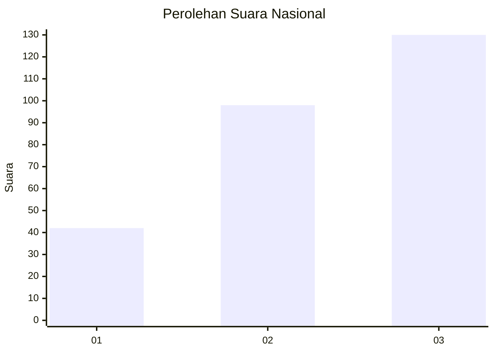
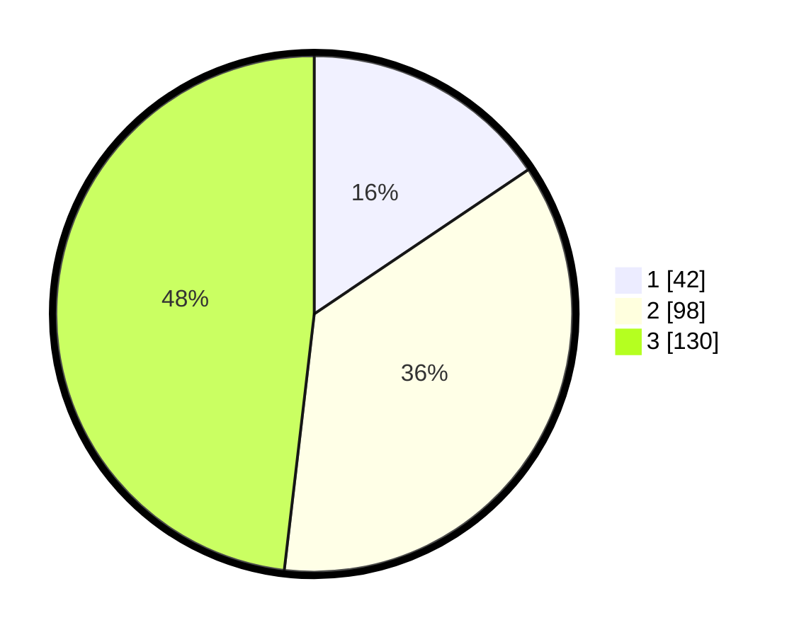

# Hasil

## Grafik

## Tabel

| No. | Nama Paslon    | Suara | Suara (raw) | Persentase |
|:--- |:-------------- | -----:| -----------:| ----------:|
| 1   | ANIES MUHAIMIN | 42    | [42][p-1]   | 15,56      |
| 2   | PRABOWO GIBRAN | 98    | [98][p-2]   | 36,30      |
| 3   | GANJAR MAHFUD  | 130   | [130][p-3]  | 48,15      |

[p-1]: https://github.com/gigit-pemilu/pemilu-2024/blob/main/pilpres/hitung-suara/sub/34-di-yogyakarta/sub/04-sleman/sub/07-depok/sub/2002-maguwoharjo/sub/108-tps/sub/paslon-1.txt
[p-2]: https://github.com/gigit-pemilu/pemilu-2024/blob/main/pilpres/hitung-suara/sub/34-di-yogyakarta/sub/04-sleman/sub/07-depok/sub/2002-maguwoharjo/sub/108-tps/sub/paslon-2.txt
[p-3]: https://github.com/gigit-pemilu/pemilu-2024/blob/main/pilpres/hitung-suara/sub/34-di-yogyakarta/sub/04-sleman/sub/07-depok/sub/2002-maguwoharjo/sub/108-tps/sub/paslon-3.txt

## Foto C Plano

https://sirekap-obj-formc.kpu.go.id/54dc/pemilu/ppwp/34/04/07/20/02/3404072002108-20240214-224836--c50f9480-3ba5-490b-8d3f-30d11e8721d4.jpg

https://sirekap-obj-formc.kpu.go.id/54dc/pemilu/ppwp/34/04/07/20/02/3404072002108-20240214-225110--b2b92b66-fed7-4cf8-9802-1a34e53dfc73.jpg

https://sirekap-obj-formc.kpu.go.id/54dc/pemilu/ppwp/34/04/07/20/02/3404072002108-20240214-225350--e65027ff-f17c-42fa-b0c3-5a444d514e90.jpg

## Metadata

| Key        | Value               |
| ---------- | ------------------- |
| Time Stamp | 2024-02-17 13:37:34 |

