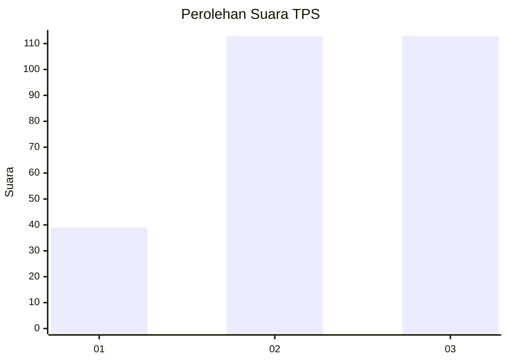
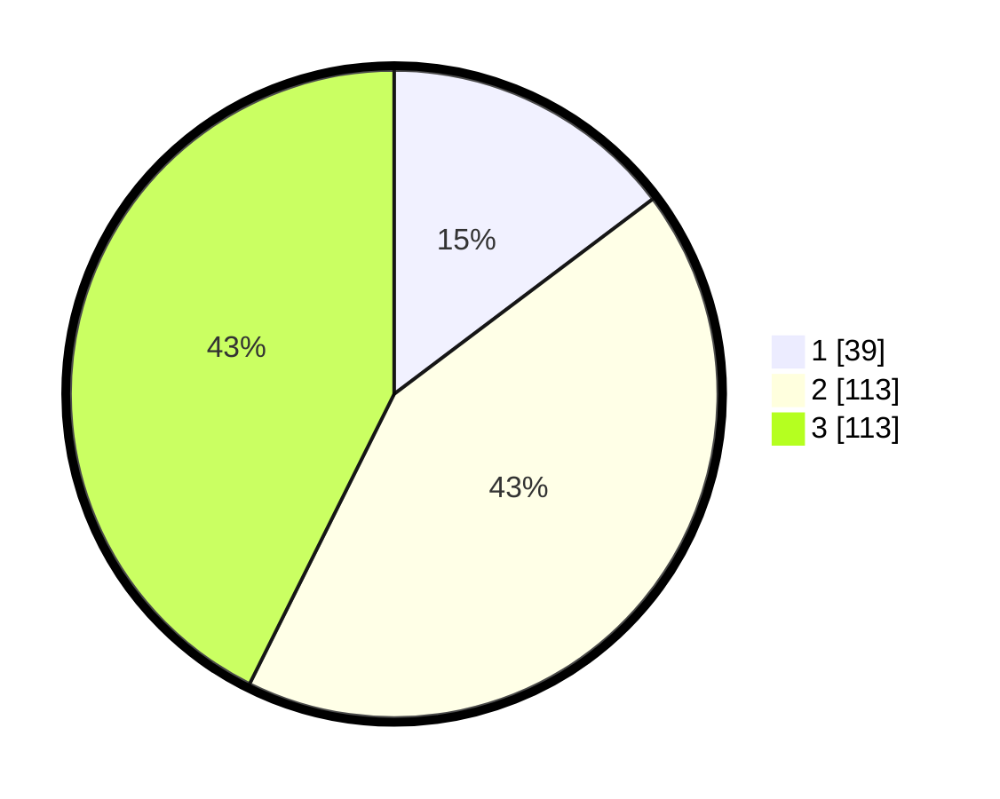

# Hasil

## Grafik

## Tabel

| No. | Nama Paslon    | Suara | Suara (raw) | Persentase |
|:--- |:-------------- | -----:| -----------:| ----------:|
| 1   | ANIES MUHAIMIN | 39    | [39][p-1]   | 14,72      |
| 2   | PRABOWO GIBRAN | 113   | [113][p-2]  | 42,64      |
| 3   | GANJAR MAHFUD  | 113   | [113][p-3]  | 42,64      |

[p-1]: https://github.com/gigit-pemilu/pemilu-2024-34-di-yogyakarta/blob/main/pilpres/hitung-suara/sub/34-di-yogyakarta/sub/04-sleman/sub/07-depok/sub/2002-maguwoharjo/sub/123-tps/sub/paslon-1.txt
[p-2]: https://github.com/gigit-pemilu/pemilu-2024-34-di-yogyakarta/blob/main/pilpres/hitung-suara/sub/34-di-yogyakarta/sub/04-sleman/sub/07-depok/sub/2002-maguwoharjo/sub/123-tps/sub/paslon-2.txt
[p-3]: https://github.com/gigit-pemilu/pemilu-2024-34-di-yogyakarta/blob/main/pilpres/hitung-suara/sub/34-di-yogyakarta/sub/04-sleman/sub/07-depok/sub/2002-maguwoharjo/sub/123-tps/sub/paslon-3.txt

## Foto C Plano

https://sirekap-obj-formc.kpu.go.id/3490/pemilu/ppwp/34/04/07/20/02/3404072002123-20240216-120301--69508f76-133d-4da3-beaa-ec418cd6432d.jpg

https://sirekap-obj-formc.kpu.go.id/3490/pemilu/ppwp/34/04/07/20/02/3404072002123-20240216-120302--f729ba2b-a4c8-4d71-a009-3c6e06f196d1.jpg

https://sirekap-obj-formc.kpu.go.id/3490/pemilu/ppwp/34/04/07/20/02/3404072002123-20240216-120302--99093a97-5c22-4f36-8796-1f690da39514.jpg

## Metadata

| Key        | Value               |
| ---------- | ------------------- |
| Time Stamp | 2024-02-16 22:01:00 |

## DATA PEMILIH TETAP

Jumlah pemilih dalam DPT: **293**.
 * L: **142**.
 * P: **151**.

## DATA PENGGUNA HAK PILIH

Jumlah pengguna hak pilih dalam DPT: **254**.
 * L: **124**.
 * P: **130**.

Jumlah pengguna hak pilih dalam DPTb: **1**.
 * L: **1**.
 * P: **0**.

Jumlah pengguna hak pilih dalam DPK: **15**.
 * L: **7**.
 * P: **8**.

Jumlah pengguna hak pilih: **270**.
 * L: **132**.
 * P: **138**.

## JUMLAH SUARA SAH DAN TIDAK SAH

JUMLAH SELURUH SUARA SAH: **265**.

JUMLAH SUARA TIDAK SAH: **5**.

JUMLAH SELURUH SUARA SAH DAN SUARA TIDAK SAH: **270**.

