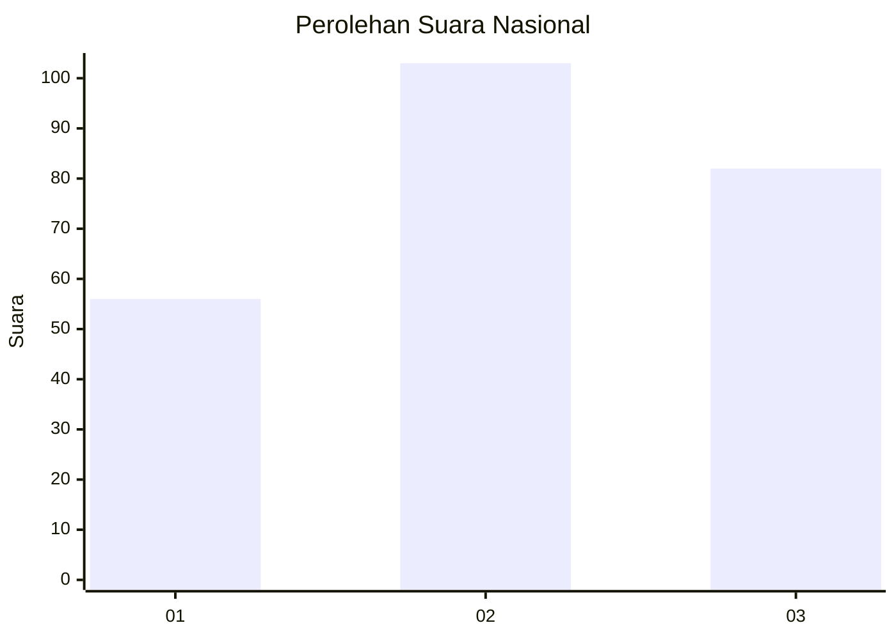
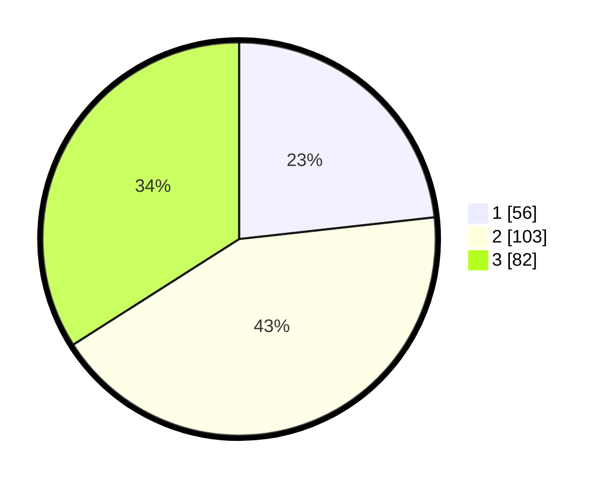

# Hasil

## Grafik

## Tabel

| No. | Nama Paslon    | Suara | Suara (raw) | Persentase |
|:--- |:-------------- | -----:| -----------:| ----------:|
| 1   | ANIES MUHAIMIN | 56    | [56][p-1]   | 23,24      |
| 2   | PRABOWO GIBRAN | 103   | [103][p-2]  | 42,74      |
| 3   | GANJAR MAHFUD  | 82    | [82][p-3]   | 34,02      |

[p-1]: https://github.com/gigit-pemilu/pemilu-2024/blob/main/pilpres/hitung-suara/sub/34-di-yogyakarta/sub/04-sleman/sub/07-depok/sub/2003-condongcatur/sub/001-tps/sub/paslon-1.txt
[p-2]: https://github.com/gigit-pemilu/pemilu-2024/blob/main/pilpres/hitung-suara/sub/34-di-yogyakarta/sub/04-sleman/sub/07-depok/sub/2003-condongcatur/sub/001-tps/sub/paslon-2.txt
[p-3]: https://github.com/gigit-pemilu/pemilu-2024/blob/main/pilpres/hitung-suara/sub/34-di-yogyakarta/sub/04-sleman/sub/07-depok/sub/2003-condongcatur/sub/001-tps/sub/paslon-3.txt

## Foto C Plano

https://sirekap-obj-formc.kpu.go.id/5949/pemilu/ppwp/34/04/07/20/03/3404072003001-20240215-091235--19ed7f1b-e3ec-4efb-af4b-68fa62f4371d.jpg

https://sirekap-obj-formc.kpu.go.id/5949/pemilu/ppwp/34/04/07/20/03/3404072003001-20240215-091349--8ca2d54b-d60b-4c45-8e73-7120f9fe6a99.jpg

https://sirekap-obj-formc.kpu.go.id/5949/pemilu/ppwp/34/04/07/20/03/3404072003001-20240215-091448--10dec808-b2d8-48aa-b951-43c973f574d0.jpg

## Metadata

| Key        | Value               |
| ---------- | ------------------- |
| Time Stamp | 2024-02-15 21:01:18 |

