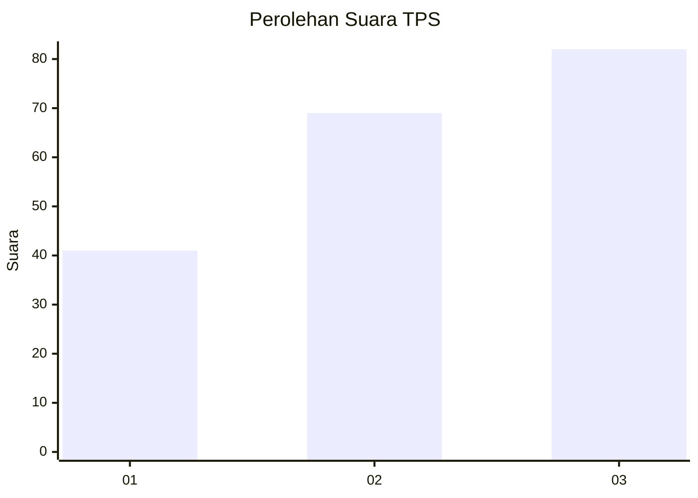
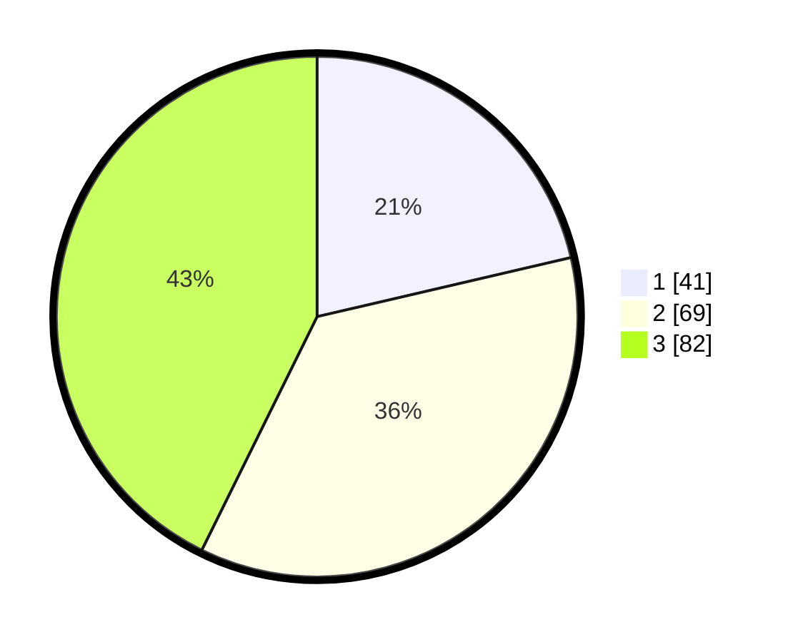

# Hasil

## Grafik

## Tabel

| No. | Nama Paslon    | Suara | Suara (raw) | Persentase |
|:--- |:-------------- | -----:| -----------:| ----------:|
| 1   | ANIES MUHAIMIN | 41    | [41][p-1]   | 21,35      |
| 2   | PRABOWO GIBRAN | 69    | [69][p-2]   | 35,94      |
| 3   | GANJAR MAHFUD  | 82    | [82][p-3]   | 42,71      |

[p-1]: https://github.com/gigit-pemilu/pemilu-2024-34-di-yogyakarta/blob/main/pilpres/hitung-suara/sub/34-di-yogyakarta/sub/04-sleman/sub/07-depok/sub/2003-condongcatur/sub/003-tps/sub/paslon-1.txt
[p-2]: https://github.com/gigit-pemilu/pemilu-2024-34-di-yogyakarta/blob/main/pilpres/hitung-suara/sub/34-di-yogyakarta/sub/04-sleman/sub/07-depok/sub/2003-condongcatur/sub/003-tps/sub/paslon-2.txt
[p-3]: https://github.com/gigit-pemilu/pemilu-2024-34-di-yogyakarta/blob/main/pilpres/hitung-suara/sub/34-di-yogyakarta/sub/04-sleman/sub/07-depok/sub/2003-condongcatur/sub/003-tps/sub/paslon-3.txt

## Foto C Plano

https://sirekap-obj-formc.kpu.go.id/ec55/pemilu/ppwp/34/04/07/20/03/3404072003003-20240216-195253--f0c1e727-c122-47d9-90ec-fb8217142dfe.jpg

https://sirekap-obj-formc.kpu.go.id/ec55/pemilu/ppwp/34/04/07/20/03/3404072003003-20240216-195254--d81a1ac3-4cde-44be-8a1a-54001984af96.jpg

https://sirekap-obj-formc.kpu.go.id/ec55/pemilu/ppwp/34/04/07/20/03/3404072003003-20240216-195253--46fd2aaa-f6cc-4feb-9c5c-fedd171bd776.jpg

## Metadata

| Key        | Value               |
| ---------- | ------------------- |
| Time Stamp | 2024-02-16 22:30:00 |

## DATA PEMILIH TETAP

Jumlah pemilih dalam DPT: **274**.
 * L: **145**.
 * P: **129**.

## DATA PENGGUNA HAK PILIH

Jumlah pengguna hak pilih dalam DPT: **206**.
 * L: **98**.
 * P: **108**.

Jumlah pengguna hak pilih dalam DPTb: **11**.
 * L: **4**.
 * P: **7**.

Jumlah pengguna hak pilih dalam DPK: **6**.
 * L: **3**.
 * P: **3**.

Jumlah pengguna hak pilih: **223**.
 * L: **105**.
 * P: **118**.

## JUMLAH SUARA SAH DAN TIDAK SAH

JUMLAH SELURUH SUARA SAH: **192**.

JUMLAH SUARA TIDAK SAH: **31**.

JUMLAH SELURUH SUARA SAH DAN SUARA TIDAK SAH: **223**.

