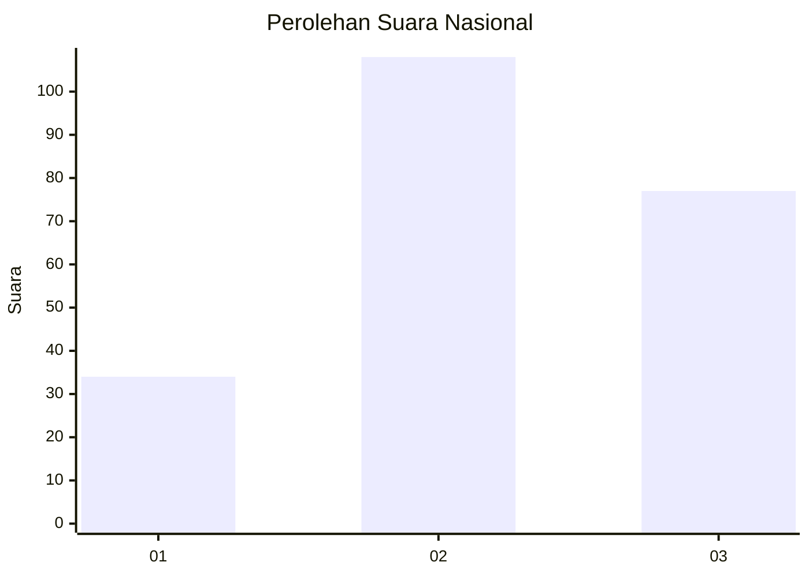
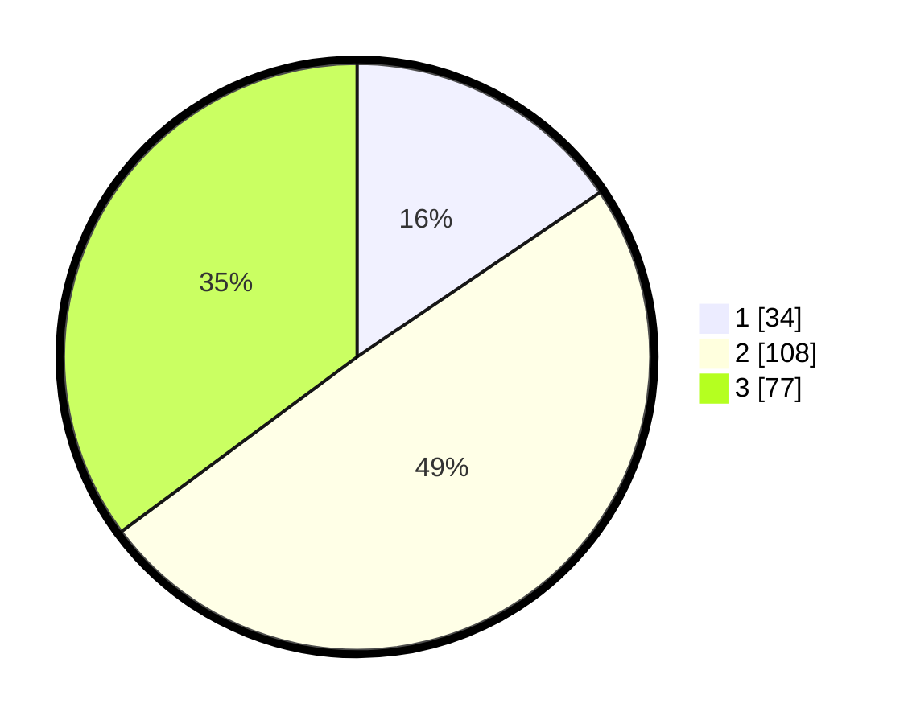

# Hasil

## Grafik

## Tabel

| No. | Nama Paslon    | Suara | Suara (raw) | Persentase |
|:--- |:-------------- | -----:| -----------:| ----------:|
| 1   | ANIES MUHAIMIN | 34    | [34][p-1]   | 15,53      |
| 2   | PRABOWO GIBRAN | 108   | [108][p-2]  | 49,32      |
| 3   | GANJAR MAHFUD  | 77    | [77][p-3]   | 35,16      |

[p-1]: https://github.com/gigit-pemilu/pemilu-2024/blob/main/pilpres/hitung-suara/sub/34-di-yogyakarta/sub/04-sleman/sub/07-depok/sub/2003-condongcatur/sub/006-tps/sub/paslon-1.txt
[p-2]: https://github.com/gigit-pemilu/pemilu-2024/blob/main/pilpres/hitung-suara/sub/34-di-yogyakarta/sub/04-sleman/sub/07-depok/sub/2003-condongcatur/sub/006-tps/sub/paslon-2.txt
[p-3]: https://github.com/gigit-pemilu/pemilu-2024/blob/main/pilpres/hitung-suara/sub/34-di-yogyakarta/sub/04-sleman/sub/07-depok/sub/2003-condongcatur/sub/006-tps/sub/paslon-3.txt

## Foto C Plano

https://sirekap-obj-formc.kpu.go.id/45f4/pemilu/ppwp/34/04/07/20/03/3404072003006-20240217-093446--111fe181-841c-4690-836c-e5660326e933.jpg

https://sirekap-obj-formc.kpu.go.id/45f4/pemilu/ppwp/34/04/07/20/03/3404072003006-20240217-093617--88441163-ec7a-46da-85cc-cc375f7bd3ce.jpg

https://sirekap-obj-formc.kpu.go.id/45f4/pemilu/ppwp/34/04/07/20/03/3404072003006-20240217-093705--908e86a6-4eba-4da8-a9bb-19bd15cba1a8.jpg

## Metadata

| Key        | Value               |
| ---------- | ------------------- |
| Time Stamp | 2024-02-17 12:00:00 |

