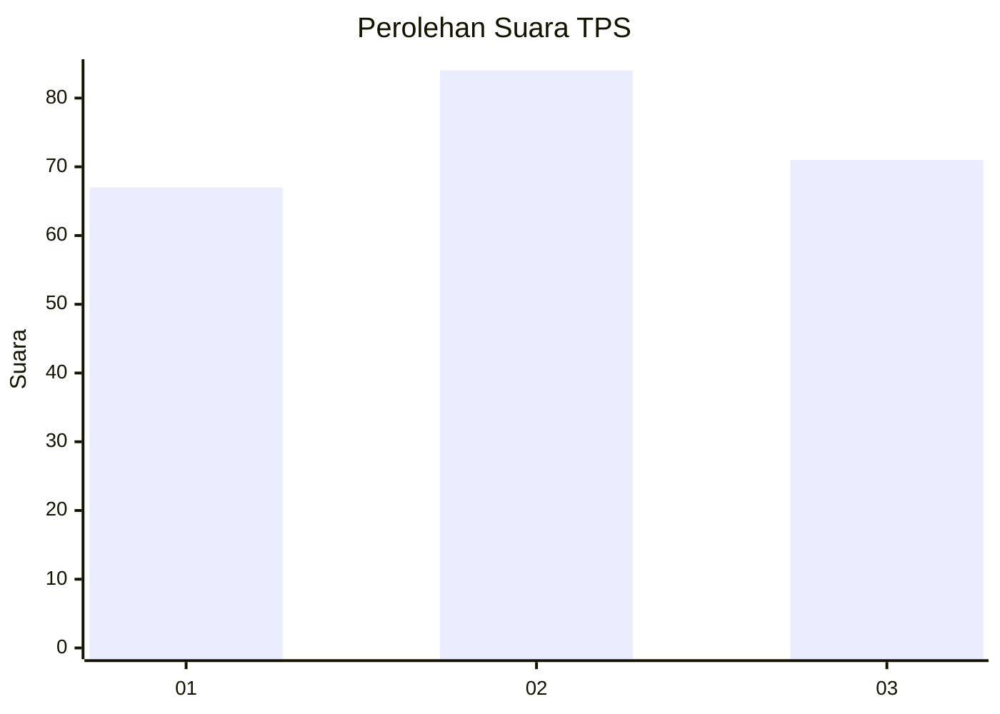
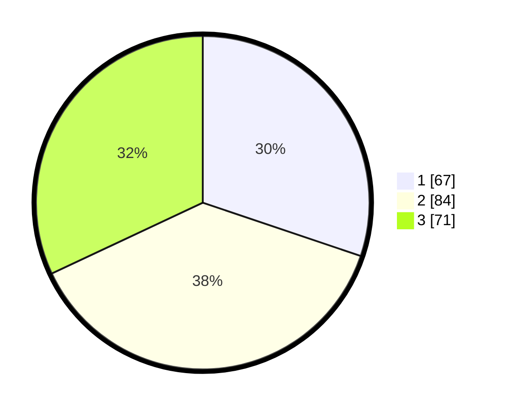

# Hasil

## Grafik

## Tabel

| No. | Nama Paslon    | Suara | Suara (raw) | Persentase |
|:--- |:-------------- | -----:| -----------:| ----------:|
| 1   | ANIES MUHAIMIN | 67    | [67][p-1]   | 30,18      |
| 2   | PRABOWO GIBRAN | 84    | [84][p-2]   | 37,84      |
| 3   | GANJAR MAHFUD  | 71    | [71][p-3]   | 31,98      |

[p-1]: https://github.com/gigit-pemilu/pemilu-2024-34-di-yogyakarta/blob/main/pilpres/hitung-suara/sub/34-di-yogyakarta/sub/04-sleman/sub/07-depok/sub/2003-condongcatur/sub/016-tps/sub/paslon-1.txt
[p-2]: https://github.com/gigit-pemilu/pemilu-2024-34-di-yogyakarta/blob/main/pilpres/hitung-suara/sub/34-di-yogyakarta/sub/04-sleman/sub/07-depok/sub/2003-condongcatur/sub/016-tps/sub/paslon-2.txt
[p-3]: https://github.com/gigit-pemilu/pemilu-2024-34-di-yogyakarta/blob/main/pilpres/hitung-suara/sub/34-di-yogyakarta/sub/04-sleman/sub/07-depok/sub/2003-condongcatur/sub/016-tps/sub/paslon-3.txt

## Foto C Plano

https://sirekap-obj-formc.kpu.go.id/4984/pemilu/ppwp/34/04/07/20/03/3404072003016-20240215-061514--d81fbd9d-5edf-40ab-9a7b-0f3542e61b15.jpg

https://sirekap-obj-formc.kpu.go.id/4984/pemilu/ppwp/34/04/07/20/03/3404072003016-20240215-061541--d4a28cd4-c6f0-44df-b398-f3f92faa7743.jpg

https://sirekap-obj-formc.kpu.go.id/4984/pemilu/ppwp/34/04/07/20/03/3404072003016-20240215-061550--f229ee42-4b63-4a89-90a5-7dbf91fc621f.jpg

## Metadata

| Key        | Value               |
| ---------- | ------------------- |
| Time Stamp | 2024-02-17 13:37:34 |

