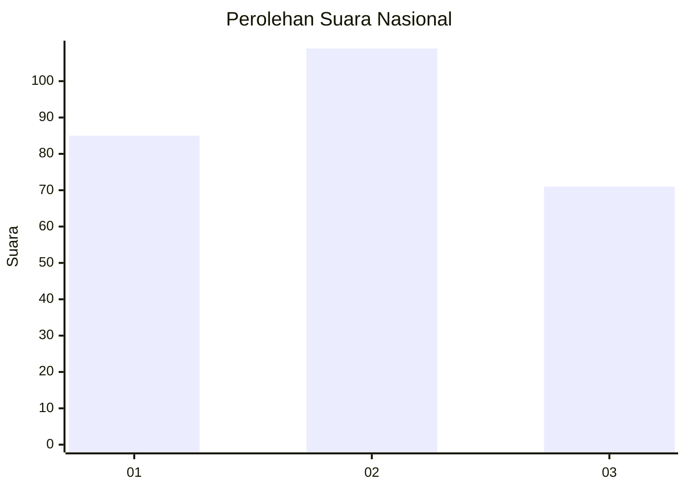
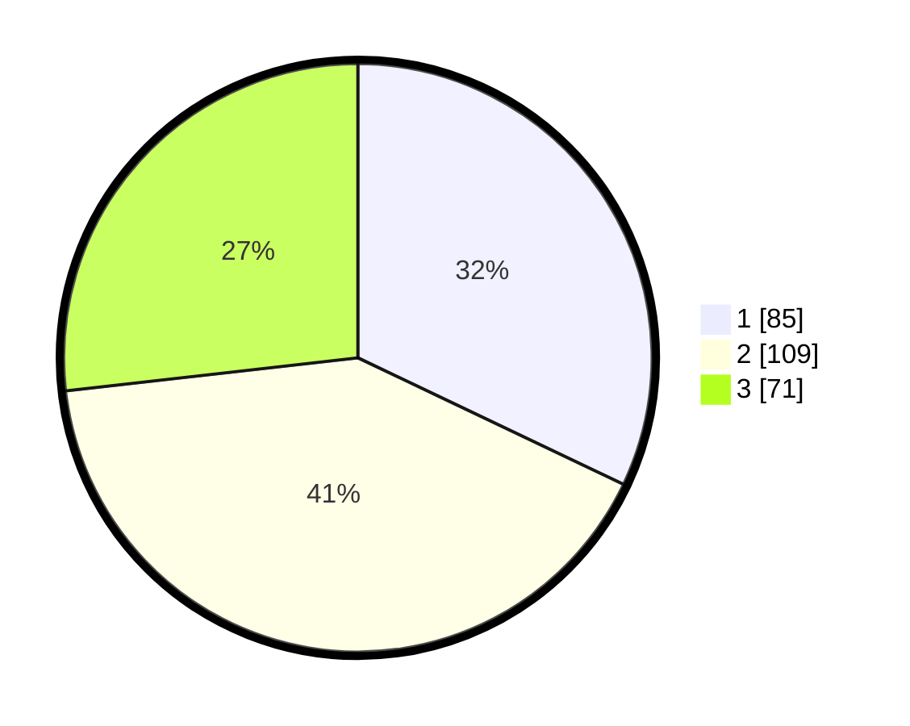

# Hasil

## Grafik

## Tabel

| No. | Nama Paslon    | Suara | Suara (raw) | Persentase |
|:--- |:-------------- | -----:| -----------:| ----------:|
| 1   | ANIES MUHAIMIN | 85    | [85][p-1]   | 32,08      |
| 2   | PRABOWO GIBRAN | 109   | [109][p-2]  | 41,13      |
| 3   | GANJAR MAHFUD  | 71    | [71][p-3]   | 26,79      |

[p-1]: https://github.com/gigit-pemilu/pemilu-2024/blob/main/pilpres/hitung-suara/sub/34-di-yogyakarta/sub/04-sleman/sub/07-depok/sub/2003-condongcatur/sub/020-tps/sub/paslon-1.txt
[p-2]: https://github.com/gigit-pemilu/pemilu-2024/blob/main/pilpres/hitung-suara/sub/34-di-yogyakarta/sub/04-sleman/sub/07-depok/sub/2003-condongcatur/sub/020-tps/sub/paslon-2.txt
[p-3]: https://github.com/gigit-pemilu/pemilu-2024/blob/main/pilpres/hitung-suara/sub/34-di-yogyakarta/sub/04-sleman/sub/07-depok/sub/2003-condongcatur/sub/020-tps/sub/paslon-3.txt

## Foto C Plano

https://sirekap-obj-formc.kpu.go.id/f4a6/pemilu/ppwp/34/04/07/20/03/3404072003020-20240216-131305--c05b2bce-5aa2-4d73-a99a-c58bda307379.jpg

https://sirekap-obj-formc.kpu.go.id/f4a6/pemilu/ppwp/34/04/07/20/03/3404072003020-20240216-131307--b1069fc7-474b-4c1f-b3ff-df22e7ff63af.jpg

https://sirekap-obj-formc.kpu.go.id/f4a6/pemilu/ppwp/34/04/07/20/03/3404072003020-20240216-131306--2c898a41-62a9-46c4-8478-96b42e9bd31b.jpg

## Metadata

| Key        | Value               |
| ---------- | ------------------- |
| Time Stamp | 2024-02-16 22:30:00 |

## DATA PEMILIH TETAP

Jumlah pemilih dalam DPT: **251**.
 * L: **118**.
 * P: **133**.

## DATA PENGGUNA HAK PILIH

Jumlah pengguna hak pilih dalam DPT: **251**.
 * L: **118**.
 * P: **133**.

Jumlah pengguna hak pilih dalam DPTb: **11**.
 * L: **7**.
 * P: **4**.

Jumlah pengguna hak pilih dalam DPK: **12**.
 * L: **3**.
 * P: **9**.

Jumlah pengguna hak pilih: **274**.
 * L: **128**.
 * P: **146**.

## JUMLAH SUARA SAH DAN TIDAK SAH

JUMLAH SELURUH SUARA SAH: **265**.

JUMLAH SUARA TIDAK SAH: **9**.

JUMLAH SELURUH SUARA SAH DAN SUARA TIDAK SAH: **274**.

