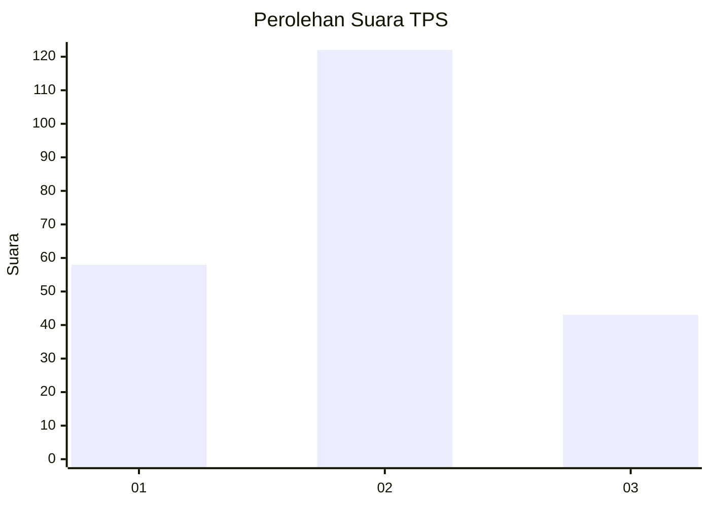
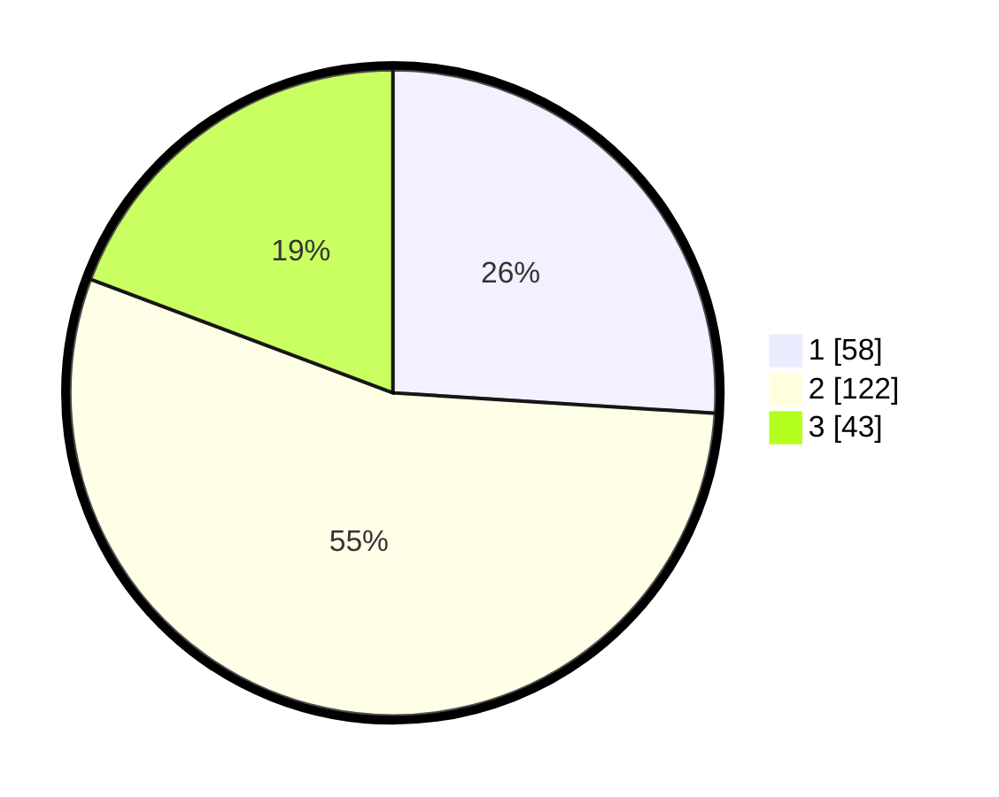

# Hasil

## Grafik

## Tabel

| No. | Nama Paslon    | Suara | Suara (raw) | Persentase |
|:--- |:-------------- | -----:| -----------:| ----------:|
| 1   | ANIES MUHAIMIN | 58    | [58][p-1]   | 26,01      |
| 2   | PRABOWO GIBRAN | 122   | [122][p-2]  | 54,71      |
| 3   | GANJAR MAHFUD  | 43    | [43][p-3]   | 19,28      |

[p-1]: https://github.com/gigit-pemilu/pemilu-2024-34-di-yogyakarta/blob/main/pilpres/hitung-suara/sub/34-di-yogyakarta/sub/04-sleman/sub/07-depok/sub/2003-condongcatur/sub/023-tps/sub/paslon-1.txt
[p-2]: https://github.com/gigit-pemilu/pemilu-2024-34-di-yogyakarta/blob/main/pilpres/hitung-suara/sub/34-di-yogyakarta/sub/04-sleman/sub/07-depok/sub/2003-condongcatur/sub/023-tps/sub/paslon-2.txt
[p-3]: https://github.com/gigit-pemilu/pemilu-2024-34-di-yogyakarta/blob/main/pilpres/hitung-suara/sub/34-di-yogyakarta/sub/04-sleman/sub/07-depok/sub/2003-condongcatur/sub/023-tps/sub/paslon-3.txt

## Foto C Plano

https://sirekap-obj-formc.kpu.go.id/5e53/pemilu/ppwp/34/04/07/20/03/3404072003023-20240215-001351--e87cff35-b075-4801-938c-13ed08a8ff91.jpg

https://sirekap-obj-formc.kpu.go.id/5e53/pemilu/ppwp/34/04/07/20/03/3404072003023-20240214-235937--16369244-6e69-48bb-8669-1ad9881c3565.jpg

https://sirekap-obj-formc.kpu.go.id/5e53/pemilu/ppwp/34/04/07/20/03/3404072003023-20240215-000323--8b175439-d7c9-4fc7-9796-74db592cbeca.jpg

## Metadata

| Key        | Value               |
| ---------- | ------------------- |
| Time Stamp | 2024-02-15 21:01:18 |

