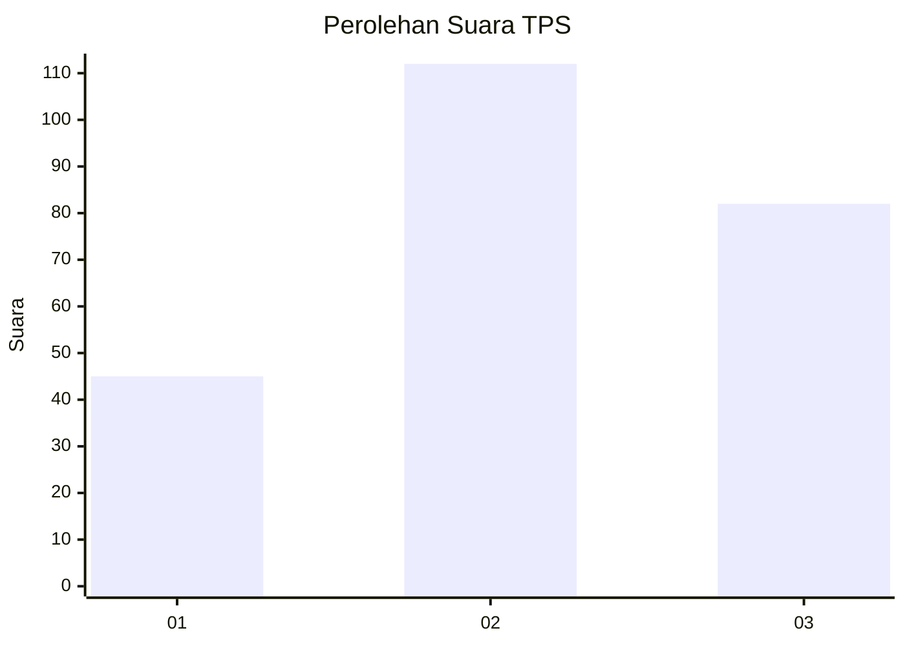
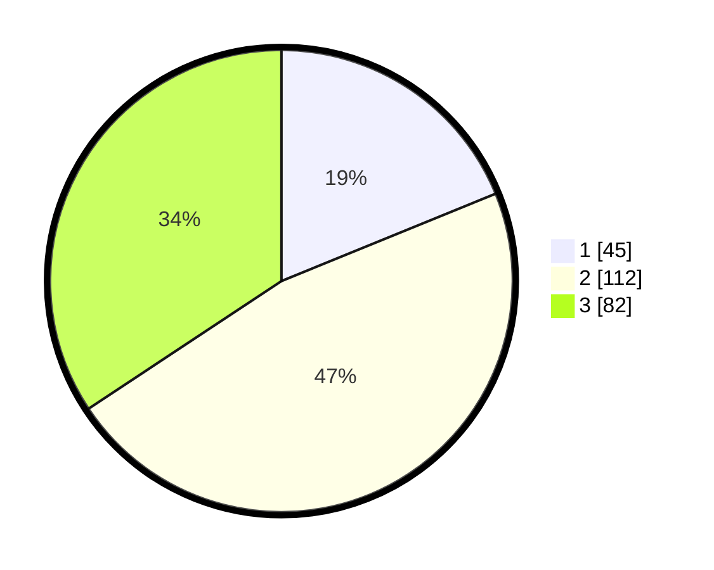

# Hasil

## Grafik

## Tabel

| No. | Nama Paslon    | Suara | Suara (raw) | Persentase |
|:--- |:-------------- | -----:| -----------:| ----------:|
| 1   | ANIES MUHAIMIN | 45    | [45][p-1]   | 18,83      |
| 2   | PRABOWO GIBRAN | 112   | [112][p-2]  | 46,86      |
| 3   | GANJAR MAHFUD  | 82    | [82][p-3]   | 34,31      |

[p-1]: https://github.com/gigit-pemilu/pemilu-2024-34-di-yogyakarta/blob/main/pilpres/hitung-suara/sub/34-di-yogyakarta/sub/04-sleman/sub/07-depok/sub/2003-condongcatur/sub/025-tps/sub/paslon-1.txt
[p-2]: https://github.com/gigit-pemilu/pemilu-2024-34-di-yogyakarta/blob/main/pilpres/hitung-suara/sub/34-di-yogyakarta/sub/04-sleman/sub/07-depok/sub/2003-condongcatur/sub/025-tps/sub/paslon-2.txt
[p-3]: https://github.com/gigit-pemilu/pemilu-2024-34-di-yogyakarta/blob/main/pilpres/hitung-suara/sub/34-di-yogyakarta/sub/04-sleman/sub/07-depok/sub/2003-condongcatur/sub/025-tps/sub/paslon-3.txt

## Foto C Plano

https://sirekap-obj-formc.kpu.go.id/cbd4/pemilu/ppwp/34/04/07/20/03/3404072003025-20240215-141739--6b689fa8-c052-4e46-a6db-26c15a454246.jpg

https://sirekap-obj-formc.kpu.go.id/cbd4/pemilu/ppwp/34/04/07/20/03/3404072003025-20240215-012731--d96b954a-7145-4824-897b-da671b7b0d24.jpg

https://sirekap-obj-formc.kpu.go.id/cbd4/pemilu/ppwp/34/04/07/20/03/3404072003025-20240215-203312--1c9ff0ff-bc13-4b2e-b5d5-c7cd95ef5e29.jpg

## Metadata

| Key        | Value               |
| ---------- | ------------------- |
| Time Stamp | 2024-02-15 22:30:27 |

