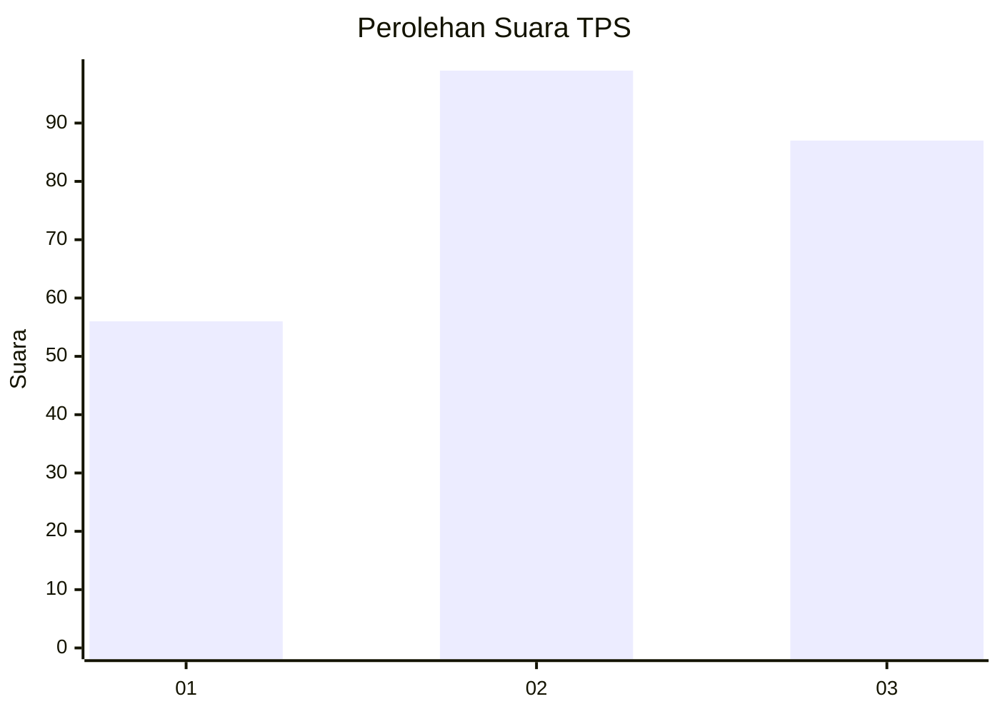
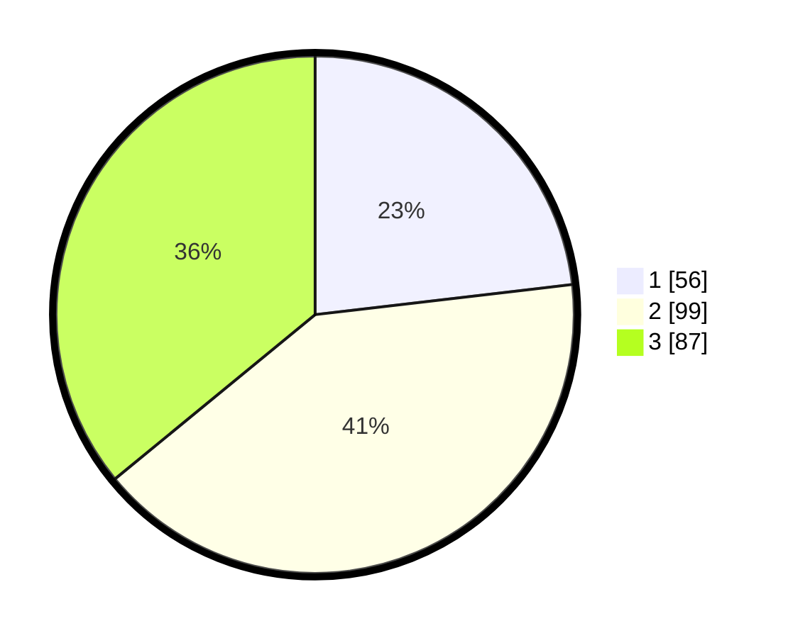

# Hasil

## Grafik

## Tabel

| No. | Nama Paslon    | Suara | Suara (raw) | Persentase |
|:--- |:-------------- | -----:| -----------:| ----------:|
| 1   | ANIES MUHAIMIN | 56    | [56][p-1]   | 23,14      |
| 2   | PRABOWO GIBRAN | 99    | [99][p-2]   | 40,91      |
| 3   | GANJAR MAHFUD  | 87    | [87][p-3]   | 35,95      |

[p-1]: https://github.com/gigit-pemilu/pemilu-2024-34-di-yogyakarta/blob/main/pilpres/hitung-suara/sub/34-di-yogyakarta/sub/04-sleman/sub/07-depok/sub/2003-condongcatur/sub/028-tps/sub/paslon-1.txt
[p-2]: https://github.com/gigit-pemilu/pemilu-2024-34-di-yogyakarta/blob/main/pilpres/hitung-suara/sub/34-di-yogyakarta/sub/04-sleman/sub/07-depok/sub/2003-condongcatur/sub/028-tps/sub/paslon-2.txt
[p-3]: https://github.com/gigit-pemilu/pemilu-2024-34-di-yogyakarta/blob/main/pilpres/hitung-suara/sub/34-di-yogyakarta/sub/04-sleman/sub/07-depok/sub/2003-condongcatur/sub/028-tps/sub/paslon-3.txt

## Foto C Plano

https://sirekap-obj-formc.kpu.go.id/556b/pemilu/ppwp/34/04/07/20/03/3404072003028-20240214-230504--93529819-6c3a-4c0a-87ef-61ac46895817.jpg

https://sirekap-obj-formc.kpu.go.id/556b/pemilu/ppwp/34/04/07/20/03/3404072003028-20240214-231103--7441184e-d243-4bf2-898e-1c39ef382b9b.jpg

https://sirekap-obj-formc.kpu.go.id/556b/pemilu/ppwp/34/04/07/20/03/3404072003028-20240214-231403--04618671-e757-434d-adc6-f45c04387d5c.jpg

## Metadata

| Key        | Value               |
| ---------- | ------------------- |
| Time Stamp | 2024-02-17 13:37:34 |

