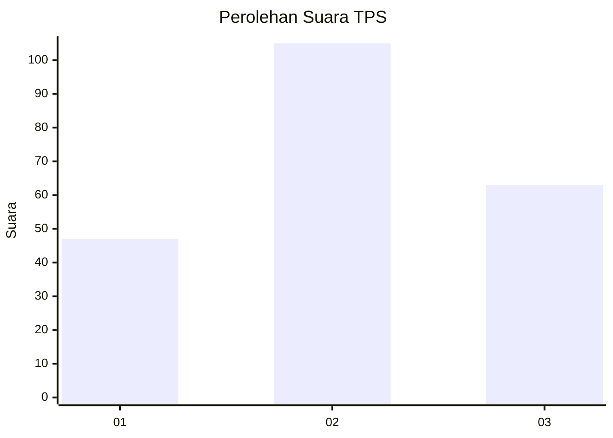
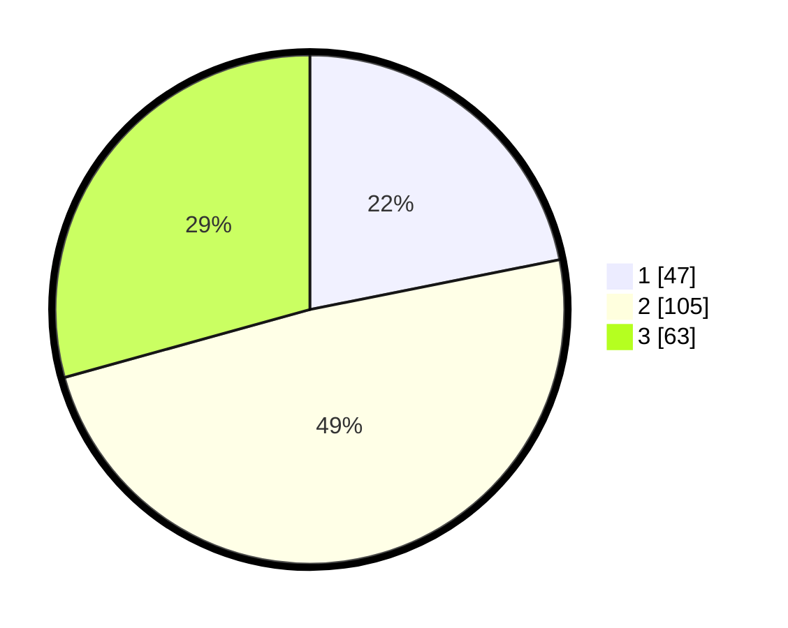

# Hasil

## Grafik

## Tabel

| No. | Nama Paslon    | Suara | Suara (raw) | Persentase |
|:--- |:-------------- | -----:| -----------:| ----------:|
| 1   | ANIES MUHAIMIN | 47    | [47][p-1]   | 21,86      |
| 2   | PRABOWO GIBRAN | 105   | [105][p-2]  | 48,84      |
| 3   | GANJAR MAHFUD  | 63    | [63][p-3]   | 29,30      |

[p-1]: https://github.com/gigit-pemilu/pemilu-2024-34-di-yogyakarta/blob/main/pilpres/hitung-suara/sub/34-di-yogyakarta/sub/04-sleman/sub/07-depok/sub/2003-condongcatur/sub/029-tps/sub/paslon-1.txt
[p-2]: https://github.com/gigit-pemilu/pemilu-2024-34-di-yogyakarta/blob/main/pilpres/hitung-suara/sub/34-di-yogyakarta/sub/04-sleman/sub/07-depok/sub/2003-condongcatur/sub/029-tps/sub/paslon-2.txt
[p-3]: https://github.com/gigit-pemilu/pemilu-2024-34-di-yogyakarta/blob/main/pilpres/hitung-suara/sub/34-di-yogyakarta/sub/04-sleman/sub/07-depok/sub/2003-condongcatur/sub/029-tps/sub/paslon-3.txt

## Foto C Plano

https://sirekap-obj-formc.kpu.go.id/a51a/pemilu/ppwp/34/04/07/20/03/3404072003029-20240214-210759--5bdf176b-670d-4a93-96c3-d65bef3542e9.jpg

https://sirekap-obj-formc.kpu.go.id/a51a/pemilu/ppwp/34/04/07/20/03/3404072003029-20240214-210933--7e706a7a-01a1-41a7-9668-a51ead5dcecd.jpg

https://sirekap-obj-formc.kpu.go.id/a51a/pemilu/ppwp/34/04/07/20/03/3404072003029-20240214-211122--0741942b-b210-40d2-b651-f92de152d8c1.jpg

## Metadata

| Key        | Value               |
| ---------- | ------------------- |
| Time Stamp | 2024-02-15 16:00:26 |

