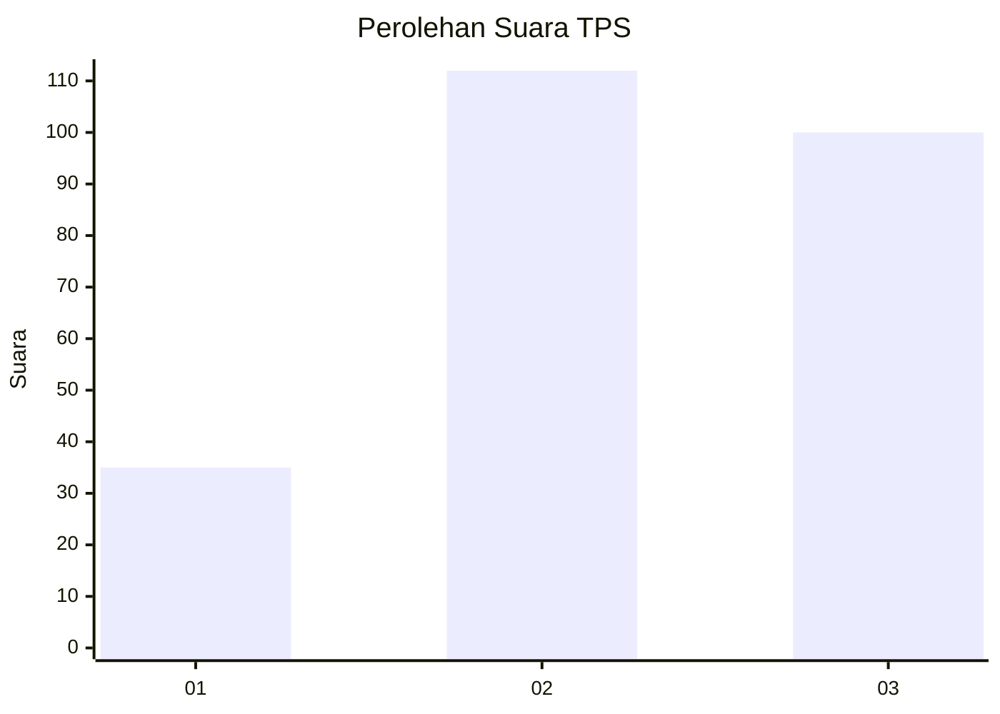
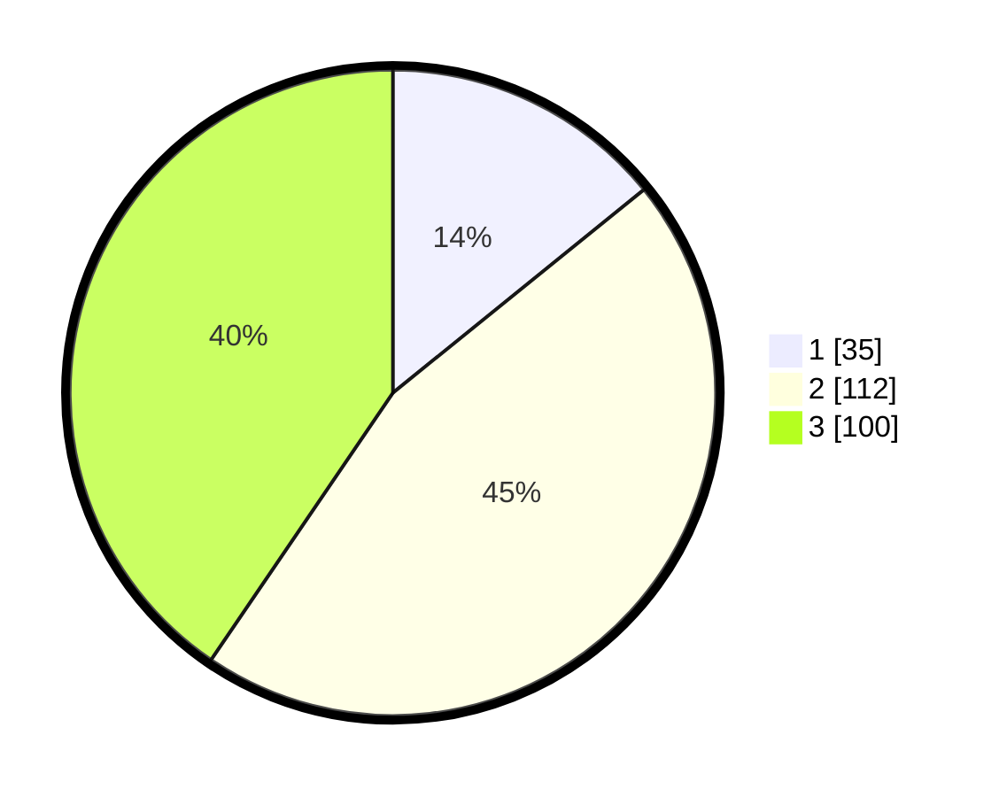

# Hasil

## Grafik

## Tabel

| No. | Nama Paslon    | Suara | Suara (raw) | Persentase |
|:--- |:-------------- | -----:| -----------:| ----------:|
| 1   | ANIES MUHAIMIN | 35    | [35][p-1]   | 14,17      |
| 2   | PRABOWO GIBRAN | 112   | [112][p-2]  | 45,34      |
| 3   | GANJAR MAHFUD  | 100   | [100][p-3]  | 40,49      |

[p-1]: https://github.com/gigit-pemilu/pemilu-2024-34-di-yogyakarta/blob/main/pilpres/hitung-suara/sub/34-di-yogyakarta/sub/04-sleman/sub/07-depok/sub/2003-condongcatur/sub/036-tps/sub/paslon-1.txt
[p-2]: https://github.com/gigit-pemilu/pemilu-2024-34-di-yogyakarta/blob/main/pilpres/hitung-suara/sub/34-di-yogyakarta/sub/04-sleman/sub/07-depok/sub/2003-condongcatur/sub/036-tps/sub/paslon-2.txt
[p-3]: https://github.com/gigit-pemilu/pemilu-2024-34-di-yogyakarta/blob/main/pilpres/hitung-suara/sub/34-di-yogyakarta/sub/04-sleman/sub/07-depok/sub/2003-condongcatur/sub/036-tps/sub/paslon-3.txt

## Foto C Plano

https://sirekap-obj-formc.kpu.go.id/e9a2/pemilu/ppwp/34/04/07/20/03/3404072003036-20240217-224634--834ad0e2-6e6c-4e4b-81aa-8e71892116e2.jpg

https://sirekap-obj-formc.kpu.go.id/e9a2/pemilu/ppwp/34/04/07/20/03/3404072003036-20240215-001235--23cba0fe-2692-4b4b-b5ad-2cee61b779df.jpg

https://sirekap-obj-formc.kpu.go.id/e9a2/pemilu/ppwp/34/04/07/20/03/3404072003036-20240215-001500--62a9bc47-f317-4475-b63a-63fe62bf9b0a.jpg

## Metadata

| Key        | Value               |
| ---------- | ------------------- |
| Time Stamp | 2024-02-19 06:16:00 |

