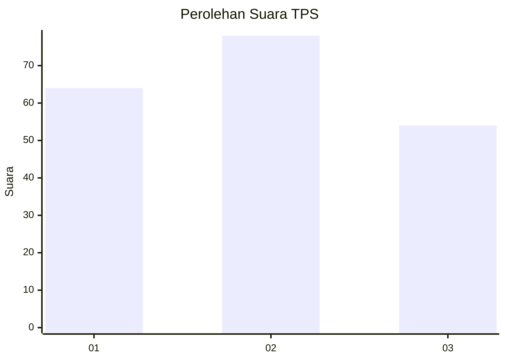
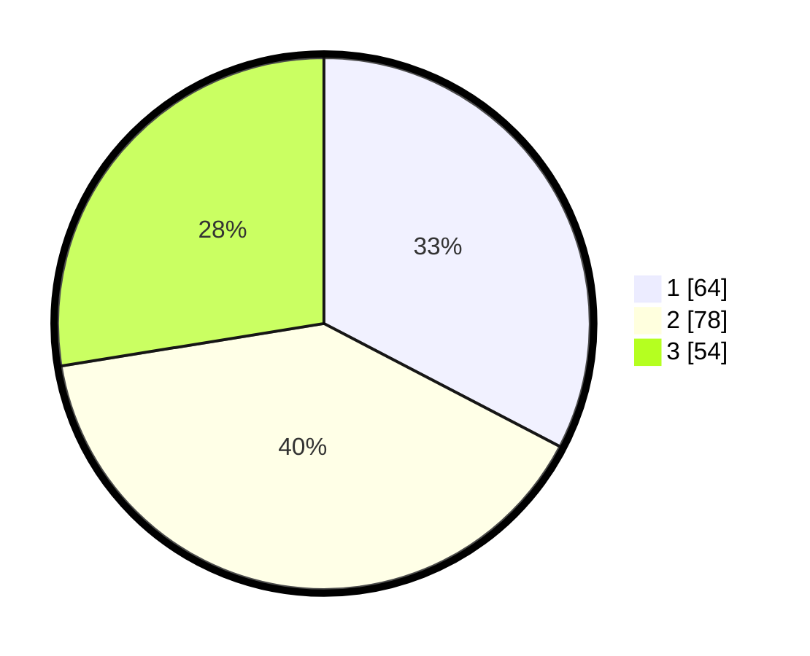

# Hasil

## Grafik

## Tabel

| No. | Nama Paslon    | Suara | Suara (raw) | Persentase |
|:--- |:-------------- | -----:| -----------:| ----------:|
| 1   | ANIES MUHAIMIN | 64    | [64][p-1]   | 32,65      |
| 2   | PRABOWO GIBRAN | 78    | [78][p-2]   | 39,80      |
| 3   | GANJAR MAHFUD  | 54    | [54][p-3]   | 27,55      |

[p-1]: https://github.com/gigit-pemilu/pemilu-2024-34-di-yogyakarta/blob/main/pilpres/hitung-suara/sub/34-di-yogyakarta/sub/04-sleman/sub/07-depok/sub/2003-condongcatur/sub/039-tps/sub/paslon-1.txt
[p-2]: https://github.com/gigit-pemilu/pemilu-2024-34-di-yogyakarta/blob/main/pilpres/hitung-suara/sub/34-di-yogyakarta/sub/04-sleman/sub/07-depok/sub/2003-condongcatur/sub/039-tps/sub/paslon-2.txt
[p-3]: https://github.com/gigit-pemilu/pemilu-2024-34-di-yogyakarta/blob/main/pilpres/hitung-suara/sub/34-di-yogyakarta/sub/04-sleman/sub/07-depok/sub/2003-condongcatur/sub/039-tps/sub/paslon-3.txt

## Foto C Plano

https://sirekap-obj-formc.kpu.go.id/6b92/pemilu/ppwp/34/04/07/20/03/3404072003039-20240215-013404--2e8dc777-d0d2-41e1-b56b-f20f95f4dbe0.jpg

https://sirekap-obj-formc.kpu.go.id/6b92/pemilu/ppwp/34/04/07/20/03/3404072003039-20240214-212228--a770d9e7-e752-413b-820a-77680364d35f.jpg

https://sirekap-obj-formc.kpu.go.id/6b92/pemilu/ppwp/34/04/07/20/03/3404072003039-20240215-013408--f6990f49-b9f0-4a27-ba13-e341bf82372f.jpg

## Metadata

| Key        | Value               |
| ---------- | ------------------- |
| Time Stamp | 2024-02-15 16:00:26 |

