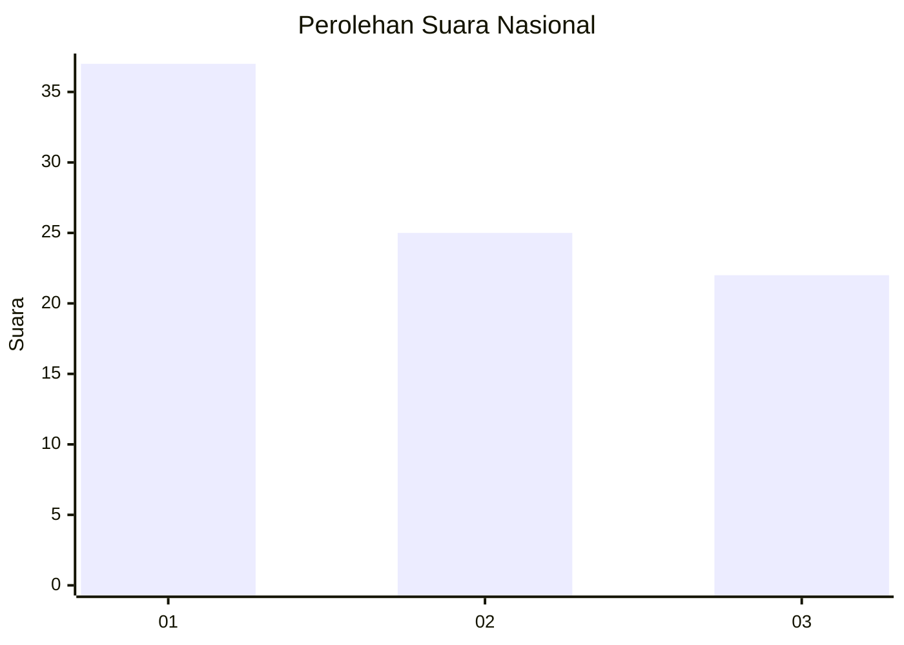
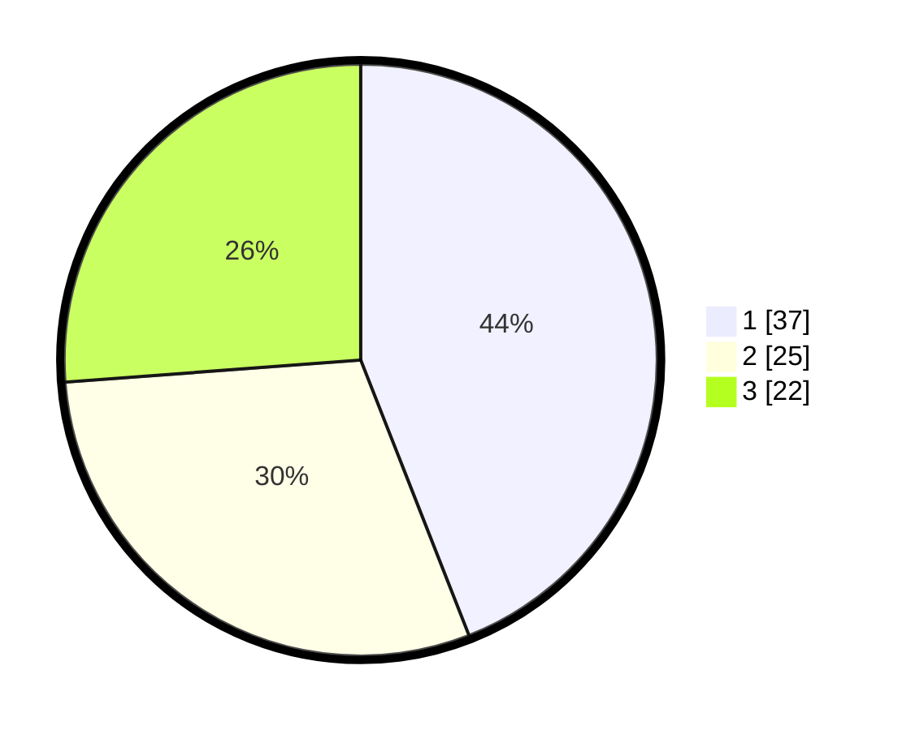

# Hasil

## Grafik

## Tabel

| No. | Nama Paslon    | Suara | Suara (raw) | Persentase |
|:--- |:-------------- | -----:| -----------:| ----------:|
| 1   | ANIES MUHAIMIN | 37    | [37][p-1]   | 44,05      |
| 2   | PRABOWO GIBRAN | 25    | [25][p-2]   | 29,76      |
| 3   | GANJAR MAHFUD  | 22    | [22][p-3]   | 26,19      |

[p-1]: https://github.com/gigit-pemilu/pemilu-2024/blob/main/pilpres/hitung-suara/sub/34-di-yogyakarta/sub/04-sleman/sub/07-depok/sub/2003-condongcatur/sub/043-tps/sub/paslon-1.txt
[p-2]: https://github.com/gigit-pemilu/pemilu-2024/blob/main/pilpres/hitung-suara/sub/34-di-yogyakarta/sub/04-sleman/sub/07-depok/sub/2003-condongcatur/sub/043-tps/sub/paslon-2.txt
[p-3]: https://github.com/gigit-pemilu/pemilu-2024/blob/main/pilpres/hitung-suara/sub/34-di-yogyakarta/sub/04-sleman/sub/07-depok/sub/2003-condongcatur/sub/043-tps/sub/paslon-3.txt

## Foto C Plano

https://sirekap-obj-formc.kpu.go.id/5db6/pemilu/ppwp/34/04/07/20/03/3404072003043-20240215-010640--28eea368-d9eb-4e7e-a498-291216a606e1.jpg

https://sirekap-obj-formc.kpu.go.id/5db6/pemilu/ppwp/34/04/07/20/03/3404072003043-20240215-011144--a41bbcd0-ec72-407b-98c3-41d72ed65fc2.jpg

https://sirekap-obj-formc.kpu.go.id/5db6/pemilu/ppwp/34/04/07/20/03/3404072003043-20240215-011517--c92d28dc-a93b-471c-99d5-636b2676c692.jpg

## Metadata

| Key        | Value               |
| ---------- | ------------------- |
| Time Stamp | 2024-02-15 16:00:26 |

