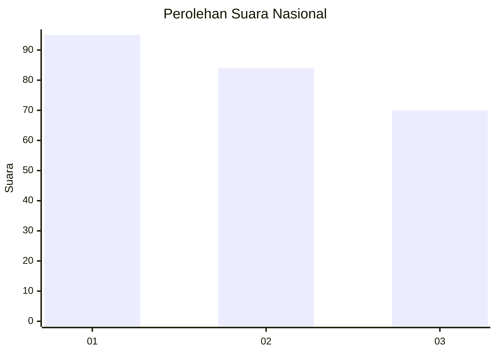
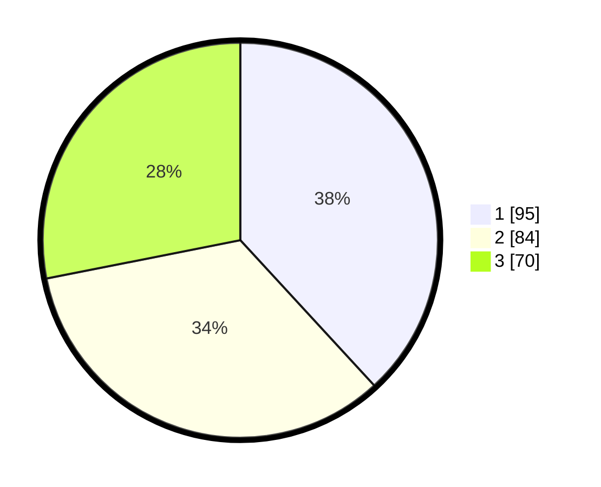

# Hasil

## Grafik

## Tabel

| No. | Nama Paslon    | Suara | Suara (raw) | Persentase |
|:--- |:-------------- | -----:| -----------:| ----------:|
| 1   | ANIES MUHAIMIN | 95    | [95][p-1]   | 38,15      |
| 2   | PRABOWO GIBRAN | 84    | [84][p-2]   | 33,73      |
| 3   | GANJAR MAHFUD  | 70    | [70][p-3]   | 28,11      |

[p-1]: https://github.com/gigit-pemilu/pemilu-2024/blob/main/pilpres/hitung-suara/sub/34-di-yogyakarta/sub/04-sleman/sub/07-depok/sub/2003-condongcatur/sub/045-tps/sub/paslon-1.txt
[p-2]: https://github.com/gigit-pemilu/pemilu-2024/blob/main/pilpres/hitung-suara/sub/34-di-yogyakarta/sub/04-sleman/sub/07-depok/sub/2003-condongcatur/sub/045-tps/sub/paslon-2.txt
[p-3]: https://github.com/gigit-pemilu/pemilu-2024/blob/main/pilpres/hitung-suara/sub/34-di-yogyakarta/sub/04-sleman/sub/07-depok/sub/2003-condongcatur/sub/045-tps/sub/paslon-3.txt

## Foto C Plano

https://sirekap-obj-formc.kpu.go.id/a9a8/pemilu/ppwp/34/04/07/20/03/3404072003045-20240219-091318--0a739d67-a0a5-4fa4-92d4-fde51fe3c479.jpg

https://sirekap-obj-formc.kpu.go.id/a9a8/pemilu/ppwp/34/04/07/20/03/3404072003045-20240219-091422--06d67e87-3b0b-4aef-adfc-9b1460b1703e.jpg

https://sirekap-obj-formc.kpu.go.id/a9a8/pemilu/ppwp/34/04/07/20/03/3404072003045-20240219-091504--86156c23-b76a-45e6-b472-defdc21d7f31.jpg

## Metadata

| Key        | Value               |
| ---------- | ------------------- |
| Time Stamp | 2024-02-24 22:31:28 |

