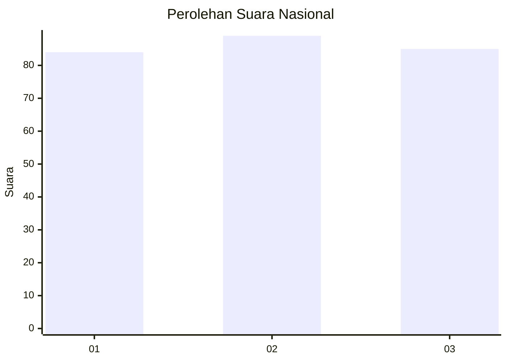
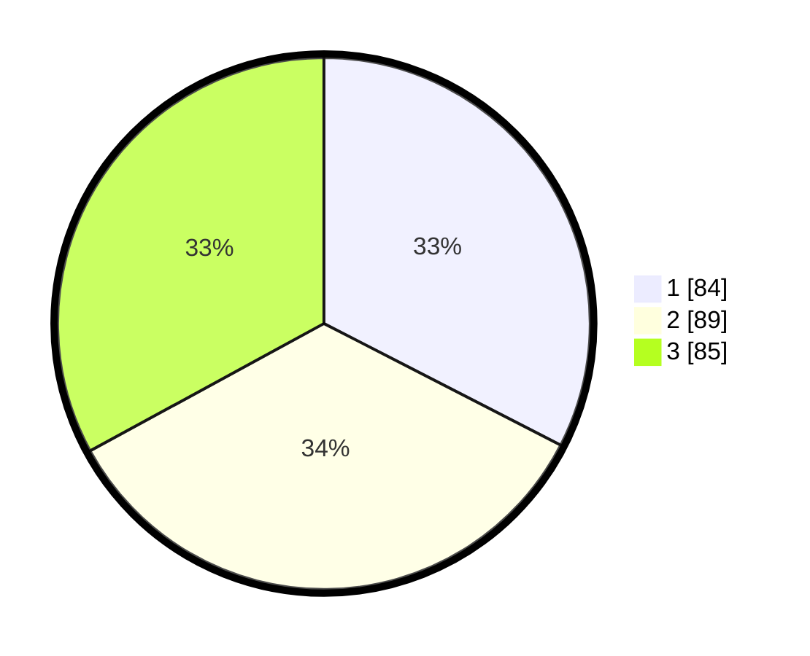

# Hasil

## Grafik

## Tabel

| No. | Nama Paslon    | Suara | Suara (raw) | Persentase |
|:--- |:-------------- | -----:| -----------:| ----------:|
| 1   | ANIES MUHAIMIN | 84    | [84][p-1]   | 32,56      |
| 2   | PRABOWO GIBRAN | 89    | [89][p-2]   | 34,50      |
| 3   | GANJAR MAHFUD  | 85    | [85][p-3]   | 32,95      |

[p-1]: https://github.com/gigit-pemilu/pemilu-2024/blob/main/pilpres/hitung-suara/sub/34-di-yogyakarta/sub/04-sleman/sub/07-depok/sub/2003-condongcatur/sub/054-tps/sub/paslon-1.txt
[p-2]: https://github.com/gigit-pemilu/pemilu-2024/blob/main/pilpres/hitung-suara/sub/34-di-yogyakarta/sub/04-sleman/sub/07-depok/sub/2003-condongcatur/sub/054-tps/sub/paslon-2.txt
[p-3]: https://github.com/gigit-pemilu/pemilu-2024/blob/main/pilpres/hitung-suara/sub/34-di-yogyakarta/sub/04-sleman/sub/07-depok/sub/2003-condongcatur/sub/054-tps/sub/paslon-3.txt

## Foto C Plano

https://sirekap-obj-formc.kpu.go.id/7d40/pemilu/ppwp/34/04/07/20/03/3404072003054-20240215-145148--250729b4-1ad0-4d55-bd20-8af9f2799a16.jpg

https://sirekap-obj-formc.kpu.go.id/7d40/pemilu/ppwp/34/04/07/20/03/3404072003054-20240214-193649--574d3059-84d4-4307-8d7c-a15ef0696c23.jpg

https://sirekap-obj-formc.kpu.go.id/7d40/pemilu/ppwp/34/04/07/20/03/3404072003054-20240214-193803--828b278d-8a6c-4a95-a1f1-ca830fc34de3.jpg

## Metadata

| Key        | Value               |
| ---------- | ------------------- |
| Time Stamp | 2024-02-15 15:00:29 |

