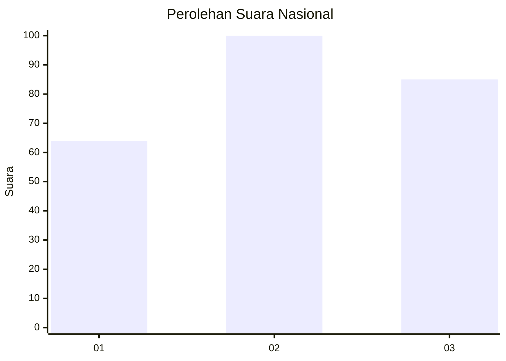
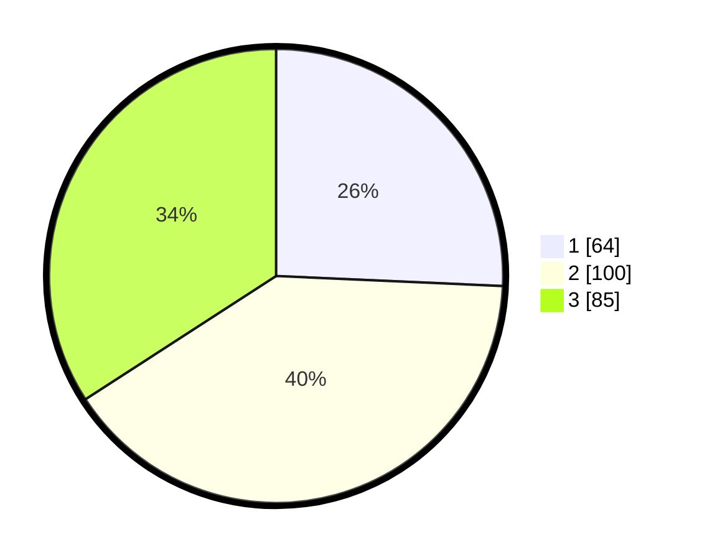

# Hasil

## Grafik

## Tabel

| No. | Nama Paslon    | Suara | Suara (raw) | Persentase |
|:--- |:-------------- | -----:| -----------:| ----------:|
| 1   | ANIES MUHAIMIN | 64    | [64][p-1]   | 25,70      |
| 2   | PRABOWO GIBRAN | 100   | [100][p-2]  | 40,16      |
| 3   | GANJAR MAHFUD  | 85    | [85][p-3]   | 34,14      |

[p-1]: https://github.com/gigit-pemilu/pemilu-2024/blob/main/pilpres/hitung-suara/sub/34-di-yogyakarta/sub/04-sleman/sub/07-depok/sub/2003-condongcatur/sub/057-tps/sub/paslon-1.txt
[p-2]: https://github.com/gigit-pemilu/pemilu-2024/blob/main/pilpres/hitung-suara/sub/34-di-yogyakarta/sub/04-sleman/sub/07-depok/sub/2003-condongcatur/sub/057-tps/sub/paslon-2.txt
[p-3]: https://github.com/gigit-pemilu/pemilu-2024/blob/main/pilpres/hitung-suara/sub/34-di-yogyakarta/sub/04-sleman/sub/07-depok/sub/2003-condongcatur/sub/057-tps/sub/paslon-3.txt

## Foto C Plano

https://sirekap-obj-formc.kpu.go.id/5d46/pemilu/ppwp/34/04/07/20/03/3404072003057-20240214-212228--d3174e67-9d78-4837-8316-ba0c0c104282.jpg

https://sirekap-obj-formc.kpu.go.id/5d46/pemilu/ppwp/34/04/07/20/03/3404072003057-20240214-192336--2958969b-997e-417f-afa9-cae5a4ef0934.jpg

https://sirekap-obj-formc.kpu.go.id/5d46/pemilu/ppwp/34/04/07/20/03/3404072003057-20240214-210622--7b97b777-86a6-45ef-92b3-ecf6a5b721cf.jpg

## Metadata

| Key        | Value               |
| ---------- | ------------------- |
| Time Stamp | 2024-02-15 16:00:26 |

