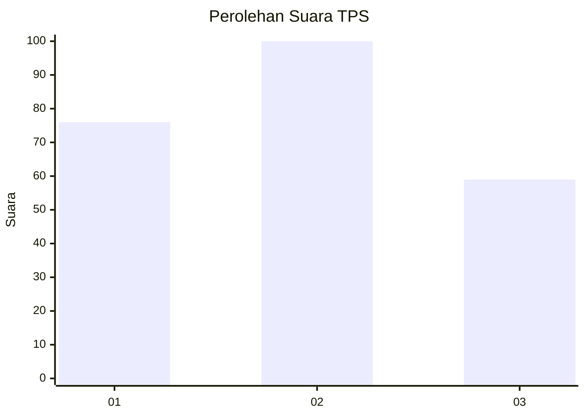
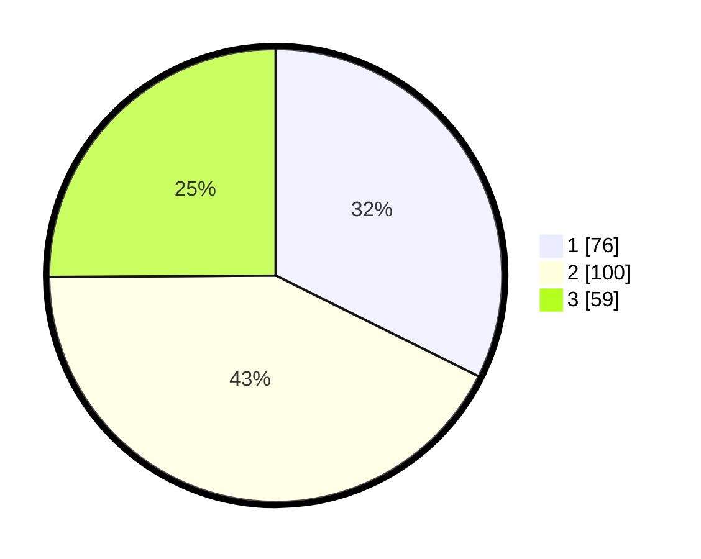

# Hasil

## Grafik

## Tabel

| No. | Nama Paslon    | Suara | Suara (raw) | Persentase |
|:--- |:-------------- | -----:| -----------:| ----------:|
| 1   | ANIES MUHAIMIN | 76    | [76][p-1]   | 32,34      |
| 2   | PRABOWO GIBRAN | 100   | [100][p-2]  | 42,55      |
| 3   | GANJAR MAHFUD  | 59    | [59][p-3]   | 25,11      |

[p-1]: https://github.com/gigit-pemilu/pemilu-2024-34-di-yogyakarta/blob/main/pilpres/hitung-suara/sub/34-di-yogyakarta/sub/04-sleman/sub/07-depok/sub/2003-condongcatur/sub/059-tps/sub/paslon-1.txt
[p-2]: https://github.com/gigit-pemilu/pemilu-2024-34-di-yogyakarta/blob/main/pilpres/hitung-suara/sub/34-di-yogyakarta/sub/04-sleman/sub/07-depok/sub/2003-condongcatur/sub/059-tps/sub/paslon-2.txt
[p-3]: https://github.com/gigit-pemilu/pemilu-2024-34-di-yogyakarta/blob/main/pilpres/hitung-suara/sub/34-di-yogyakarta/sub/04-sleman/sub/07-depok/sub/2003-condongcatur/sub/059-tps/sub/paslon-3.txt

## Foto C Plano

https://sirekap-obj-formc.kpu.go.id/8c86/pemilu/ppwp/34/04/07/20/03/3404072003059-20240219-115314--12877c76-ae45-4e89-9e7a-0b9a2df7d5db.jpg

https://sirekap-obj-formc.kpu.go.id/8c86/pemilu/ppwp/34/04/07/20/03/3404072003059-20240219-115315--c4393671-29a1-4da1-9cd4-86f215cba413.jpg

https://sirekap-obj-formc.kpu.go.id/8c86/pemilu/ppwp/34/04/07/20/03/3404072003059-20240219-115315--ae26a96d-d666-405e-8ba5-09f76521802c.jpg

## Metadata

| Key        | Value               |
| ---------- | ------------------- |
| Time Stamp | 2024-02-21 23:00:00 |

## DATA PEMILIH TETAP

Jumlah pemilih dalam DPT: **295**.
 * L: **159**.
 * P: **136**.

## DATA PENGGUNA HAK PILIH

Jumlah pengguna hak pilih dalam DPT: **230**.
 * L: **120**.
 * P: **110**.

Jumlah pengguna hak pilih dalam DPTb: **12**.
 * L: **1**.
 * P: **11**.

Jumlah pengguna hak pilih dalam DPK: **4**.
 * L: **1**.
 * P: **3**.

Jumlah pengguna hak pilih: **246**.
 * L: **122**.
 * P: **124**.

## JUMLAH SUARA SAH DAN TIDAK SAH

JUMLAH SELURUH SUARA SAH: **235**.

JUMLAH SUARA TIDAK SAH: **11**.

JUMLAH SELURUH SUARA SAH DAN SUARA TIDAK SAH: **246**.

