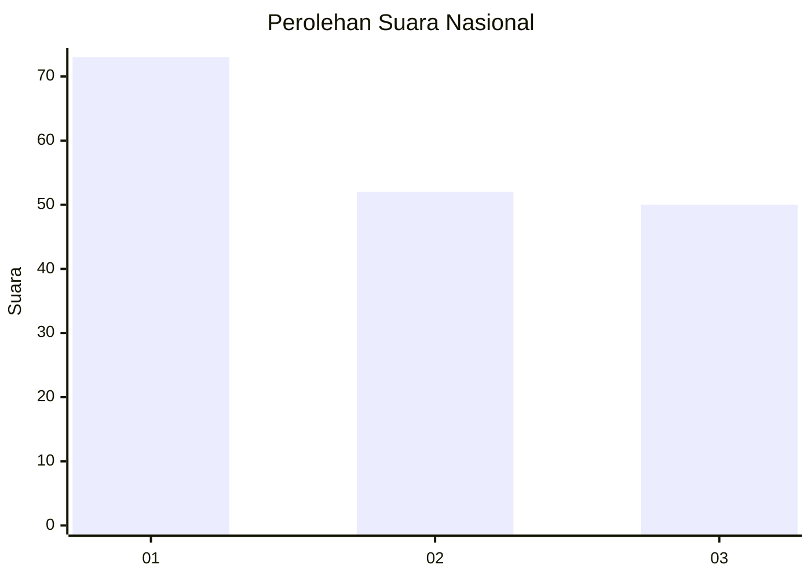
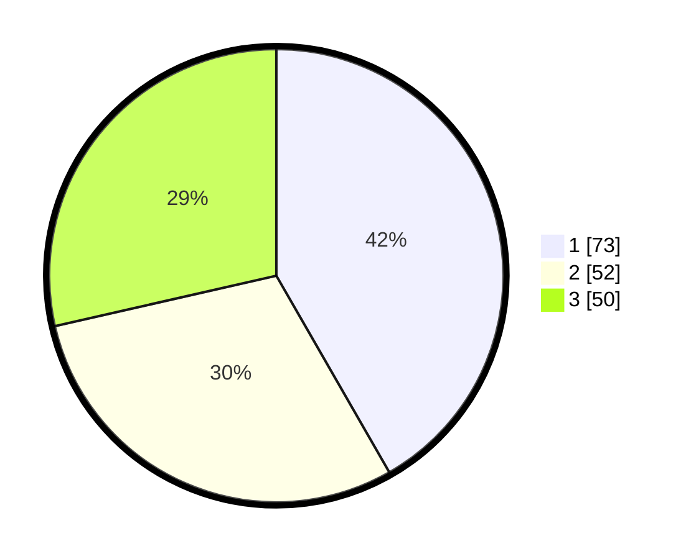

# Hasil

## Grafik

## Tabel

| No. | Nama Paslon    | Suara | Suara (raw) | Persentase |
|:--- |:-------------- | -----:| -----------:| ----------:|
| 1   | ANIES MUHAIMIN | 73    | [73][p-1]   | 41,71      |
| 2   | PRABOWO GIBRAN | 52    | [52][p-2]   | 29,71      |
| 3   | GANJAR MAHFUD  | 50    | [50][p-3]   | 28,57      |

[p-1]: https://github.com/gigit-pemilu/pemilu-2024/blob/main/pilpres/hitung-suara/sub/34-di-yogyakarta/sub/04-sleman/sub/07-depok/sub/2003-condongcatur/sub/075-tps/sub/paslon-1.txt
[p-2]: https://github.com/gigit-pemilu/pemilu-2024/blob/main/pilpres/hitung-suara/sub/34-di-yogyakarta/sub/04-sleman/sub/07-depok/sub/2003-condongcatur/sub/075-tps/sub/paslon-2.txt
[p-3]: https://github.com/gigit-pemilu/pemilu-2024/blob/main/pilpres/hitung-suara/sub/34-di-yogyakarta/sub/04-sleman/sub/07-depok/sub/2003-condongcatur/sub/075-tps/sub/paslon-3.txt

## Foto C Plano

https://sirekap-obj-formc.kpu.go.id/9c9d/pemilu/ppwp/34/04/07/20/03/3404072003075-20240214-214115--782e0193-3e32-4246-a259-6c5a1e84bb77.jpg

https://sirekap-obj-formc.kpu.go.id/9c9d/pemilu/ppwp/34/04/07/20/03/3404072003075-20240214-214128--d19f972f-7e03-49c7-91bf-f4aa33a01262.jpg

https://sirekap-obj-formc.kpu.go.id/9c9d/pemilu/ppwp/34/04/07/20/03/3404072003075-20240214-214204--ab9c9469-d8a3-43c4-aaa5-605e162b0045.jpg

## Metadata

| Key        | Value               |
| ---------- | ------------------- |
| Time Stamp | 2024-02-15 16:00:26 |

