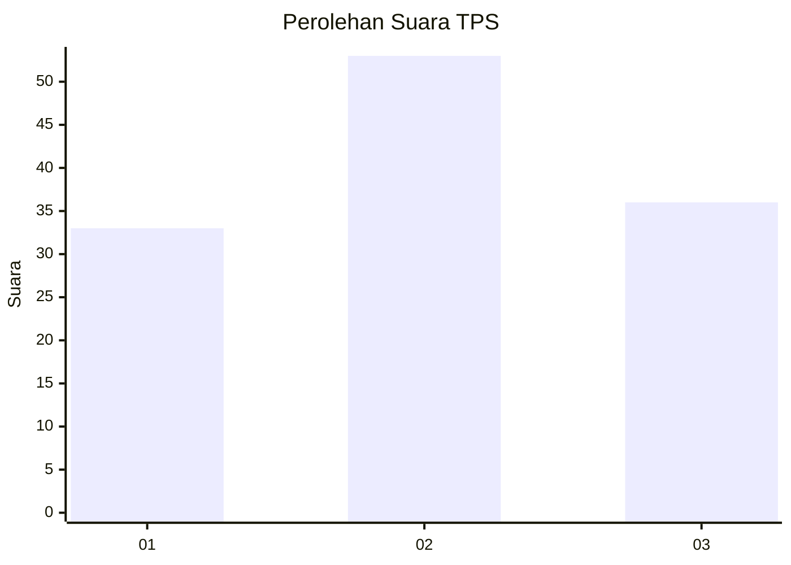
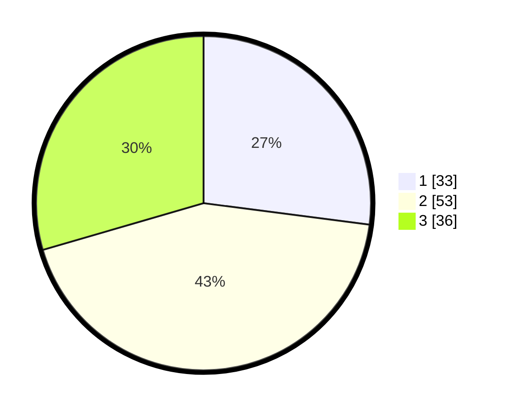

# Hasil

## Grafik

## Tabel

| No. | Nama Paslon    | Suara | Suara (raw) | Persentase |
|:--- |:-------------- | -----:| -----------:| ----------:|
| 1   | ANIES MUHAIMIN | 33    | [33][p-1]   | 27,05      |
| 2   | PRABOWO GIBRAN | 53    | [53][p-2]   | 43,44      |
| 3   | GANJAR MAHFUD  | 36    | [36][p-3]   | 29,51      |

[p-1]: https://github.com/gigit-pemilu/pemilu-2024-34-di-yogyakarta/blob/main/pilpres/hitung-suara/sub/34-di-yogyakarta/sub/04-sleman/sub/07-depok/sub/2003-condongcatur/sub/081-tps/sub/paslon-1.txt
[p-2]: https://github.com/gigit-pemilu/pemilu-2024-34-di-yogyakarta/blob/main/pilpres/hitung-suara/sub/34-di-yogyakarta/sub/04-sleman/sub/07-depok/sub/2003-condongcatur/sub/081-tps/sub/paslon-2.txt
[p-3]: https://github.com/gigit-pemilu/pemilu-2024-34-di-yogyakarta/blob/main/pilpres/hitung-suara/sub/34-di-yogyakarta/sub/04-sleman/sub/07-depok/sub/2003-condongcatur/sub/081-tps/sub/paslon-3.txt

## Foto C Plano

https://sirekap-obj-formc.kpu.go.id/1afe/pemilu/ppwp/34/04/07/20/03/3404072003081-20240215-043859--071c11cb-94ab-4528-9228-514fd3a5c7ef.jpg

https://sirekap-obj-formc.kpu.go.id/1afe/pemilu/ppwp/34/04/07/20/03/3404072003081-20240215-043932--379b1042-c9d7-4c72-a209-625f8e52455a.jpg

https://sirekap-obj-formc.kpu.go.id/1afe/pemilu/ppwp/34/04/07/20/03/3404072003081-20240215-043941--eb089596-478d-4221-85c0-c92d1ecee39f.jpg

## Metadata

| Key        | Value               |
| ---------- | ------------------- |
| Time Stamp | 2024-02-15 21:30:27 |

