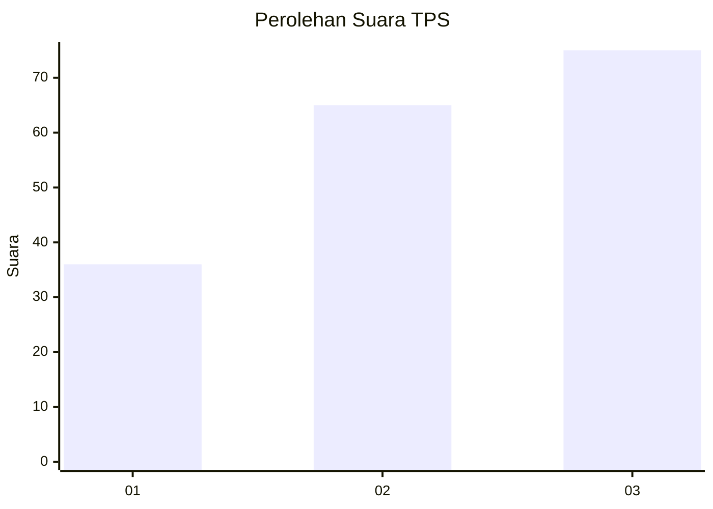
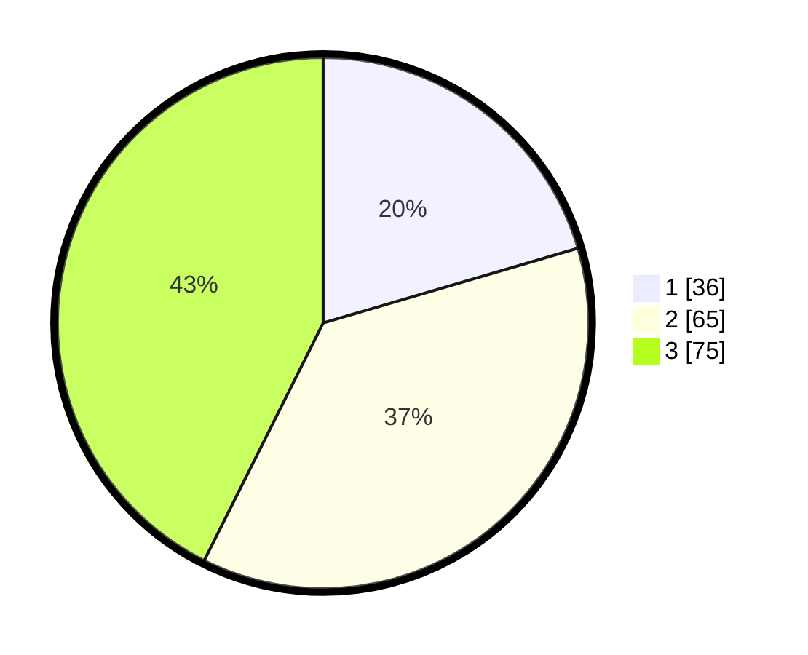

# Hasil

## Grafik

## Tabel

| No. | Nama Paslon    | Suara | Suara (raw) | Persentase |
|:--- |:-------------- | -----:| -----------:| ----------:|
| 1   | ANIES MUHAIMIN | 36    | [36][p-1]   | 20,45      |
| 2   | PRABOWO GIBRAN | 65    | [65][p-2]   | 36,93      |
| 3   | GANJAR MAHFUD  | 75    | [75][p-3]   | 42,61      |

[p-1]: https://github.com/gigit-pemilu/pemilu-2024-34-di-yogyakarta/blob/main/pilpres/hitung-suara/sub/34-di-yogyakarta/sub/04-sleman/sub/07-depok/sub/2003-condongcatur/sub/091-tps/sub/paslon-1.txt
[p-2]: https://github.com/gigit-pemilu/pemilu-2024-34-di-yogyakarta/blob/main/pilpres/hitung-suara/sub/34-di-yogyakarta/sub/04-sleman/sub/07-depok/sub/2003-condongcatur/sub/091-tps/sub/paslon-2.txt
[p-3]: https://github.com/gigit-pemilu/pemilu-2024-34-di-yogyakarta/blob/main/pilpres/hitung-suara/sub/34-di-yogyakarta/sub/04-sleman/sub/07-depok/sub/2003-condongcatur/sub/091-tps/sub/paslon-3.txt

## Foto C Plano

https://sirekap-obj-formc.kpu.go.id/d416/pemilu/ppwp/34/04/07/20/03/3404072003091-20240214-222759--7b622f6e-7f9a-43ff-be21-924cd83eec4c.jpg

https://sirekap-obj-formc.kpu.go.id/d416/pemilu/ppwp/34/04/07/20/03/3404072003091-20240214-222819--c7b31286-ec27-4da7-bdb3-0ae655c62af1.jpg

https://sirekap-obj-formc.kpu.go.id/d416/pemilu/ppwp/34/04/07/20/03/3404072003091-20240214-222844--444c29b1-28fb-45f3-8eeb-5d39f1320093.jpg

## Metadata

| Key        | Value               |
| ---------- | ------------------- |
| Time Stamp | 2024-02-17 13:37:34 |

