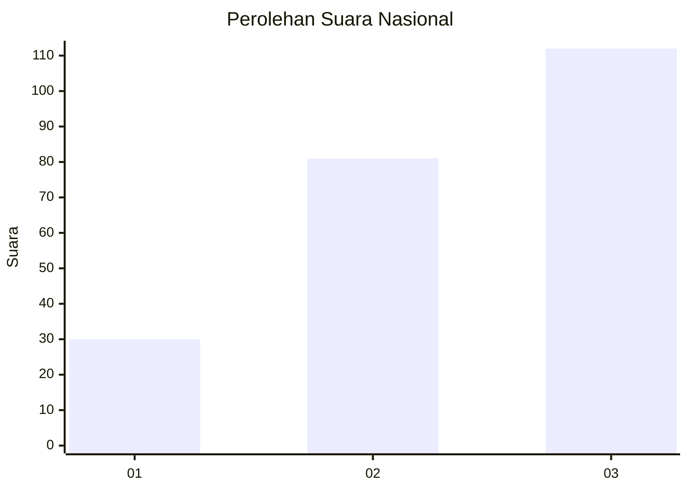
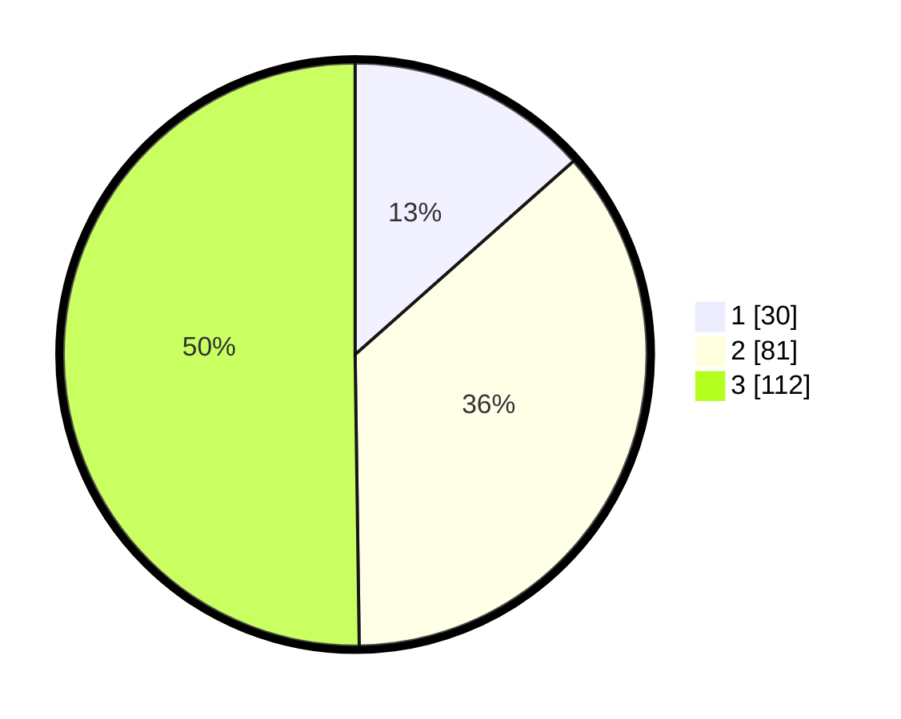

# Hasil

## Grafik

## Tabel

| No. | Nama Paslon    | Suara | Suara (raw) | Persentase |
|:--- |:-------------- | -----:| -----------:| ----------:|
| 1   | ANIES MUHAIMIN | 30    | [30][p-1]   | 13,45      |
| 2   | PRABOWO GIBRAN | 81    | [81][p-2]   | 36,32      |
| 3   | GANJAR MAHFUD  | 112   | [112][p-3]  | 50,22      |

[p-1]: https://github.com/gigit-pemilu/pemilu-2024/blob/main/pilpres/hitung-suara/sub/34-di-yogyakarta/sub/04-sleman/sub/07-depok/sub/2003-condongcatur/sub/093-tps/sub/paslon-1.txt
[p-2]: https://github.com/gigit-pemilu/pemilu-2024/blob/main/pilpres/hitung-suara/sub/34-di-yogyakarta/sub/04-sleman/sub/07-depok/sub/2003-condongcatur/sub/093-tps/sub/paslon-2.txt
[p-3]: https://github.com/gigit-pemilu/pemilu-2024/blob/main/pilpres/hitung-suara/sub/34-di-yogyakarta/sub/04-sleman/sub/07-depok/sub/2003-condongcatur/sub/093-tps/sub/paslon-3.txt

## Foto C Plano

https://sirekap-obj-formc.kpu.go.id/b948/pemilu/ppwp/34/04/07/20/03/3404072003093-20240216-133612--686a0418-8b21-4fde-b4ea-ac4a1c579691.jpg

https://sirekap-obj-formc.kpu.go.id/b948/pemilu/ppwp/34/04/07/20/03/3404072003093-20240216-133613--d59122b1-b1b3-4f35-83be-beba23019e8a.jpg

https://sirekap-obj-formc.kpu.go.id/b948/pemilu/ppwp/34/04/07/20/03/3404072003093-20240216-133612--e46d37a3-9a58-4535-8e79-3bfe2b17f298.jpg

## Metadata

| Key        | Value               |
| ---------- | ------------------- |
| Time Stamp | 2024-02-16 23:00:00 |

## DATA PEMILIH TETAP

Jumlah pemilih dalam DPT: **266**.
 * L: **124**.
 * P: **142**.

## DATA PENGGUNA HAK PILIH

Jumlah pengguna hak pilih dalam DPT: **218**.
 * L: **98**.
 * P: **120**.

Jumlah pengguna hak pilih dalam DPTb: **9**.
 * L: **1**.
 * P: **8**.

Jumlah pengguna hak pilih dalam DPK: **2**.
 * L: **1**.
 * P: **1**.

Jumlah pengguna hak pilih: **229**.
 * L: **100**.
 * P: **129**.

## JUMLAH SUARA SAH DAN TIDAK SAH

JUMLAH SELURUH SUARA SAH: **223**.

JUMLAH SUARA TIDAK SAH: **6**.

JUMLAH SELURUH SUARA SAH DAN SUARA TIDAK SAH: **229**.

