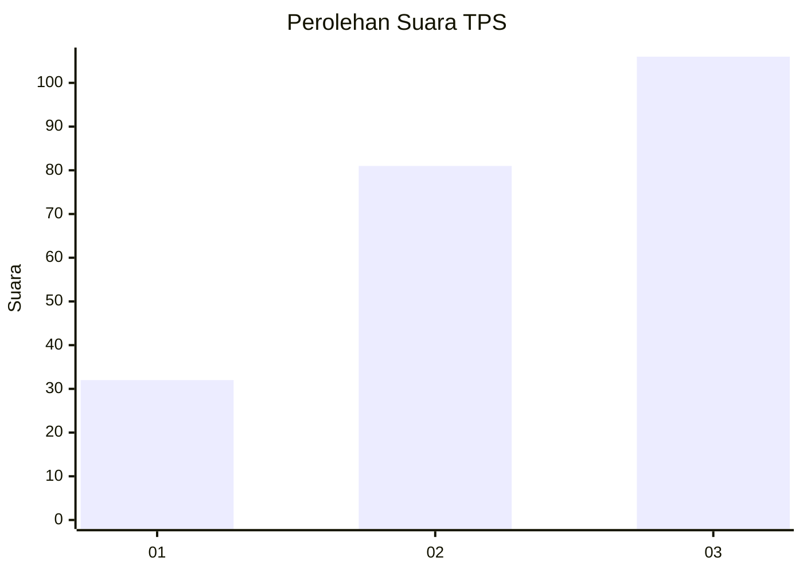
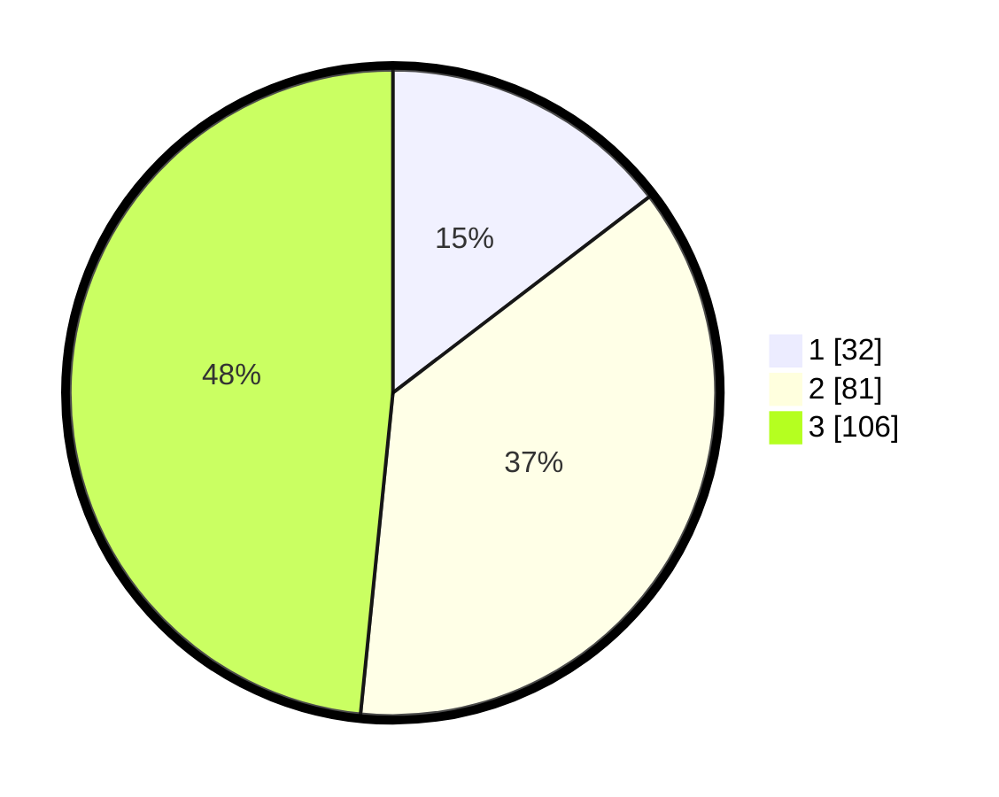

# Hasil

## Grafik

## Tabel

| No. | Nama Paslon    | Suara | Suara (raw) | Persentase |
|:--- |:-------------- | -----:| -----------:| ----------:|
| 1   | ANIES MUHAIMIN | 32    | [32][p-1]   | 14,61      |
| 2   | PRABOWO GIBRAN | 81    | [81][p-2]   | 36,99      |
| 3   | GANJAR MAHFUD  | 106   | [106][p-3]  | 48,40      |

[p-1]: https://github.com/gigit-pemilu/pemilu-2024-34-di-yogyakarta/blob/main/pilpres/hitung-suara/sub/34-di-yogyakarta/sub/04-sleman/sub/07-depok/sub/2003-condongcatur/sub/097-tps/sub/paslon-1.txt
[p-2]: https://github.com/gigit-pemilu/pemilu-2024-34-di-yogyakarta/blob/main/pilpres/hitung-suara/sub/34-di-yogyakarta/sub/04-sleman/sub/07-depok/sub/2003-condongcatur/sub/097-tps/sub/paslon-2.txt
[p-3]: https://github.com/gigit-pemilu/pemilu-2024-34-di-yogyakarta/blob/main/pilpres/hitung-suara/sub/34-di-yogyakarta/sub/04-sleman/sub/07-depok/sub/2003-condongcatur/sub/097-tps/sub/paslon-3.txt

## Foto C Plano

https://sirekap-obj-formc.kpu.go.id/837b/pemilu/ppwp/34/04/07/20/03/3404072003097-20240215-005315--7c182d36-6f1c-466e-b6d0-5eedacbe3195.jpg

https://sirekap-obj-formc.kpu.go.id/837b/pemilu/ppwp/34/04/07/20/03/3404072003097-20240215-005955--cba953cc-5059-4c31-9e30-cf5993c817b4.jpg

https://sirekap-obj-formc.kpu.go.id/837b/pemilu/ppwp/34/04/07/20/03/3404072003097-20240215-010028--f55f01b2-2cff-4ee3-bedc-98d89236385b.jpg

## Metadata

| Key        | Value               |
| ---------- | ------------------- |
| Time Stamp | 2024-02-24 22:31:28 |

