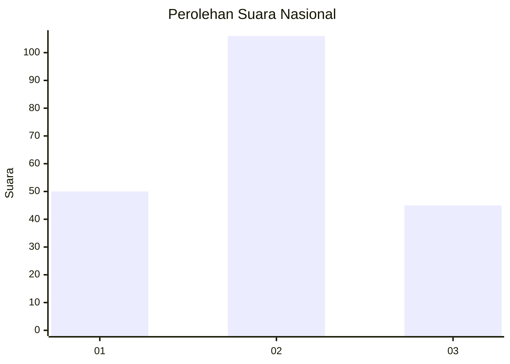
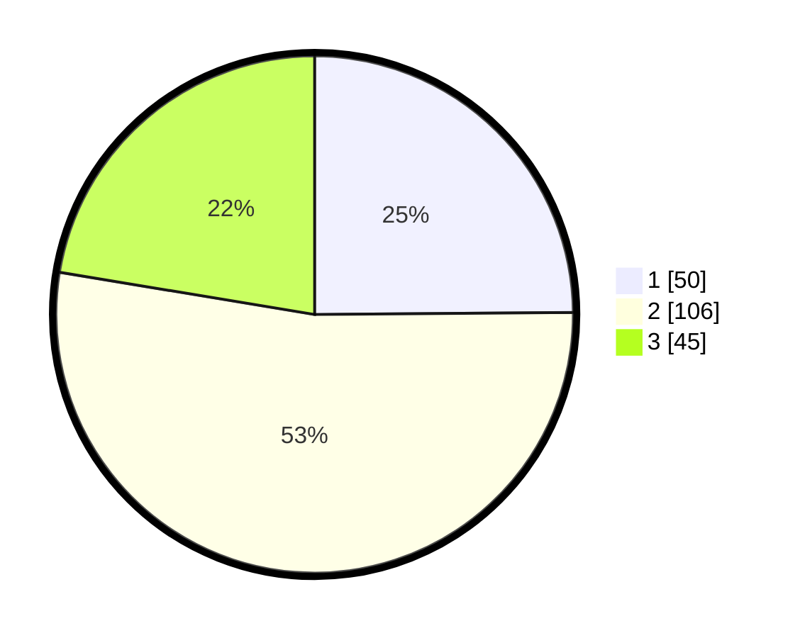

# Hasil

## Grafik

## Tabel

| No. | Nama Paslon    | Suara | Suara (raw) | Persentase |
|:--- |:-------------- | -----:| -----------:| ----------:|
| 1   | ANIES MUHAIMIN | 50    | [50][p-1]   | 24,88      |
| 2   | PRABOWO GIBRAN | 106   | [106][p-2]  | 52,74      |
| 3   | GANJAR MAHFUD  | 45    | [45][p-3]   | 22,39      |

[p-1]: https://github.com/gigit-pemilu/pemilu-2024/blob/main/pilpres/hitung-suara/sub/34-di-yogyakarta/sub/04-sleman/sub/07-depok/sub/2003-condongcatur/sub/113-tps/sub/paslon-1.txt
[p-2]: https://github.com/gigit-pemilu/pemilu-2024/blob/main/pilpres/hitung-suara/sub/34-di-yogyakarta/sub/04-sleman/sub/07-depok/sub/2003-condongcatur/sub/113-tps/sub/paslon-2.txt
[p-3]: https://github.com/gigit-pemilu/pemilu-2024/blob/main/pilpres/hitung-suara/sub/34-di-yogyakarta/sub/04-sleman/sub/07-depok/sub/2003-condongcatur/sub/113-tps/sub/paslon-3.txt

## Foto C Plano

https://sirekap-obj-formc.kpu.go.id/c7f8/pemilu/ppwp/34/04/07/20/03/3404072003113-20240215-010405--0b664f4e-61ca-4ae3-9fc9-77b53c266dbd.jpg

https://sirekap-obj-formc.kpu.go.id/c7f8/pemilu/ppwp/34/04/07/20/03/3404072003113-20240215-010700--d41b6bb7-6e4b-4699-8f33-dddd10ace631.jpg

https://sirekap-obj-formc.kpu.go.id/c7f8/pemilu/ppwp/34/04/07/20/03/3404072003113-20240215-010839--3ee785c4-d94a-41aa-a26b-15515d77822e.jpg

## Metadata

| Key        | Value               |
| ---------- | ------------------- |
| Time Stamp | 2024-02-17 13:37:34 |

