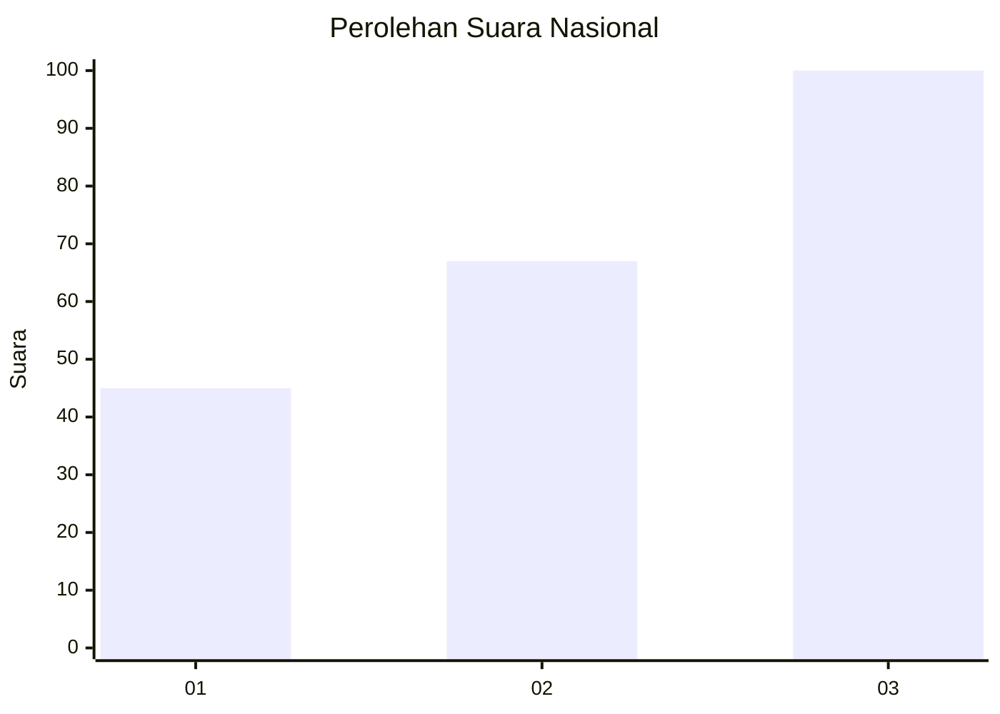
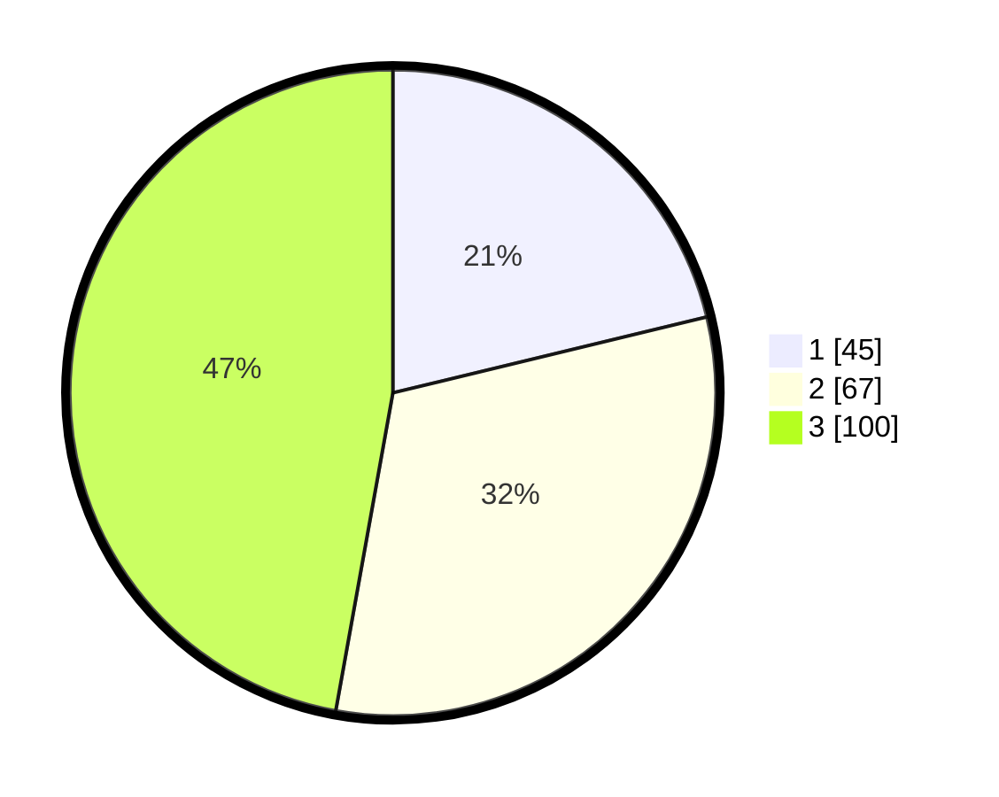

# Hasil

## Grafik

## Tabel

| No. | Nama Paslon    | Suara | Suara (raw) | Persentase |
|:--- |:-------------- | -----:| -----------:| ----------:|
| 1   | ANIES MUHAIMIN | 45    | [45][p-1]   | 21,23      |
| 2   | PRABOWO GIBRAN | 67    | [67][p-2]   | 31,60      |
| 3   | GANJAR MAHFUD  | 100   | [100][p-3]  | 47,17      |

[p-1]: https://github.com/gigit-pemilu/pemilu-2024/blob/main/pilpres/hitung-suara/sub/34-di-yogyakarta/sub/04-sleman/sub/07-depok/sub/2003-condongcatur/sub/125-tps/sub/paslon-1.txt
[p-2]: https://github.com/gigit-pemilu/pemilu-2024/blob/main/pilpres/hitung-suara/sub/34-di-yogyakarta/sub/04-sleman/sub/07-depok/sub/2003-condongcatur/sub/125-tps/sub/paslon-2.txt
[p-3]: https://github.com/gigit-pemilu/pemilu-2024/blob/main/pilpres/hitung-suara/sub/34-di-yogyakarta/sub/04-sleman/sub/07-depok/sub/2003-condongcatur/sub/125-tps/sub/paslon-3.txt

## Foto C Plano

https://sirekap-obj-formc.kpu.go.id/8e9c/pemilu/ppwp/34/04/07/20/03/3404072003125-20240215-113727--16d4e842-35f7-4ee3-bc77-92b2ba5d5e4a.jpg

https://sirekap-obj-formc.kpu.go.id/8e9c/pemilu/ppwp/34/04/07/20/03/3404072003125-20240215-035033--cef3a9fc-bccb-4250-9842-31c90e29f880.jpg

https://sirekap-obj-formc.kpu.go.id/8e9c/pemilu/ppwp/34/04/07/20/03/3404072003125-20240215-035041--adc3a8d3-50ba-4017-b1b3-d8ec2791fa35.jpg

## Metadata

| Key        | Value               |
| ---------- | ------------------- |
| Time Stamp | 2024-02-25 09:00:00 |

