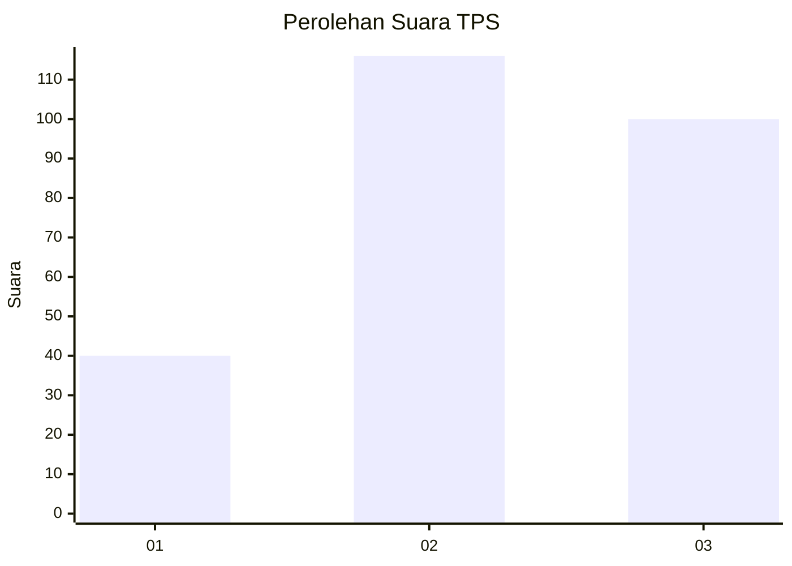
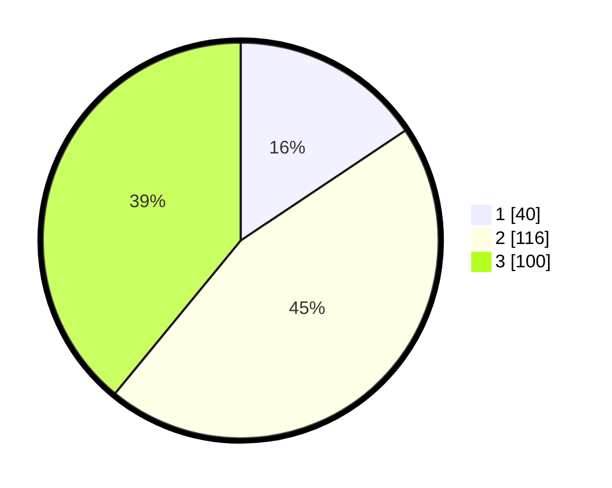

# Hasil

## Grafik

## Tabel

| No. | Nama Paslon    | Suara | Suara (raw) | Persentase |
|:--- |:-------------- | -----:| -----------:| ----------:|
| 1   | ANIES MUHAIMIN | 40    | [40][p-1]   | 15,63      |
| 2   | PRABOWO GIBRAN | 116   | [116][p-2]  | 45,31      |
| 3   | GANJAR MAHFUD  | 100   | [100][p-3]  | 39,06      |

[p-1]: https://github.com/gigit-pemilu/pemilu-2024-34-di-yogyakarta/blob/main/pilpres/hitung-suara/sub/34-di-yogyakarta/sub/04-sleman/sub/07-depok/sub/2003-condongcatur/sub/131-tps/sub/paslon-1.txt
[p-2]: https://github.com/gigit-pemilu/pemilu-2024-34-di-yogyakarta/blob/main/pilpres/hitung-suara/sub/34-di-yogyakarta/sub/04-sleman/sub/07-depok/sub/2003-condongcatur/sub/131-tps/sub/paslon-2.txt
[p-3]: https://github.com/gigit-pemilu/pemilu-2024-34-di-yogyakarta/blob/main/pilpres/hitung-suara/sub/34-di-yogyakarta/sub/04-sleman/sub/07-depok/sub/2003-condongcatur/sub/131-tps/sub/paslon-3.txt

## Foto C Plano

https://sirekap-obj-formc.kpu.go.id/0b7b/pemilu/ppwp/34/04/07/20/03/3404072003131-20240215-001701--ad9702ca-75bb-42b9-a736-7f161201676e.jpg

https://sirekap-obj-formc.kpu.go.id/0b7b/pemilu/ppwp/34/04/07/20/03/3404072003131-20240215-001338--b6df38b0-fb02-4849-a86a-79d064edb138.jpg

https://sirekap-obj-formc.kpu.go.id/0b7b/pemilu/ppwp/34/04/07/20/03/3404072003131-20240215-001835--5ec1dc5a-cac5-4860-b7e4-c614e43da5d1.jpg

## Metadata

| Key        | Value               |
| ---------- | ------------------- |
| Time Stamp | 2024-02-15 18:00:26 |

## DATA PEMILIH TETAP

Jumlah pemilih dalam DPT: **74**.
 * L: **104**.
 * P: **157**.

## DATA PENGGUNA HAK PILIH

Jumlah pengguna hak pilih dalam DPT: **70**.
 * L: **110**.
 * P: **174**.

Jumlah pengguna hak pilih dalam DPTb: **4**.
 * L: **4**.
 * P: **7**.

Jumlah pengguna hak pilih dalam DPK: **4**.
 * L: **2**.
 * P: **0**.

Jumlah pengguna hak pilih: **42**.
 * L: **114**.
 * P: **144**.

## JUMLAH SUARA SAH DAN TIDAK SAH

JUMLAH SELURUH SUARA SAH: **256**.

JUMLAH SUARA TIDAK SAH: **7**.

JUMLAH SELURUH SUARA SAH DAN SUARA TIDAK SAH: **263**.

