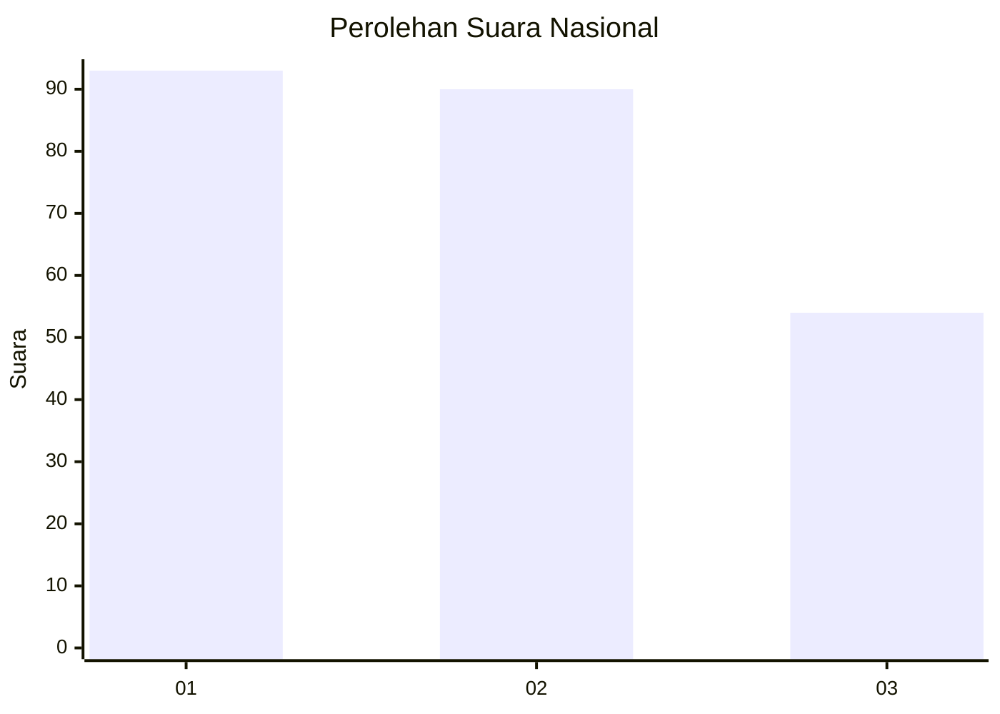
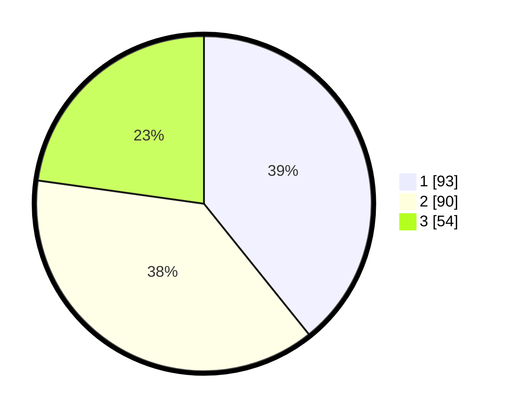

# Hasil

## Grafik

## Tabel

| No. | Nama Paslon    | Suara | Suara (raw) | Persentase |
|:--- |:-------------- | -----:| -----------:| ----------:|
| 1   | ANIES MUHAIMIN | 93    | [93][p-1]   | 39,24      |
| 2   | PRABOWO GIBRAN | 90    | [90][p-2]   | 37,97      |
| 3   | GANJAR MAHFUD  | 54    | [54][p-3]   | 22,78      |

[p-1]: https://github.com/gigit-pemilu/pemilu-2024/blob/main/pilpres/hitung-suara/sub/34-di-yogyakarta/sub/04-sleman/sub/07-depok/sub/2003-condongcatur/sub/133-tps/sub/paslon-1.txt
[p-2]: https://github.com/gigit-pemilu/pemilu-2024/blob/main/pilpres/hitung-suara/sub/34-di-yogyakarta/sub/04-sleman/sub/07-depok/sub/2003-condongcatur/sub/133-tps/sub/paslon-2.txt
[p-3]: https://github.com/gigit-pemilu/pemilu-2024/blob/main/pilpres/hitung-suara/sub/34-di-yogyakarta/sub/04-sleman/sub/07-depok/sub/2003-condongcatur/sub/133-tps/sub/paslon-3.txt

## Foto C Plano

https://sirekap-obj-formc.kpu.go.id/e957/pemilu/ppwp/34/04/07/20/03/3404072003133-20240216-063949--e6c9631c-d9df-4057-bff6-613196b981f7.jpg

https://sirekap-obj-formc.kpu.go.id/e957/pemilu/ppwp/34/04/07/20/03/3404072003133-20240215-020007--3daf8fea-661c-43fa-ad6f-a4ebc901b54f.jpg

https://sirekap-obj-formc.kpu.go.id/e957/pemilu/ppwp/34/04/07/20/03/3404072003133-20240215-020043--09262594-9319-4b6e-a618-c9e5c5b9313d.jpg

## Metadata

| Key        | Value               |
| ---------- | ------------------- |
| Time Stamp | 2024-02-19 06:16:00 |

