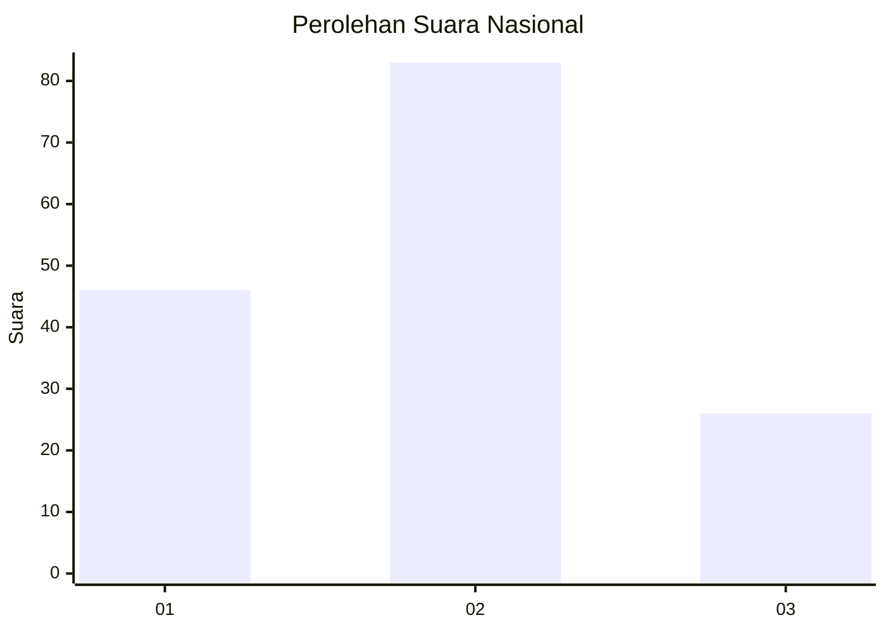
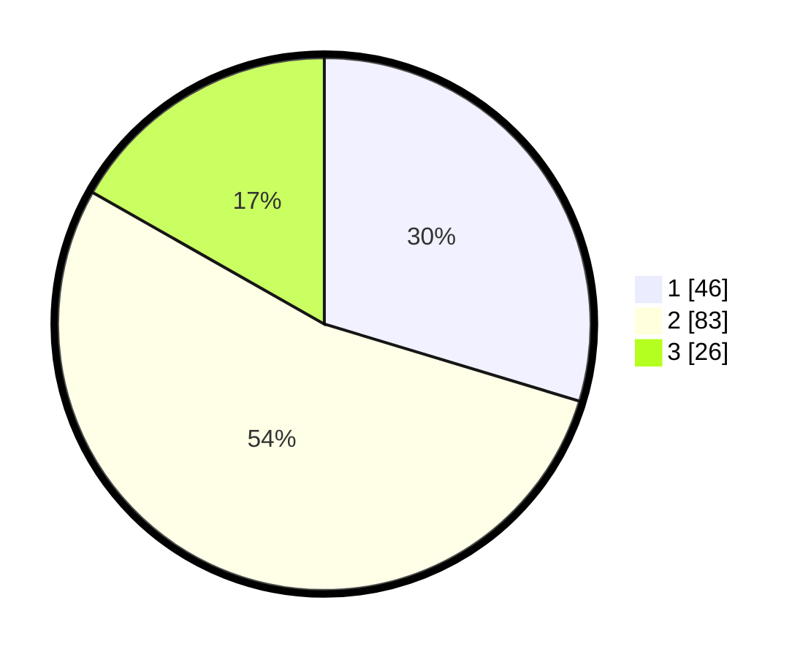

# Hasil

## Grafik

## Tabel

| No. | Nama Paslon    | Suara | Suara (raw) | Persentase |
|:--- |:-------------- | -----:| -----------:| ----------:|
| 1   | ANIES MUHAIMIN | 46    | [46][p-1]   | 29,68      |
| 2   | PRABOWO GIBRAN | 83    | [83][p-2]   | 53,55      |
| 3   | GANJAR MAHFUD  | 26    | [26][p-3]   | 16,77      |

[p-1]: https://github.com/gigit-pemilu/pemilu-2024/blob/main/pilpres/hitung-suara/sub/34-di-yogyakarta/sub/04-sleman/sub/07-depok/sub/2003-condongcatur/sub/901-tps/sub/paslon-1.txt
[p-2]: https://github.com/gigit-pemilu/pemilu-2024/blob/main/pilpres/hitung-suara/sub/34-di-yogyakarta/sub/04-sleman/sub/07-depok/sub/2003-condongcatur/sub/901-tps/sub/paslon-2.txt
[p-3]: https://github.com/gigit-pemilu/pemilu-2024/blob/main/pilpres/hitung-suara/sub/34-di-yogyakarta/sub/04-sleman/sub/07-depok/sub/2003-condongcatur/sub/901-tps/sub/paslon-3.txt

## Foto C Plano

https://sirekap-obj-formc.kpu.go.id/8af6/pemilu/ppwp/34/04/07/20/03/3404072003901-20240217-010044--b00bc5cf-54a4-4b70-914e-736466f09a82.jpg

https://sirekap-obj-formc.kpu.go.id/8af6/pemilu/ppwp/34/04/07/20/03/3404072003901-20240217-010045--a6862127-313d-40fa-93cd-fabe9bc6ccb6.jpg

https://sirekap-obj-formc.kpu.go.id/8af6/pemilu/ppwp/34/04/07/20/03/3404072003901-20240217-010044--a4770fd4-be47-4c8e-9697-d3496bfff3a0.jpg

## Metadata

| Key        | Value               |
| ---------- | ------------------- |
| Time Stamp | 2024-02-17 11:30:03 |

## DATA PEMILIH TETAP

Jumlah pemilih dalam DPT: **228**.
 * L: **71**.
 * P: **157**.

## DATA PENGGUNA HAK PILIH

Jumlah pengguna hak pilih dalam DPT: **141**.
 * L: **42**.
 * P: **99**.

Jumlah pengguna hak pilih dalam DPTb: **14**.
 * L: **13**.
 * P: **1**.

Jumlah pengguna hak pilih dalam DPK: **0**.
 * L: **0**.
 * P: **0**.

Jumlah pengguna hak pilih: **155**.
 * L: **55**.
 * P: **100**.

## JUMLAH SUARA SAH DAN TIDAK SAH

JUMLAH SELURUH SUARA SAH: **155**.

JUMLAH SUARA TIDAK SAH: **0**.

JUMLAH SELURUH SUARA SAH DAN SUARA TIDAK SAH: **155**.

