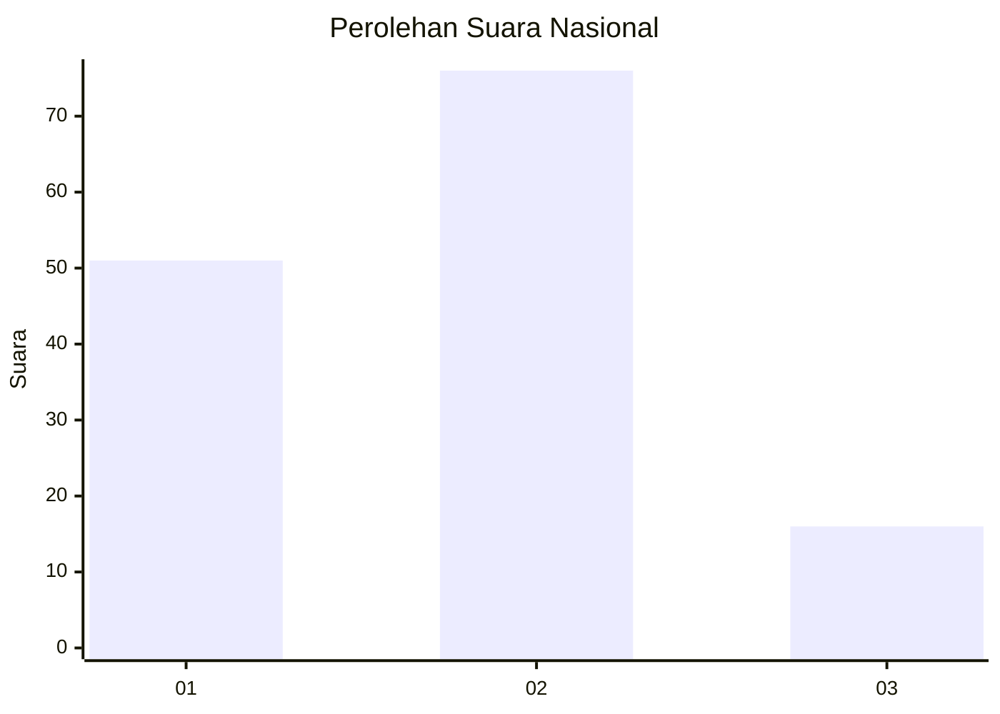
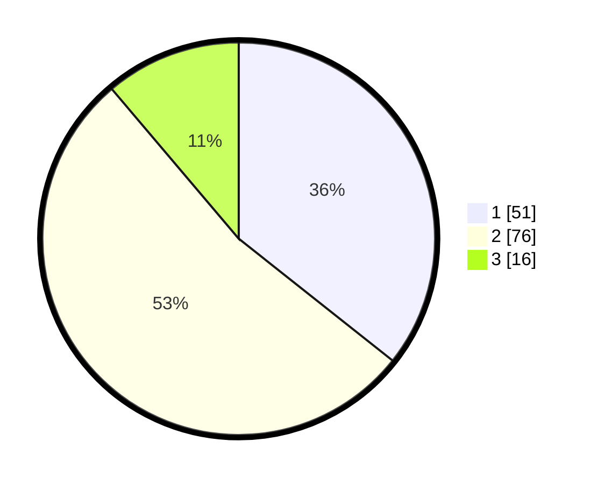

# Hasil

## Grafik

## Tabel

| No. | Nama Paslon    | Suara | Suara (raw) | Persentase |
|:--- |:-------------- | -----:| -----------:| ----------:|
| 1   | ANIES MUHAIMIN | 51    | [51][p-1]   | 35,66      |
| 2   | PRABOWO GIBRAN | 76    | [76][p-2]   | 53,15      |
| 3   | GANJAR MAHFUD  | 16    | [16][p-3]   | 11,19      |

[p-1]: https://github.com/gigit-pemilu/pemilu-2024/blob/main/pilpres/hitung-suara/sub/34-di-yogyakarta/sub/04-sleman/sub/07-depok/sub/2003-condongcatur/sub/902-tps/sub/paslon-1.txt
[p-2]: https://github.com/gigit-pemilu/pemilu-2024/blob/main/pilpres/hitung-suara/sub/34-di-yogyakarta/sub/04-sleman/sub/07-depok/sub/2003-condongcatur/sub/902-tps/sub/paslon-2.txt
[p-3]: https://github.com/gigit-pemilu/pemilu-2024/blob/main/pilpres/hitung-suara/sub/34-di-yogyakarta/sub/04-sleman/sub/07-depok/sub/2003-condongcatur/sub/902-tps/sub/paslon-3.txt

## Foto C Plano

https://sirekap-obj-formc.kpu.go.id/243a/pemilu/ppwp/34/04/07/20/03/3404072003902-20240214-202707--b732dd7d-f754-4895-9b1f-4669cf5e5af1.jpg

https://sirekap-obj-formc.kpu.go.id/243a/pemilu/ppwp/34/04/07/20/03/3404072003902-20240214-202902--174a1fa8-fbc6-4d90-b393-7e97f412f71a.jpg

## Metadata

| Key        | Value               |
| ---------- | ------------------- |
| Time Stamp | 2024-02-15 16:00:26 |

