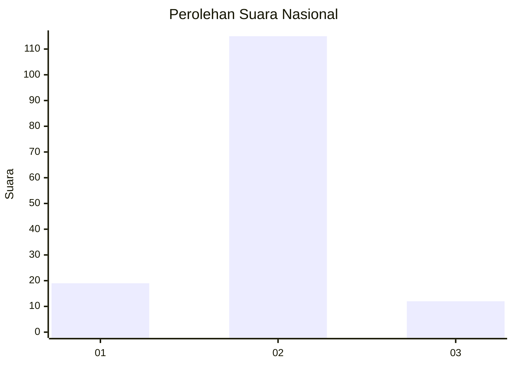
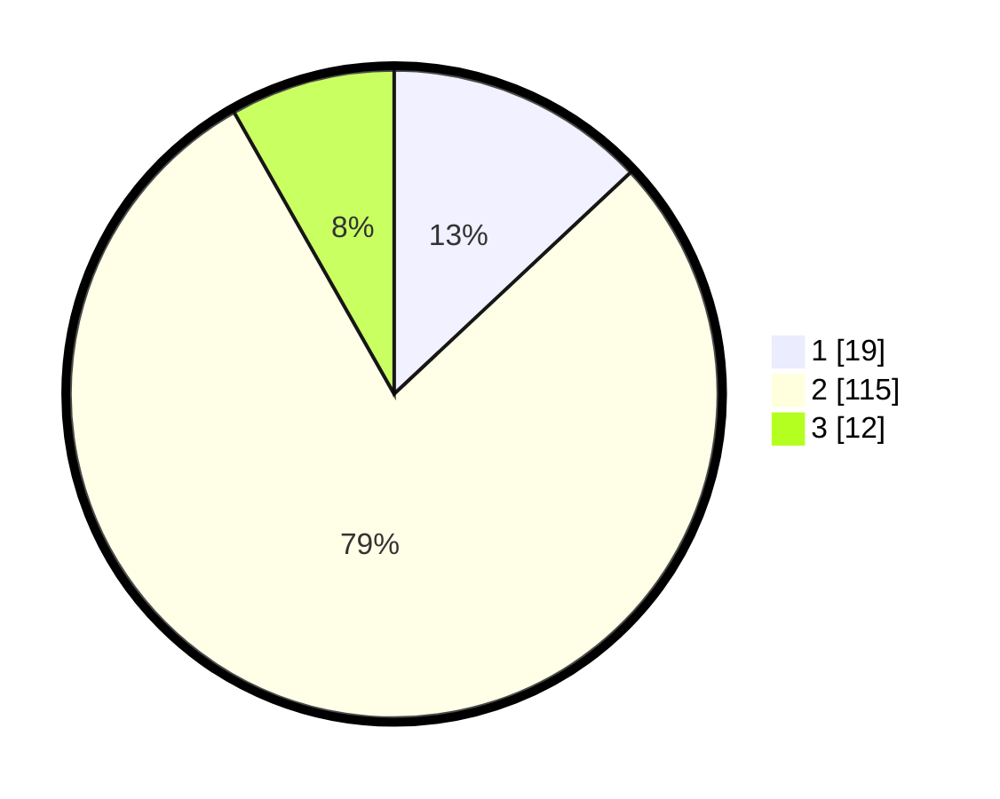

# Hasil

## Grafik

## Tabel

| No. | Nama Paslon    | Suara | Suara (raw) | Persentase |
|:--- |:-------------- | -----:| -----------:| ----------:|
| 1   | ANIES MUHAIMIN | 19    | [19][p-1]   | 13,01      |
| 2   | PRABOWO GIBRAN | 115   | [115][p-2]  | 78,77      |
| 3   | GANJAR MAHFUD  | 12    | [12][p-3]   | 8,22       |

[p-1]: https://github.com/gigit-pemilu/pemilu-2024/blob/main/pilpres/hitung-suara/sub/34-di-yogyakarta/sub/04-sleman/sub/07-depok/sub/2003-condongcatur/sub/904-tps/sub/paslon-1.txt
[p-2]: https://github.com/gigit-pemilu/pemilu-2024/blob/main/pilpres/hitung-suara/sub/34-di-yogyakarta/sub/04-sleman/sub/07-depok/sub/2003-condongcatur/sub/904-tps/sub/paslon-2.txt
[p-3]: https://github.com/gigit-pemilu/pemilu-2024/blob/main/pilpres/hitung-suara/sub/34-di-yogyakarta/sub/04-sleman/sub/07-depok/sub/2003-condongcatur/sub/904-tps/sub/paslon-3.txt

## Foto C Plano

https://sirekap-obj-formc.kpu.go.id/24a3/pemilu/ppwp/34/04/07/20/03/3404072003904-20240214-155827--22bf4aa6-0007-4169-88d9-3094c1b77a21.jpg

https://sirekap-obj-formc.kpu.go.id/24a3/pemilu/ppwp/34/04/07/20/03/3404072003904-20240214-155428--bb01c270-5c78-4e8f-a459-d5e7258c751c.jpg

https://sirekap-obj-formc.kpu.go.id/24a3/pemilu/ppwp/34/04/07/20/03/3404072003904-20240214-160113--bb5acc50-76f6-49e2-9bce-1b780dfc8f3f.jpg

## Metadata

| Key        | Value               |
| ---------- | ------------------- |
| Time Stamp | 2024-02-15 16:00:26 |

