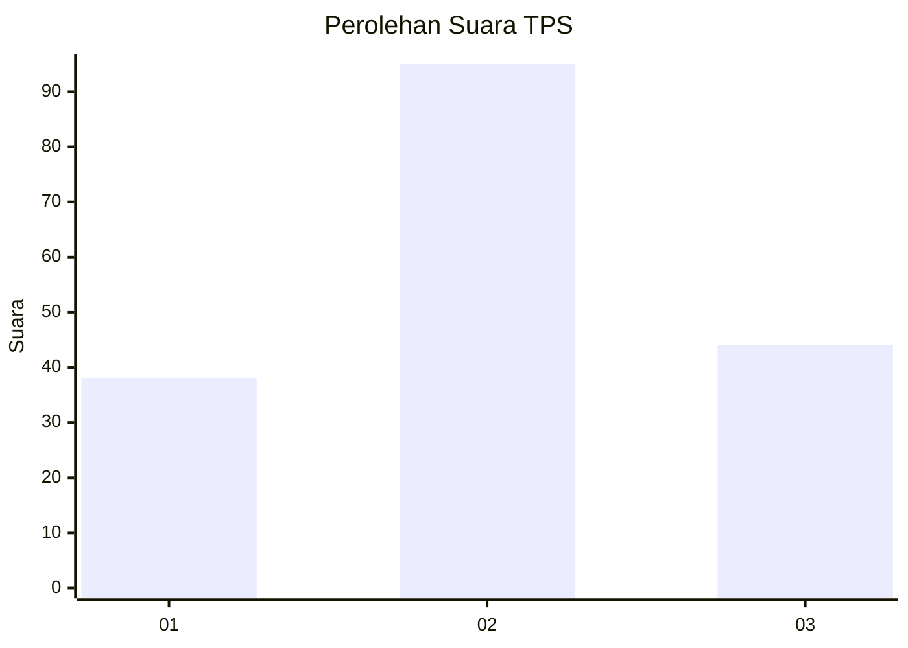
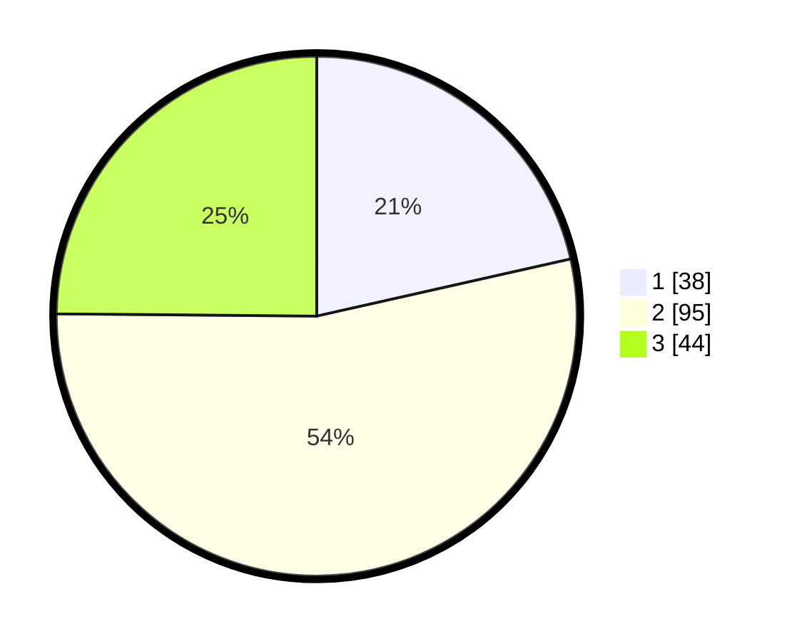

# Hasil

## Grafik

## Tabel

| No. | Nama Paslon    | Suara | Suara (raw) | Persentase |
|:--- |:-------------- | -----:| -----------:| ----------:|
| 1   | ANIES MUHAIMIN | 38    | [38][p-1]   | 21,47      |
| 2   | PRABOWO GIBRAN | 95    | [95][p-2]   | 53,67      |
| 3   | GANJAR MAHFUD  | 44    | [44][p-3]   | 24,86      |

[p-1]: https://github.com/gigit-pemilu/pemilu-2024-34-di-yogyakarta/blob/main/pilpres/hitung-suara/sub/34-di-yogyakarta/sub/04-sleman/sub/08-berbah/sub/2001-sendangtirto/sub/003-tps/sub/paslon-1.txt
[p-2]: https://github.com/gigit-pemilu/pemilu-2024-34-di-yogyakarta/blob/main/pilpres/hitung-suara/sub/34-di-yogyakarta/sub/04-sleman/sub/08-berbah/sub/2001-sendangtirto/sub/003-tps/sub/paslon-2.txt
[p-3]: https://github.com/gigit-pemilu/pemilu-2024-34-di-yogyakarta/blob/main/pilpres/hitung-suara/sub/34-di-yogyakarta/sub/04-sleman/sub/08-berbah/sub/2001-sendangtirto/sub/003-tps/sub/paslon-3.txt

## Foto C Plano

https://sirekap-obj-formc.kpu.go.id/b856/pemilu/ppwp/34/04/08/20/01/3404082001003-20240214-211253--d3625717-7e1a-4050-9f7e-4bacecefb8ad.jpg

https://sirekap-obj-formc.kpu.go.id/b856/pemilu/ppwp/34/04/08/20/01/3404082001003-20240215-011951--59c81c97-faa4-41b3-9c38-bd11e89e3b63.jpg

https://sirekap-obj-formc.kpu.go.id/b856/pemilu/ppwp/34/04/08/20/01/3404082001003-20240214-211502--863896a9-9950-4ea2-9483-37644fcf4339.jpg

## Metadata

| Key        | Value               |
| ---------- | ------------------- |
| Time Stamp | 2024-02-15 02:10:27 |

## DATA PEMILIH TETAP

Jumlah pemilih dalam DPT: **214**.
 * L: **96**.
 * P: **118**.

## DATA PENGGUNA HAK PILIH

Jumlah pengguna hak pilih dalam DPT: **168**.
 * L: **75**.
 * P: **93**.

Jumlah pengguna hak pilih dalam DPTb: **6**.
 * L: **3**.
 * P: **3**.

Jumlah pengguna hak pilih dalam DPK: **8**.
 * L: **5**.
 * P: **3**.

Jumlah pengguna hak pilih: **182**.
 * L: **83**.
 * P: **99**.

## JUMLAH SUARA SAH DAN TIDAK SAH

JUMLAH SELURUH SUARA SAH: **177**.

JUMLAH SUARA TIDAK SAH: **5**.

JUMLAH SELURUH SUARA SAH DAN SUARA TIDAK SAH: **182**.

