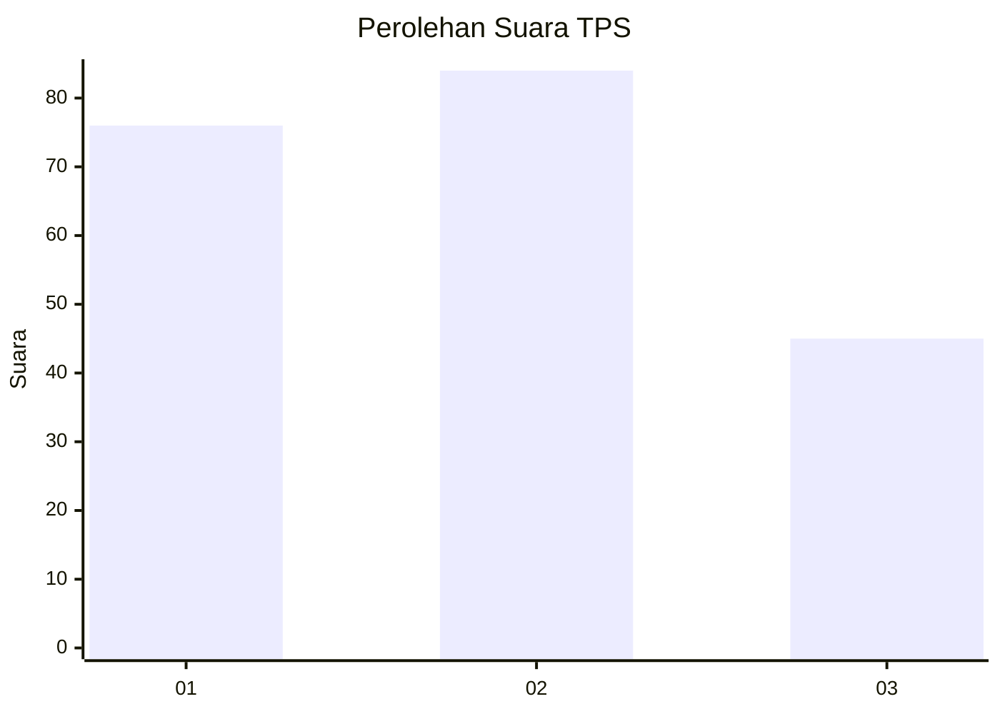
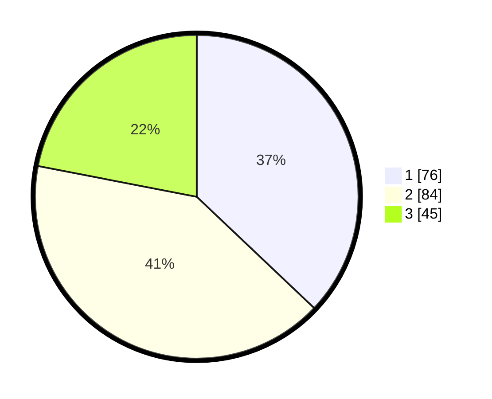

# Hasil

## Grafik

## Tabel

| No. | Nama Paslon    | Suara | Suara (raw) | Persentase |
|:--- |:-------------- | -----:| -----------:| ----------:|
| 1   | ANIES MUHAIMIN | 76    | [76][p-1]   | 37,07      |
| 2   | PRABOWO GIBRAN | 84    | [84][p-2]   | 40,98      |
| 3   | GANJAR MAHFUD  | 45    | [45][p-3]   | 21,95      |

[p-1]: https://github.com/gigit-pemilu/pemilu-2024-34-di-yogyakarta/blob/main/pilpres/hitung-suara/sub/34-di-yogyakarta/sub/04-sleman/sub/08-berbah/sub/2001-sendangtirto/sub/005-tps/sub/paslon-1.txt
[p-2]: https://github.com/gigit-pemilu/pemilu-2024-34-di-yogyakarta/blob/main/pilpres/hitung-suara/sub/34-di-yogyakarta/sub/04-sleman/sub/08-berbah/sub/2001-sendangtirto/sub/005-tps/sub/paslon-2.txt
[p-3]: https://github.com/gigit-pemilu/pemilu-2024-34-di-yogyakarta/blob/main/pilpres/hitung-suara/sub/34-di-yogyakarta/sub/04-sleman/sub/08-berbah/sub/2001-sendangtirto/sub/005-tps/sub/paslon-3.txt

## Foto C Plano

https://sirekap-obj-formc.kpu.go.id/f83f/pemilu/ppwp/34/04/08/20/01/3404082001005-20240214-202043--7831f290-024d-41cf-b2fc-4475c6a31366.jpg

https://sirekap-obj-formc.kpu.go.id/f83f/pemilu/ppwp/34/04/08/20/01/3404082001005-20240214-201843--92cd6d3d-d329-434f-a629-f47035f0c6af.jpg

https://sirekap-obj-formc.kpu.go.id/f83f/pemilu/ppwp/34/04/08/20/01/3404082001005-20240214-202005--088a24cc-e50b-4203-89a4-f778a26700ef.jpg

## Metadata

| Key        | Value               |
| ---------- | ------------------- |
| Time Stamp | 2024-02-15 00:41:44 |

## DATA PEMILIH TETAP

Jumlah pemilih dalam DPT: **233**.
 * L: **109**.
 * P: **124**.

## DATA PENGGUNA HAK PILIH

Jumlah pengguna hak pilih dalam DPT: **196**.
 * L: **91**.
 * P: **105**.

Jumlah pengguna hak pilih dalam DPTb: **13**.
 * L: **10**.
 * P: **3**.

Jumlah pengguna hak pilih dalam DPK: **2**.
 * L: **0**.
 * P: **2**.

Jumlah pengguna hak pilih: **211**.
 * L: **101**.
 * P: **110**.

## JUMLAH SUARA SAH DAN TIDAK SAH

JUMLAH SELURUH SUARA SAH: **205**.

JUMLAH SUARA TIDAK SAH: **6**.

JUMLAH SELURUH SUARA SAH DAN SUARA TIDAK SAH: **211**.

