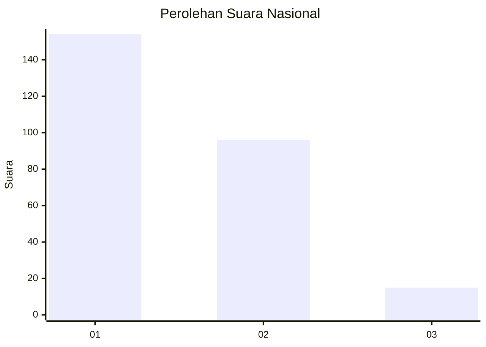
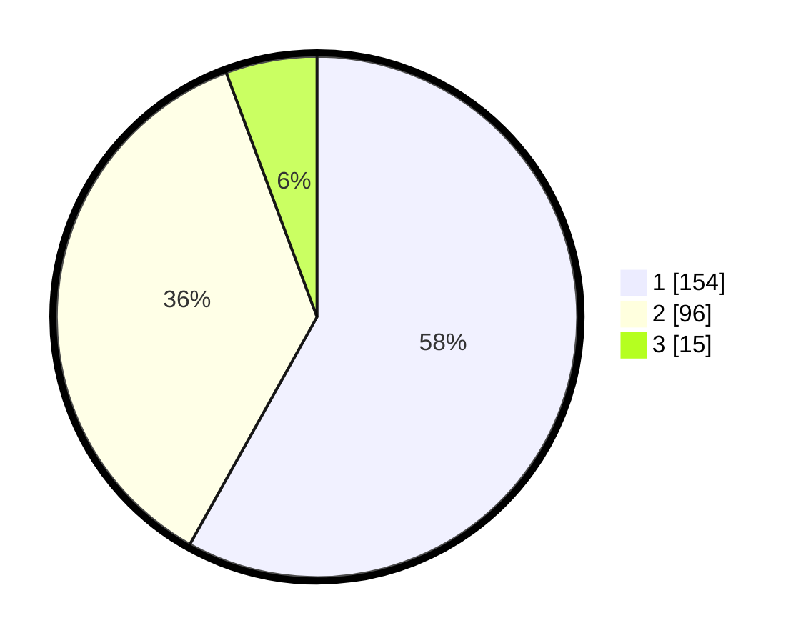

# Hasil

## Grafik

## Tabel

| No. | Nama Paslon    | Suara | Suara (raw) | Persentase |
|:--- |:-------------- | -----:| -----------:| ----------:|
| 1   | ANIES MUHAIMIN | 154   | [154][p-1]  | 58,11      |
| 2   | PRABOWO GIBRAN | 96    | [96][p-2]   | 36,23      |
| 3   | GANJAR MAHFUD  | 15    | [15][p-3]   | 5,66       |

[p-1]: https://github.com/gigit-pemilu/pemilu-2024/blob/main/pilpres/hitung-suara/sub/34-di-yogyakarta/sub/04-sleman/sub/08-berbah/sub/2001-sendangtirto/sub/009-tps/sub/paslon-1.txt
[p-2]: https://github.com/gigit-pemilu/pemilu-2024/blob/main/pilpres/hitung-suara/sub/34-di-yogyakarta/sub/04-sleman/sub/08-berbah/sub/2001-sendangtirto/sub/009-tps/sub/paslon-2.txt
[p-3]: https://github.com/gigit-pemilu/pemilu-2024/blob/main/pilpres/hitung-suara/sub/34-di-yogyakarta/sub/04-sleman/sub/08-berbah/sub/2001-sendangtirto/sub/009-tps/sub/paslon-3.txt

## Foto C Plano

https://sirekap-obj-formc.kpu.go.id/98e1/pemilu/ppwp/34/04/08/20/01/3404082001009-20240214-184924--ef13edc5-d445-4017-9436-d5e63636807e.jpg

https://sirekap-obj-formc.kpu.go.id/98e1/pemilu/ppwp/34/04/08/20/01/3404082001009-20240214-185016--983f1199-7341-4eda-8e03-e0a5cc57fb6b.jpg

https://sirekap-obj-formc.kpu.go.id/98e1/pemilu/ppwp/34/04/08/20/01/3404082001009-20240214-185044--b07deda5-c52b-452b-889c-6184920408e0.jpg

## Metadata

| Key        | Value               |
| ---------- | ------------------- |
| Time Stamp | 2024-02-14 21:46:01 |

## DATA PEMILIH TETAP

Jumlah pemilih dalam DPT: **297**.
 * L: **152**.
 * P: **145**.

## DATA PENGGUNA HAK PILIH

Jumlah pengguna hak pilih dalam DPT: **263**.
 * L: **133**.
 * P: **130**.

Jumlah pengguna hak pilih dalam DPTb: **9**.
 * L: **4**.
 * P: **5**.

Jumlah pengguna hak pilih dalam DPK: **1**.
 * L: **0**.
 * P: **1**.

Jumlah pengguna hak pilih: **273**.
 * L: **137**.
 * P: **136**.

## JUMLAH SUARA SAH DAN TIDAK SAH

JUMLAH SELURUH SUARA SAH: **265**.

JUMLAH SUARA TIDAK SAH: **8**.

JUMLAH SELURUH SUARA SAH DAN SUARA TIDAK SAH: **273**.

