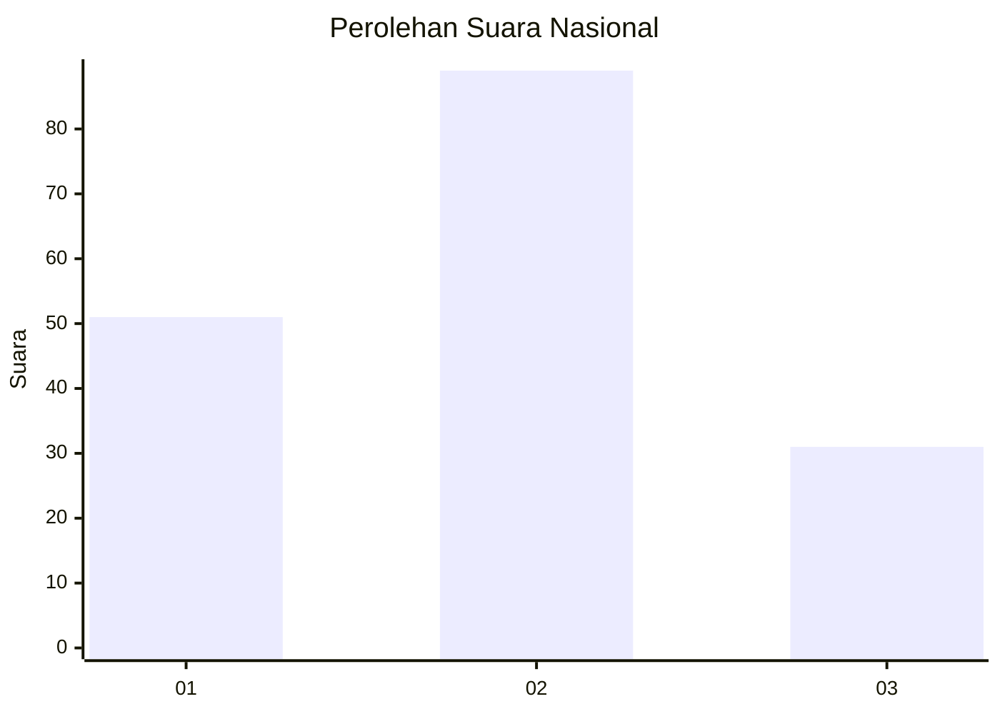
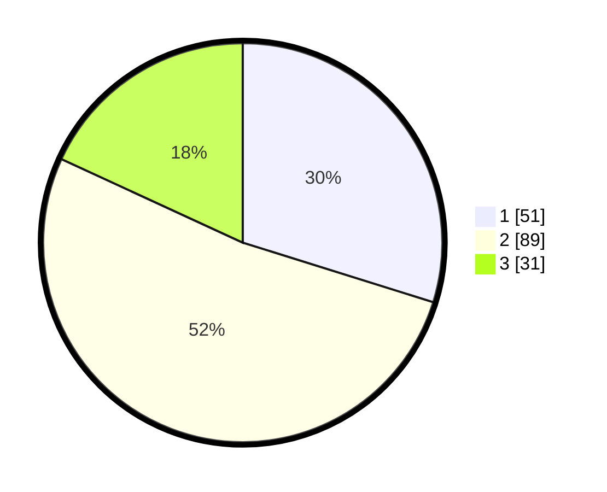

# Hasil

## Grafik

## Tabel

| No. | Nama Paslon    | Suara | Suara (raw) | Persentase |
|:--- |:-------------- | -----:| -----------:| ----------:|
| 1   | ANIES MUHAIMIN | 51    | [51][p-1]   | 29,82      |
| 2   | PRABOWO GIBRAN | 89    | [89][p-2]   | 52,05      |
| 3   | GANJAR MAHFUD  | 31    | [31][p-3]   | 18,13      |

[p-1]: https://github.com/gigit-pemilu/pemilu-2024/blob/main/pilpres/hitung-suara/sub/34-di-yogyakarta/sub/04-sleman/sub/08-berbah/sub/2001-sendangtirto/sub/010-tps/sub/paslon-1.txt
[p-2]: https://github.com/gigit-pemilu/pemilu-2024/blob/main/pilpres/hitung-suara/sub/34-di-yogyakarta/sub/04-sleman/sub/08-berbah/sub/2001-sendangtirto/sub/010-tps/sub/paslon-2.txt
[p-3]: https://github.com/gigit-pemilu/pemilu-2024/blob/main/pilpres/hitung-suara/sub/34-di-yogyakarta/sub/04-sleman/sub/08-berbah/sub/2001-sendangtirto/sub/010-tps/sub/paslon-3.txt

## Foto C Plano

https://sirekap-obj-formc.kpu.go.id/002d/pemilu/ppwp/34/04/08/20/01/3404082001010-20240214-222835--2df66950-ca17-46a2-b3c8-689a1340f2ee.jpg

https://sirekap-obj-formc.kpu.go.id/002d/pemilu/ppwp/34/04/08/20/01/3404082001010-20240214-223142--5bffa073-1341-4d95-9083-848112fb4f1b.jpg

https://sirekap-obj-formc.kpu.go.id/002d/pemilu/ppwp/34/04/08/20/01/3404082001010-20240214-223407--cd8091b8-2694-4829-bb30-783c0a709415.jpg

## Metadata

| Key        | Value               |
| ---------- | ------------------- |
| Time Stamp | 2024-02-15 16:00:26 |

