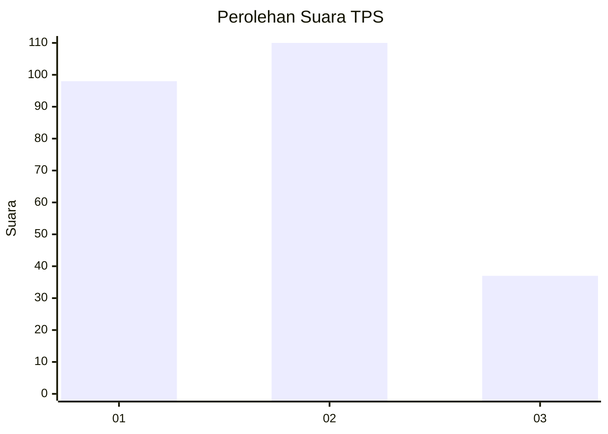
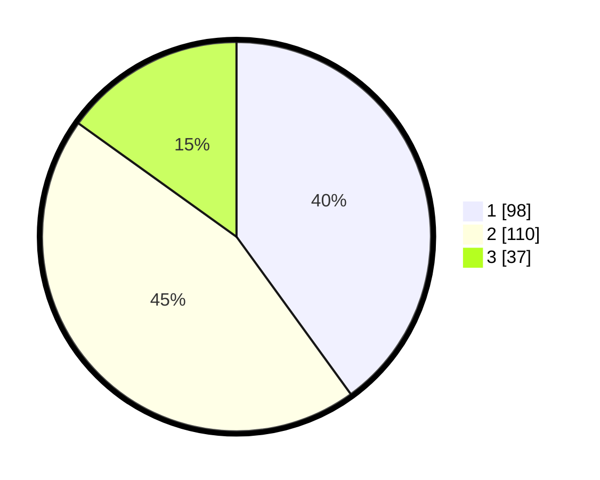

# Hasil

## Grafik

## Tabel

| No. | Nama Paslon    | Suara | Suara (raw) | Persentase |
|:--- |:-------------- | -----:| -----------:| ----------:|
| 1   | ANIES MUHAIMIN | 98    | [98][p-1]   | 40,00      |
| 2   | PRABOWO GIBRAN | 110   | [110][p-2]  | 44,90      |
| 3   | GANJAR MAHFUD  | 37    | [37][p-3]   | 15,10      |

[p-1]: https://github.com/gigit-pemilu/pemilu-2024-34-di-yogyakarta/blob/main/pilpres/hitung-suara/sub/34-di-yogyakarta/sub/04-sleman/sub/08-berbah/sub/2001-sendangtirto/sub/012-tps/sub/paslon-1.txt
[p-2]: https://github.com/gigit-pemilu/pemilu-2024-34-di-yogyakarta/blob/main/pilpres/hitung-suara/sub/34-di-yogyakarta/sub/04-sleman/sub/08-berbah/sub/2001-sendangtirto/sub/012-tps/sub/paslon-2.txt
[p-3]: https://github.com/gigit-pemilu/pemilu-2024-34-di-yogyakarta/blob/main/pilpres/hitung-suara/sub/34-di-yogyakarta/sub/04-sleman/sub/08-berbah/sub/2001-sendangtirto/sub/012-tps/sub/paslon-3.txt

## Foto C Plano

https://sirekap-obj-formc.kpu.go.id/39dc/pemilu/ppwp/34/04/08/20/01/3404082001012-20240214-155546--6df1ebcf-44e1-4ab1-a0ff-a1b532a4f98e.jpg

https://sirekap-obj-formc.kpu.go.id/39dc/pemilu/ppwp/34/04/08/20/01/3404082001012-20240214-155836--1793b107-f957-43c9-9827-83470a3ccacd.jpg

https://sirekap-obj-formc.kpu.go.id/39dc/pemilu/ppwp/34/04/08/20/01/3404082001012-20240214-155734--630e512b-6532-4d85-b973-b6d8fa7d334a.jpg

## Metadata

| Key        | Value               |
| ---------- | ------------------- |
| Time Stamp | 2024-02-15 16:00:26 |

