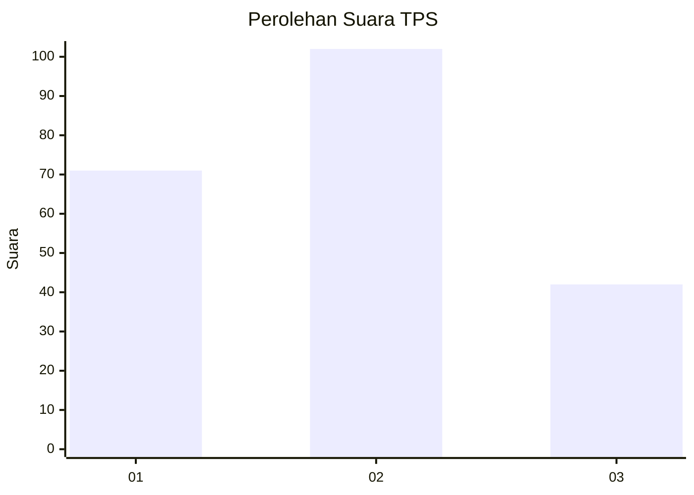
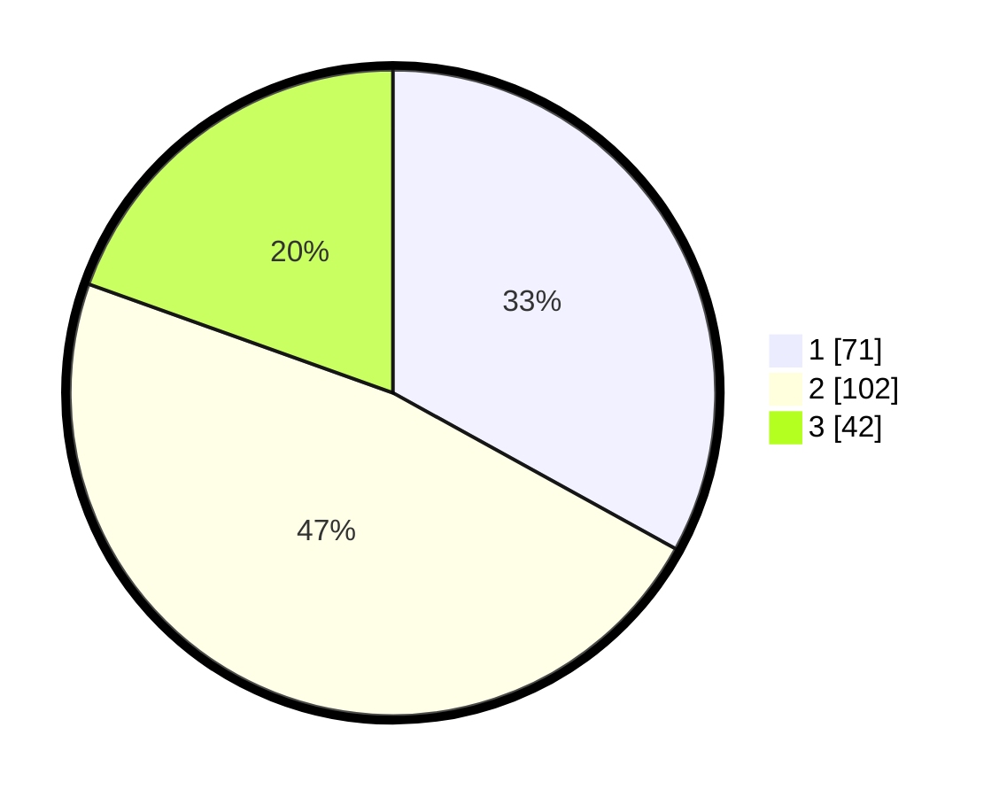

# Hasil

## Grafik

## Tabel

| No. | Nama Paslon    | Suara | Suara (raw) | Persentase |
|:--- |:-------------- | -----:| -----------:| ----------:|
| 1   | ANIES MUHAIMIN | 71    | [71][p-1]   | 33,02      |
| 2   | PRABOWO GIBRAN | 102   | [102][p-2]  | 47,44      |
| 3   | GANJAR MAHFUD  | 42    | [42][p-3]   | 19,53      |

[p-1]: https://github.com/gigit-pemilu/pemilu-2024-34-di-yogyakarta/blob/main/pilpres/hitung-suara/sub/34-di-yogyakarta/sub/04-sleman/sub/08-berbah/sub/2001-sendangtirto/sub/015-tps/sub/paslon-1.txt
[p-2]: https://github.com/gigit-pemilu/pemilu-2024-34-di-yogyakarta/blob/main/pilpres/hitung-suara/sub/34-di-yogyakarta/sub/04-sleman/sub/08-berbah/sub/2001-sendangtirto/sub/015-tps/sub/paslon-2.txt
[p-3]: https://github.com/gigit-pemilu/pemilu-2024-34-di-yogyakarta/blob/main/pilpres/hitung-suara/sub/34-di-yogyakarta/sub/04-sleman/sub/08-berbah/sub/2001-sendangtirto/sub/015-tps/sub/paslon-3.txt

## Foto C Plano

https://sirekap-obj-formc.kpu.go.id/a957/pemilu/ppwp/34/04/08/20/01/3404082001015-20240214-223439--ed0d2ebf-b9e3-4eaf-b1e9-aa21b5fb371a.jpg

https://sirekap-obj-formc.kpu.go.id/a957/pemilu/ppwp/34/04/08/20/01/3404082001015-20240214-223447--f322b3f9-fd59-47cc-b6f0-353903db5ab4.jpg

https://sirekap-obj-formc.kpu.go.id/a957/pemilu/ppwp/34/04/08/20/01/3404082001015-20240214-223452--4fda7aa0-7119-40e2-8356-301226bf4939.jpg

## Metadata

| Key        | Value               |
| ---------- | ------------------- |
| Time Stamp | 2024-02-15 22:00:27 |

